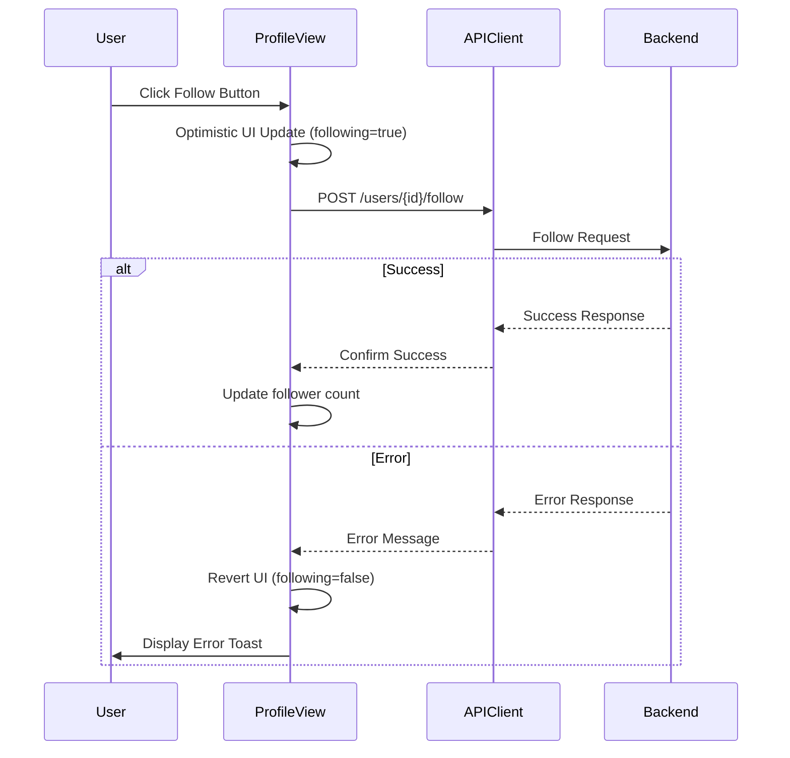
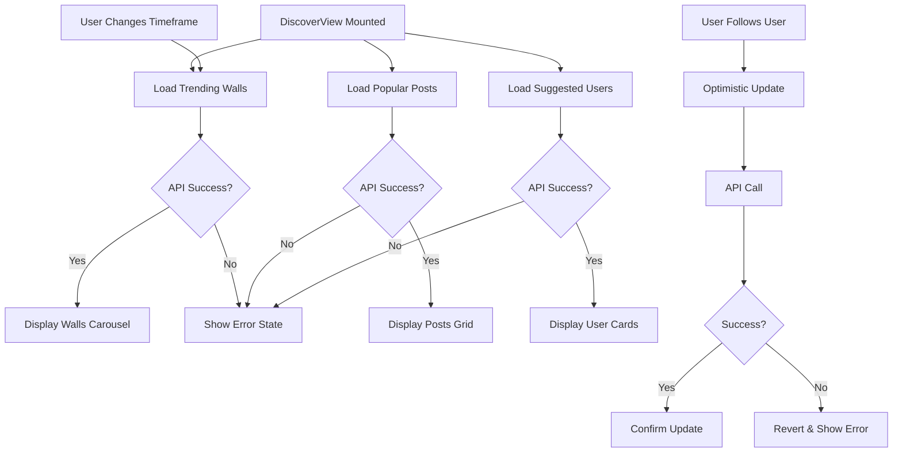
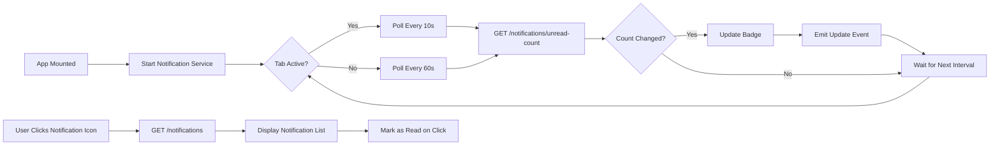
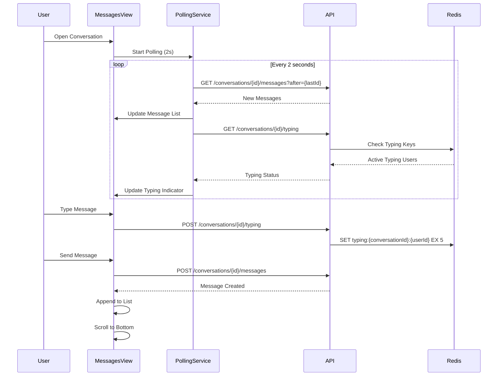
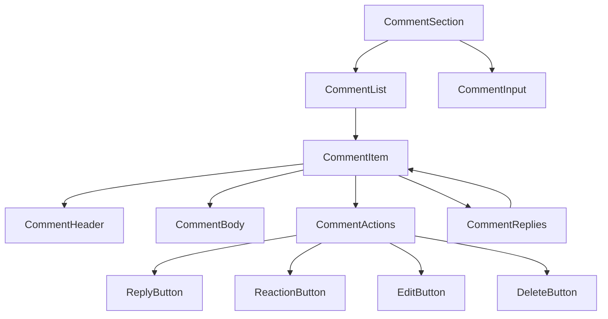
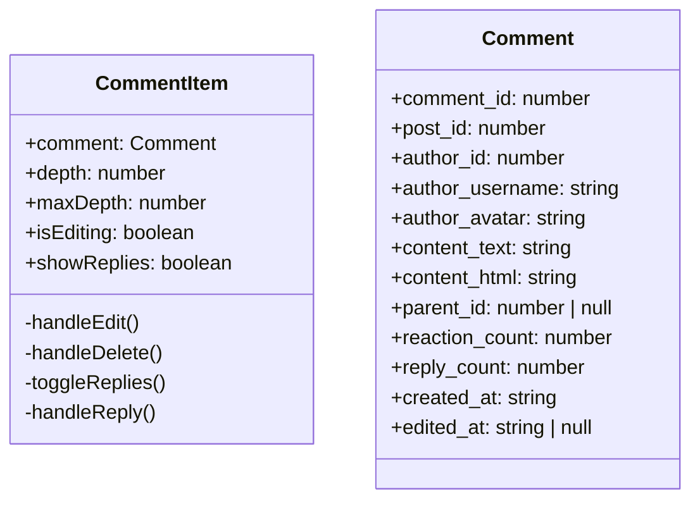
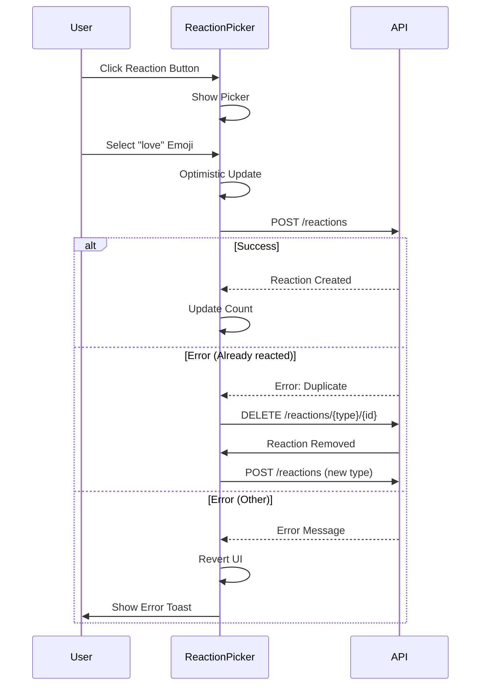
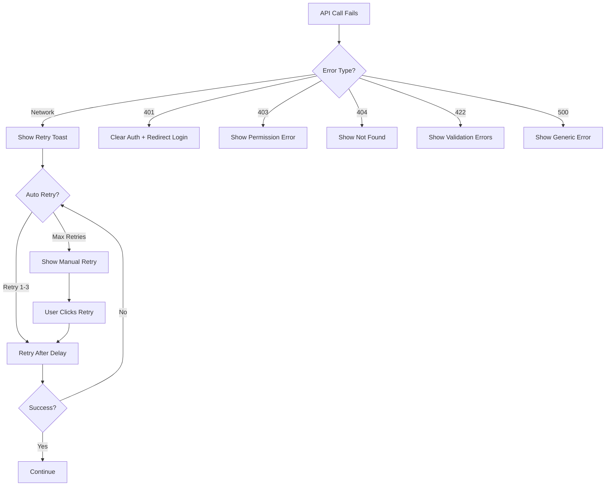
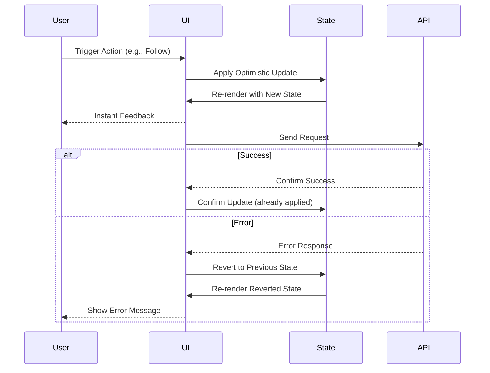

# Phase 2 Integration: Frontend-Backend Integration & Real-time Features

## Overview

This document outlines the comprehensive integration of the Vue.js frontend with the PHP backend API, implementation of real-time messaging and notification features, and completion of the social interaction UI components (comments and reactions).

## Scope

### In Scope
- Frontend-API integration for all major features
- Real-time notification polling mechanism
- Real-time messaging with typing indicators
- Comment and reaction UI components
- Profile subscription (follow/unfollow) integration
- Search and discovery feature integration
- Error handling and loading states

### Out of Scope
- WebSocket implementation (using polling instead)
- Advanced caching strategies
- Offline support
- Push notifications (browser or mobile)

## Current State Analysis

### Completed Frontend Components
- ProfileView with basic follow button
- NotificationsView with filtering and unread counts
- DiscoverView with trending walls and suggested users
- MessagesView with conversation list and message thread
- API client with authentication interceptors

### Completed Backend APIs
- Authentication endpoints
- User profile and follow management
- Post creation and retrieval
- Comment and reaction endpoints
- Notification system
- Messaging system with typing indicators
- Discover endpoints for trending content

### Integration Gaps
1. Profile follow functionality is UI-only, needs full API integration
2. Notifications display but lack real-time polling
3. Messages view uses basic polling, needs optimization
4. Comments and reactions lack dedicated UI components
5. Search functionality is not fully connected
6. Error handling is inconsistent across views

## Integration Strategy

### Phase 2.1: Core API Integration (Priority: Critical)

#### Profile Subscription Integration

**Objective**: Connect profile follow/unfollow buttons to backend API with optimistic updates.

**API Endpoints**
- POST `/api/v1/users/{userId}/follow` - Follow user
- DELETE `/api/v1/users/{userId}/follow` - Unfollow user
- GET `/api/v1/users/{userId}/follow-status` - Check follow status
- GET `/api/v1/users/{userId}/followers` - Get followers list
- GET `/api/v1/users/{userId}/following` - Get following list

**Implementation Requirements**

| Component | Modification | Rationale |
|-----------|-------------|-----------|
| ProfileView | Implement toggleFollow with API calls | Connect UI to backend |
| ProfileView | Add optimistic UI updates | Improve perceived performance |
| ProfileView | Handle follow/unfollow errors | Graceful error recovery |
| ProfileView | Show followers/following modals | Display connection lists |
| API Client | Add follow-related methods | Centralize API logic |

**State Management Flow**



**Followers/Following Modal Design**

| Feature | Description |
|---------|-------------|
| Modal Trigger | Click on follower/following count |
| Content Display | Paginated list of users with avatars |
| User Actions | Follow/unfollow buttons per user |
| Search Filter | Search within followers/following |
| Loading State | Skeleton loaders during fetch |

#### Search and Discovery Integration

**Objective**: Connect search bar and discovery feeds to backend API with debouncing and filters.

**API Endpoints**
- GET `/api/v1/discover/trending-walls?timeframe={24h\|7d\|30d}` - Trending walls
- GET `/api/v1/discover/popular-posts?timeframe={7d}&limit={n}` - Popular posts
- GET `/api/v1/discover/suggested-users?limit={n}` - User suggestions
- GET `/api/v1/search?q={query}&type={posts\|users\|walls}` - Global search

**Search Implementation Pattern**

| Aspect | Specification |
|--------|---------------|
| Debounce Delay | 300ms after last keystroke |
| Minimum Characters | 2 characters to trigger search |
| Result Grouping | Tabs for Posts, Users, Walls |
| Result Limit | 20 items per category initially |
| Load More | Pagination with offset/limit |

**DiscoverView Enhancement**



**Search Results View Structure**

| Section | Elements | Behavior |
|---------|----------|----------|
| Search Bar | Input field, search icon | Debounced search trigger |
| Filters | Tabs: All, Posts, Users, Walls | Filter displayed results |
| Results List | Mixed content cards | Click navigates to detail |
| Empty State | Message + suggested content | Shown when no results |
| Loading State | Skeleton cards | During API fetch |

### Phase 2.2: Real-time Features (Priority: High)

#### Notification Polling System

**Objective**: Implement efficient polling for real-time notifications without WebSockets.

**Polling Strategy**

| Parameter | Value | Justification |
|-----------|-------|---------------|
| Active Tab Interval | 10 seconds | Balance freshness vs server load |
| Background Tab Interval | 60 seconds | Reduce load when user inactive |
| Unread Badge Update | On every poll | Keep badge count current |
| Notification Fetch Limit | 20 items | Reasonable page size |

**Implementation Architecture**



**Notification Service Composable**

| Function | Purpose | Returns |
|----------|---------|---------|
| startPolling() | Begin notification polling | void |
| stopPolling() | Stop polling on component unmount | void |
| getUnreadCount() | Fetch current unread count | Promise\<number\> |
| markAsRead(id) | Mark single notification read | Promise\<void\> |
| markAllRead() | Mark all notifications read | Promise\<void\> |

**Visibility API Integration**

The system should use the Page Visibility API to adjust polling frequency:

| Event | Action | Reason |
|-------|--------|--------|
| visibilitychange (hidden) | Increase interval to 60s | User not viewing page |
| visibilitychange (visible) | Decrease interval to 10s | User returned to page |
| beforeunload | Stop polling | Clean up resources |

#### Real-time Messaging Enhancement

**Objective**: Optimize message polling with typing indicators and read receipts.

**Current State**: MessagesView has basic polling every 3 seconds.

**Enhancement Requirements**

| Feature | Current | Target | Implementation |
|---------|---------|--------|----------------|
| Message Polling | 3s fixed | 2s active, 10s inactive | Visibility-aware interval |
| Typing Indicators | Basic polling | Redis-backed, 5s TTL | Already implemented in backend |
| Read Receipts | Manual mark as read | Auto-mark on view | Scroll detection |
| Message Grouping | Flat list | Grouped by date | UI enhancement |
| Unread Counter | Per conversation | Real-time updates | Polling integration |

**Message Polling Flow**



**Auto Read Receipt Logic**

| Trigger | Condition | Action |
|---------|-----------|--------|
| Message Received | Message in viewport for >2s | Mark as read |
| Scroll to Bottom | Latest message visible | Mark all as read |
| Window Focus | User returns to tab | Check visible messages |

**Message Grouping Strategy**

Messages should be visually grouped for better readability:

| Group Type | Criteria | Display |
|------------|----------|---------|
| Date Separator | Messages on different days | "Today", "Yesterday", "Jan 15" |
| Sender Grouping | Same sender within 5 minutes | Avatar shown once |
| Time Display | Different minutes | Show timestamp |

### Phase 2.3: Comment and Reaction UI (Priority: High)

#### Comment Component Design

**Objective**: Create reusable comment components with threading, reactions, and inline editing.

**Component Hierarchy**



**CommentSection Component**

| Prop | Type | Purpose |
|------|------|---------|
| postId | number | Post to load comments for |
| sortBy | 'newest' \| 'oldest' \| 'popular' | Comment sort order |
| maxDepth | number | Maximum nesting level (default: 3) |

| State | Type | Purpose |
|-------|------|---------|
| comments | Comment[] | Top-level comments |
| loading | boolean | Loading state |
| replyTo | number \| null | Comment being replied to |

| Event | Payload | Purpose |
|-------|---------|---------|
| commentCreated | Comment | New comment added |
| commentDeleted | commentId | Comment removed |
| commentUpdated | Comment | Comment edited |

**CommentItem Component Structure**



**Comment Actions Behavior**

| Action | Condition | Behavior |
|--------|-----------|----------|
| Reply | depth < maxDepth | Show inline reply input |
| Reply | depth >= maxDepth | Show "view full thread" link |
| Edit | Own comment | Toggle inline edit mode |
| Delete | Own comment | Show confirmation, soft delete |
| React | Any comment | Toggle reaction picker |

**Comment Threading Strategy**

| Depth Level | Display Style | Load Strategy |
|-------------|---------------|---------------|
| 0 (root) | Full width, avatar left | Load initially |
| 1 | Indented 40px, smaller avatar | Load initially |
| 2 | Indented 80px, no avatar | Load initially |
| 3+ | "View full thread" link | Load on demand |

#### Reaction Picker Component

**Objective**: Provide quick reaction selection UI for posts and comments.

**Reaction Types**

| Reaction | Icon | Label | Color |
|----------|------|-------|-------|
| like | 👍 | Like | Blue |
| love | ❤️ | Love | Red |
| haha | 😂 | Haha | Yellow |
| wow | 😮 | Wow | Orange |
| sad | 😢 | Sad | Blue-gray |
| angry | 😠 | Angry | Red-orange |

**ReactionPicker Component**

| Prop | Type | Purpose |
|------|------|---------|
| reactableType | 'post' \| 'comment' | What is being reacted to |
| reactableId | number | ID of the item |
| currentReaction | string \| null | User's current reaction |

| Event | Payload | Purpose |
|-------|---------|---------|
| reactionChanged | { type, count } | Reaction added/changed |
| reactionRemoved | {} | Reaction removed |

**Reaction Display Behavior**

| State | Display | Interaction |
|-------|---------|-------------|
| No reaction | Gray heart icon | Click opens picker |
| Has reaction | Colored reaction icon | Click removes reaction |
| Hover | Show all reactions | Hover opens picker |
| Picker open | Horizontal emoji row | Click selects reaction |

**Reaction API Flow**



**Reaction Aggregation Display**

Posts and comments should show reaction summary:

| Display Mode | When | Format |
|--------------|------|--------|
| Icon-only | 1-3 reaction types | "❤️ 👍 5" |
| Count-only | >3 reaction types | "15 reactions" |
| Expanded | User clicks count | Modal with user list per reaction |

### Phase 2.4: Error Handling & UX Polish (Priority: Medium)

#### Standardized Error Handling

**Objective**: Consistent error display and recovery across all views.

**Error Categories**

| Category | HTTP Code | User Message | Action |
|----------|-----------|--------------|--------|
| Network Error | - | "Connection lost. Retrying..." | Auto-retry 3x |
| Unauthorized | 401 | "Session expired. Please log in." | Redirect to login |
| Forbidden | 403 | "You don't have permission." | Show error, stay on page |
| Not Found | 404 | "Content not found." | Offer back navigation |
| Validation Error | 422 | Display field errors | Highlight fields |
| Server Error | 500 | "Something went wrong. Try again." | Offer retry button |

**Error Toast Component**

| Property | Value |
|----------|-------|
| Duration | 5 seconds (auto-dismiss) |
| Position | Top-right |
| Actions | Dismiss, Retry (if applicable) |
| Types | error, warning, info, success |

**Error Recovery Patterns**



#### Loading States

**Objective**: Provide clear feedback during async operations.

**Loading State Types**

| Type | Use Case | Implementation |
|------|----------|----------------|
| Initial Load | First page load | Full-page spinner |
| Content Load | Fetching list items | Skeleton loaders |
| Action Load | Button actions | Button spinner + disable |
| Background Load | Polling updates | Subtle indicator |
| Infinite Scroll | Loading more items | Footer spinner |

**Skeleton Loader Patterns**

| Component | Skeleton Structure |
|-----------|-------------------|
| Post Card | Avatar circle + 3 text lines + action bar |
| User Card | Avatar circle + 2 text lines + button |
| Wall Card | Banner rectangle + avatar + 2 text lines |
| Comment | Small avatar + 2 text lines |
| Notification | Icon + text line + timestamp line |

#### Optimistic UI Updates

**Objective**: Improve perceived performance with instant UI feedback.

**Optimistic Update Pattern**



**Actions Requiring Optimistic Updates**

| Action | Optimistic Change | Rollback Trigger |
|--------|-------------------|------------------|
| Follow User | following = true, followers++ | API error |
| Unfollow User | following = false, followers-- | API error |
| Add Reaction | reaction set, count++ | API error or duplicate |
| Remove Reaction | reaction cleared, count-- | API error |
| Send Message | Message in list with "sending" | API error or timeout |
| Delete Comment | Comment hidden | API error |
| Mark Notification Read | Badge count--, is_read=true | API error |

## Data Models

### Frontend Type Definitions

**Notification Type**

| Field | Type | Description |
|-------|------|-------------|
| notification_id | number | Unique identifier |
| user_id | number | Recipient user ID |
| actor_id | number | User who triggered notification |
| actor_username | string | Username of actor |
| actor_avatar | string | Avatar URL of actor |
| notification_type | NotificationType | Type of notification |
| target_type | string | What was affected (post, wall, user) |
| target_id | number | ID of affected item |
| target_preview | string | Preview text |
| content | object | Additional metadata |
| is_read | boolean | Read status |
| created_at | string | ISO timestamp |

**NotificationType Enum**

- `follow` - User followed you
- `reaction` - Someone reacted to your content
- `comment` - Someone commented on your post
- `reply` - Someone replied to your comment
- `mention` - You were mentioned
- `bricks` - Bricks transaction
- `ai_complete` - AI app generation completed

**Comment Type**

| Field | Type | Description |
|-------|------|-------------|
| comment_id | number | Unique identifier |
| post_id | number | Parent post |
| author_id | number | Comment author |
| author_username | string | Author username |
| author_avatar | string | Author avatar URL |
| content_text | string | Plain text content |
| content_html | string | HTML content (sanitized) |
| parent_id | number \| null | Parent comment ID (for replies) |
| reaction_count | number | Total reactions |
| reply_count | number | Direct reply count |
| created_at | string | ISO timestamp |
| edited_at | string \| null | Last edit timestamp |
| replies | Comment[] | Nested replies (lazy loaded) |

**Reaction Type**

| Field | Type | Description |
|-------|------|-------------|
| reaction_id | number | Unique identifier |
| user_id | number | User who reacted |
| username | string | User's username |
| avatar_url | string | User's avatar |
| reactable_type | string | 'post' or 'comment' |
| reactable_id | number | ID of reacted item |
| reaction_type | ReactionType | Type of reaction |
| created_at | string | ISO timestamp |

**ReactionType Enum**

- `like`
- `love`
- `haha`
- `wow`
- `sad`
- `angry`

## API Integration Reference

### Authentication Headers

All authenticated requests must include:

```
Authorization: Bearer {jwt_token}
Content-Type: application/json
```

### Response Format

Standard API response structure:

| Field | Type | Description |
|-------|------|-------------|
| success | boolean | Request success status |
| data | object | Response payload |
| message | string | Human-readable message (optional) |
| errors | object | Validation errors (on 422) |

### Pagination Pattern

List endpoints support pagination:

| Parameter | Type | Default | Description |
|-----------|------|---------|-------------|
| limit | number | 20 | Items per page |
| offset | number | 0 | Skip N items |
| page | number | 1 | Alternative to offset |

Response includes:

| Field | Type | Description |
|-------|------|-------------|
| items | array | Data items |
| count | number | Items in current response |
| limit | number | Requested limit |
| offset | number | Current offset |
| has_more | boolean | More items available |

## Technical Implementation Details

### Polling Service Implementation

Create a composable `usePolling.ts`:

**Service Structure**

| Function | Purpose |
|----------|---------|
| createPoller(config) | Factory for polling instances |
| start() | Begin polling |
| stop() | Stop polling |
| setInterval(ms) | Adjust polling frequency |
| pause() | Temporarily pause |
| resume() | Resume after pause |

**Configuration Object**

| Property | Type | Default | Purpose |
|----------|------|---------|---------|
| interval | number | 10000 | Polling interval (ms) |
| endpoint | string | required | API endpoint to poll |
| onUpdate | function | required | Callback with new data |
| onError | function | optional | Error handler |
| enableVisibilityControl | boolean | true | Adjust on tab visibility |
| backgroundInterval | number | 60000 | Interval when tab hidden |

### Comment Component State Management

Use composable pattern for comment state:

**useComments Composable**

| State | Type | Purpose |
|-------|------|---------|
| comments | Ref\<Comment[]\> | Comment tree |
| loading | Ref\<boolean\> | Loading state |
| error | Ref\<string \| null\> | Error message |

| Method | Parameters | Returns | Purpose |
|--------|------------|---------|---------|
| loadComments | (postId, sortBy) | Promise\<void\> | Fetch comments |
| addComment | (comment) | Promise\<Comment\> | Create comment |
| updateComment | (id, data) | Promise\<Comment\> | Edit comment |
| deleteComment | (id) | Promise\<void\> | Remove comment |
| loadReplies | (parentId) | Promise\<Comment[]\> | Load nested replies |

### Optimistic Update Helper

Create utility function for optimistic updates:

**optimisticUpdate Function**

| Parameter | Type | Purpose |
|-----------|------|---------|
| state | Ref | Reactive state to update |
| optimisticChange | function | Function to apply optimistic change |
| apiCall | function | Async API call |
| rollback | function | Function to revert on error |

**Usage Pattern**

The helper should handle:
1. Apply optimistic change immediately
2. Execute API call
3. On success: keep optimistic change
4. On error: rollback + show error toast

## Testing Considerations

### Integration Testing Scenarios

| Scenario | Test Cases |
|----------|------------|
| Follow Flow | Follow user, unfollow user, optimistic update, error recovery |
| Notifications | Poll updates, mark as read, mark all read, navigation |
| Messaging | Send message, receive message, typing indicator, read receipt |
| Comments | Create, edit, delete, reply, load more, threading |
| Reactions | Add, change, remove, display count, show list |
| Search | Debounce, filter results, pagination, empty state |
| Error Handling | Network error retry, 401 redirect, validation errors |

### Manual Testing Checklist

| Area | Test | Expected Result |
|------|------|-----------------|
| Profile | Follow/unfollow | Button state changes, count updates |
| Profile | View followers | Modal shows with user list |
| Notifications | Real-time updates | Badge updates every 10s |
| Notifications | Mark as read | Badge decrements, notification grays |
| Messages | Send message | Message appears instantly |
| Messages | Typing indicator | Shows when other user types |
| Comments | Add comment | Comment appears in list |
| Comments | Reply to comment | Reply appears nested |
| Reactions | Add reaction | Icon changes, count increments |
| Search | Search query | Results appear after debounce |
| Discover | Follow from suggested | Button changes, user removed from list |

## Performance Optimization

### Polling Optimization Strategies

| Strategy | Implementation | Benefit |
|----------|----------------|---------|
| Visibility-based Intervals | Adjust frequency on tab visibility | Reduce server load |
| Request Coalescing | Batch multiple polls into single request | Fewer HTTP requests |
| Incremental Updates | Fetch only new items (after lastId) | Smaller payloads |
| Cache Headers | Use ETags and Last-Modified | Prevent unchanged fetches |
| Abort Previous Requests | Cancel pending requests on new poll | Prevent request pile-up |

### Rendering Optimization

| Technique | Use Case | Implementation |
|-----------|----------|----------------|
| Virtual Scrolling | Long comment threads | Use vue-virtual-scroller |
| Lazy Loading | Nested comment replies | Load on "show more" click |
| Debounced Reactions | Reaction picker | Debounce API call on rapid clicks |
| Memoized Components | Static user cards | Use v-memo directive |
| Intersection Observer | Infinite scroll | Trigger load on scroll threshold |

## Deployment Considerations

### Environment Configuration

| Variable | Development | Production |
|----------|-------------|------------|
| API_BASE_URL | http://localhost:8080/api/v1 | https://wall.cyka.lol/api/v1 |
| POLL_INTERVAL | 5000 | 10000 |
| BACKGROUND_POLL_INTERVAL | 30000 | 60000 |
| MAX_RETRY_ATTEMPTS | 5 | 3 |
| RETRY_DELAY | 1000 | 2000 |

### Browser Compatibility

Ensure support for:

| Feature | Requirement | Polyfill Needed |
|---------|-------------|-----------------|
| Fetch API | Modern browsers | Yes (for IE11) |
| Page Visibility API | All modern | No |
| IntersectionObserver | Modern browsers | Yes (for old Safari) |
| ES6+ Syntax | Modern browsers | Babel transpilation |

## Security Considerations

### XSS Prevention in Comments

| Measure | Implementation |
|---------|----------------|
| HTML Sanitization | Server-side with allowed tags only |
| CSP Headers | Prevent inline scripts |
| Output Encoding | Escape user content in templates |
| URL Validation | Check links in comments |

### API Security

| Protection | Method |
|------------|--------|
| CSRF | SameSite cookies + token validation |
| Rate Limiting | Backend rate limiter per user |
| Input Validation | Server-side validation always |
| Auth Token Refresh | Token expiry + refresh mechanism |

## Success Metrics

### Integration Completion Criteria

| Feature | Completion Criteria |
|---------|---------------------|
| Profile Follow | Follow/unfollow works, optimistic updates, modals functional |
| Notifications | Polling active, badge updates, navigation works |
| Messages | Send/receive, typing indicators, read receipts |
| Comments | CRUD operations, threading, reactions |
| Reactions | Add/remove, picker UI, aggregation display |
| Search | Debounced search, filtered results, pagination |
| Error Handling | All error types handled, toast notifications |

### Performance Targets

| Metric | Target | Measurement |
|--------|--------|-------------|
| Time to Interactive | < 3s | Lighthouse |
| API Response Time | < 200ms (95th percentile) | Server logs |
| Polling Impact | < 5% CPU usage | Browser DevTools |
| Comment Load Time | < 1s for 50 comments | Manual testing |
| Optimistic Update Latency | < 100ms | User perception |

## Phase Completion Status

### Phase 2.1: Core API Integration
- Profile subscription integration
- Search and discovery integration
- User follow modals

### Phase 2.2: Real-time Features
- Notification polling service
- Message polling optimization
- Typing indicators
- Read receipts

### Phase 2.3: Comment and Reaction UI
- CommentSection component
- CommentItem with threading
- CommentInput with mentions
- ReactionPicker component
- Reaction display and aggregation

### Phase 2.4: Error Handling & UX Polish
- Standardized error handling
- Toast notification system
- Loading states (skeleton loaders)
- Optimistic UI updates
- Retry mechanisms

## Next Steps After Phase 2

Once Phase 2 is complete, the following areas remain:

### Phase 3: Advanced Features
- AI-generated app creation UI
- Brick transaction system frontend
- Advanced search filters
- User settings and preferences

### Phase 4: Optimization
- Service Worker for offline support
- Push notification setup
- Advanced caching strategies
- Performance monitoring

### Phase 5: Testing & QA
- Comprehensive unit tests
- E2E testing with Cypress
- Load testing
- Security audit
