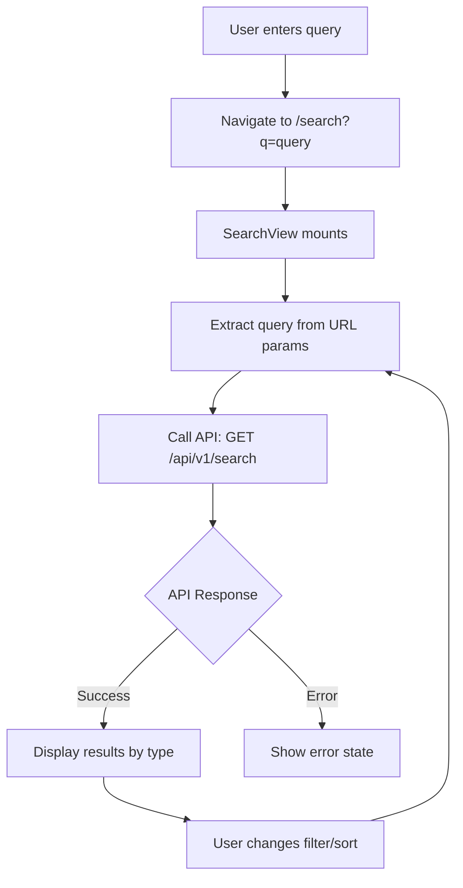

# Design: Search Interface Bug Fixes

## Problem Statement

Three critical issues have been identified in the search interface:

1. **Top Search Bar Non-Functional**: The search input in the header (`AppHeader.vue`) has no event handlers - clicking or typing does nothing
2. **Layout Issues in Discovery Page**: Search and discovery elements are misaligned and visually broken
3. **Missing Search Results Page**: When searching from the discovery page, users are redirected to `/search?q={query}` which results in a 404 error because no SearchView component exists

## Root Cause Analysis

### Issue 1: Header Search Bar
The header search input (lines 20-29 in AppHeader.vue) is purely presentational:
- No v-model binding
- No event handlers (@input, @keyup.enter, @click)
- Search button has no functionality

### Issue 2: Discovery Layout Problems
The discovery page search section (lines 7-21 in DiscoverView.vue) has:
- Misaligned grid structure (grid-template-columns: 1fr auto with 12px gap)
- Search button height mismatch (39px vs input implicit height)
- Inconsistent spacing and sizing

### Issue 3: Missing Search Route
- SearchBar component navigates to `/search` route (line 179)
- Router configuration has no `/search` route defined
- No SearchView.vue component exists to display results

## Strategic Design Solution

### Objective
Create a cohesive search experience with three functional entry points:
1. Header search (quick access)
2. Discovery page search (contextual)
3. Dedicated search results page (comprehensive)

## Component Architecture

### 1. Header Search Functionality

**Approach**: Make the header search functional by integrating with the existing SearchBar component behavior.

**Modifications Required**:
- Add reactive state for search query
- Implement search handler that navigates to SearchView
- Add keyboard shortcut support (Ctrl+K / Cmd+K)
- Use debouncing to prevent excessive navigation triggers

**Interaction Flow**:
```
User Input → Debounce (300ms) → Validate (≥2 chars) → Navigate to /search?q={query}
                                     ↓
                                < 2 chars → No action
```

### 2. Discovery Page Layout Fixes

**Problem Areas**:
| Element | Current State | Target State |
|---------|---------------|--------------|
| Search container | grid with 1fr auto | Flexbox with gap |
| Search input | Variable height | 48px fixed |
| Search button | 39px height | 48px height |
| Container spacing | Inconsistent margins | Unified spacing |

**Layout Strategy**:
- Replace grid with flexbox for better alignment control
- Standardize all interactive element heights to 48px
- Use consistent border-radius (12px)
- Ensure visual hierarchy with proper spacing

**Updated Structure**:
```
.search-section
  └── .search-container (flex, gap: 12px)
      ├── .search-input (flex: 1, height: 48px)
      └── .search-button (width: 48px, height: 48px)
```

### 3. Search Results View Component

**Component**: `SearchView.vue`

**Purpose**: Display comprehensive search results across all content types (posts, walls, users, AI apps).

**Layout Structure**:
```
SearchView
├── Search Header
│   ├── Search Input (with current query)
│   └── Active Filters Display
├── Result Type Tabs
│   ├── All Results (default)
│   ├── Posts (count badge)
│   ├── Walls (count badge)
│   ├── Users (count badge)
│   └── AI Apps (count badge)
├── Sort Controls
│   ├── Relevance (default)
│   ├── Recent
│   └── Popular
└── Results Display Area
    ├── Loading State
    ├── Empty State (no results)
    └── Result Cards (by type)
```

**Data Flow**:


## API Integration

### Endpoint Usage
**Base Endpoint**: `GET /api/v1/search`

**Query Parameters**:
| Parameter | Type | Default | Description |
|-----------|------|---------|-------------|
| q | string | required | Search query (2-200 chars) |
| type | enum | "all" | Filter: all, post, wall, user, ai-app |
| sort | enum | "relevance" | Sort: relevance, recent, popular |
| page | number | 1 | Pagination page |
| limit | number | 20 | Results per page (max 50) |

**Response Structure**:
```
{
  success: boolean,
  data: {
    query: string,
    type: string,
    sort: string,
    results: {
      posts?: { items: Post[], total: number },
      walls?: { items: Wall[], total: number },
      users?: { items: User[], total: number },
      ai_apps?: { items: AIApp[], total: number }
    },
    counts: {
      total: number,
      posts: number,
      walls: number,
      users: number,
      ai_apps: number
    },
    pagination: {
      page: number,
      limit: number
    }
  }
}
```

## State Management

### SearchView Component State
```
searchQuery: string           // Current search term
activeType: string            // Selected tab: all, post, wall, user, ai-app
sortBy: string                // Sort method: relevance, recent, popular
currentPage: number           // Pagination state
searchResults: SearchResults  // API response data
isLoading: boolean            // Loading indicator
error: string | null          // Error message
```

### Reactive Behavior
- Query changes trigger immediate API call (debounced)
- Tab/filter changes trigger new API call with updated type
- Sort changes trigger new API call with updated sort parameter
- Page changes append results (infinite scroll) or replace (pagination)

## User Experience Enhancements

### Loading States
- Skeleton loaders for each result type during initial load
- Inline loading indicators for filter/sort changes
- Prevent duplicate requests during loading

### Empty States
| Scenario | Message | Action |
|----------|---------|--------|
| No query | "Enter a search term to begin" | Show trending searches |
| No results | "No results found for '{query}'" | Suggest related searches |
| Network error | "Failed to load results" | Retry button |
| Invalid query | "Search term too short" | Minimum length indicator |

### Search Suggestions
- Display trending searches when input is empty
- Show recent searches from localStorage
- Clear individual or all recent searches

## Routing Configuration

### New Route Definition
```
{
  path: '/search',
  name: 'search',
  component: SearchView,
  beforeEnter: requireAuth,
  meta: { title: 'Search Results' },
  props: route => ({
    initialQuery: route.query.q || '',
    initialType: route.query.type || 'all',
    initialSort: route.query.sort || 'relevance'
  })
}
```

## Styling Consistency

### Design Tokens to Apply
```
Height Standard: 48px (all inputs and buttons)
Border Radius: 12px (inputs), 50% (icon buttons)
Spacing: 12px (between elements), 16px (section margins)
Transition: 0.2s ease-in-out (all interactions)
Focus State: 2px solid var(--color-primary)
```

### Responsive Breakpoints
- Desktop (>1024px): Full layout with sidebar
- Tablet (768-1024px): Condensed layout, hide filters in drawer
- Mobile (<768px): Stack layout, bottom sheet for filters

## Accessibility Considerations

### Keyboard Navigation
- Tab order: Search input → Filters → Tabs → Results
- Enter key: Submit search / Select result
- Arrow keys: Navigate between tabs and results
- Escape key: Clear search / Close dropdowns

### ARIA Attributes
- aria-label for icon buttons
- aria-live for result count updates
- aria-expanded for dropdown states
- role="search" for search form
- role="tablist" for result type tabs

## Error Handling

### Client-Side Validation
- Minimum query length: 2 characters
- Maximum query length: 200 characters
- Sanitize input to prevent XSS

### API Error Scenarios
| Error Code | User Message | Recovery Action |
|------------|--------------|-----------------|
| 400 | "Invalid search query" | Show query requirements |
| 429 | "Too many searches" | Show rate limit timer |
| 500 | "Search unavailable" | Retry with exponential backoff |
| Network | "Connection lost" | Offline indicator + retry |

## Performance Optimization

### Caching Strategy
- Backend cache: 5 minutes for search results
- Frontend cache: Store last 5 searches in memory
- localStorage: Persist recent searches (max 10)

### Debouncing
- Header search input: 300ms debounce
- Discovery search input: 300ms debounce
- Filter changes: Immediate (no debounce)

### Lazy Loading
- Result images: Intersection Observer
- Infinite scroll: Load next page when 80% scrolled
- Tab content: Load on demand when tab activated

## Implementation Priority

### Phase 1: Critical Fixes (Immediate)
1. Add SearchView component with basic layout
2. Add /search route to router
3. Make header search functional
4. Fix discovery page layout issues

### Phase 2: Enhanced Functionality
1. Implement tab filtering
2. Add sort controls
3. Implement pagination/infinite scroll
4. Add loading and empty states

### Phase 3: Polish
1. Add trending searches
2. Implement search suggestions
3. Add keyboard shortcuts
4. Optimize performance with caching

## Success Criteria

### Functional Requirements
- ✅ Header search navigates to search results page
- ✅ Discovery search navigates to search results page
- ✅ Search results page displays all content types
- ✅ Users can filter by content type
- ✅ Users can sort by relevance/recent/popular
- ✅ No layout issues or visual misalignments

### Performance Requirements
- Search response time: <500ms (cached), <2s (uncached)
- Debounce delay: 300ms (prevents excessive calls)
- Page load: <1s for initial view

### Accessibility Requirements
- Keyboard navigation: All features accessible
- Screen reader: Proper ARIA labels
- Focus indicators: Visible on all interactive elements

## Technical Constraints

### Browser Support
- Modern browsers (Chrome, Firefox, Safari, Edge latest versions)
- ES6+ features supported
- CSS Grid/Flexbox required

### Dependencies
- Vue Router: For navigation and route params
- Debounce utility: From @vueuse/core or custom composable
- API Client: Existing apiClient service

## Risk Mitigation

### Potential Issues
| Risk | Impact | Mitigation |
|------|--------|------------|
| Search overload | High server load | Backend rate limiting (30/min) |
| Slow FULLTEXT | Poor UX | Backend caching, pagination |
| Layout breaks | User confusion | Responsive testing, CSS fallbacks |
| 404 errors | Navigation failure | Proper route guards, error boundaries |

## Testing Strategy

### Manual Testing Checklist
- [ ] Header search submits on Enter key
- [ ] Discovery search submits on button click
- [ ] SearchView loads with query from URL
- [ ] All content type tabs display results
- [ ] Sort controls change result order
- [ ] Empty state shows when no results
- [ ] Loading state appears during API call
- [ ] Layout is correct on mobile/tablet/desktop
- [ ] Recent searches persist across sessions
- [ ] Error states display appropriate messages

### Edge Cases
- Empty search query
- Very long search query (>200 chars)
- Special characters in query
- Rapid typing (debounce validation)
- Network disconnection during search
- No results for any content type
- Switching tabs during loading
