# Vue.js Frontend Development Design

## Project Context

The Wall Social Platform currently has a vanilla JavaScript frontend implementation with approximately 4,700+ lines of code across multiple files. The frontend includes authentication, routing, theme management, and various social features. The backend provides 77 REST API endpoints that are fully operational.

## Design Objective

Migrate the entire frontend from vanilla JavaScript to Vue.js 3 with Composition API, implementing all previously planned features in a modern, maintainable, and scalable architecture.

## Strategic Rationale

### Why Vue.js 3

| Aspect | Benefit |
|--------|---------|
| Reactivity System | Simplifies state management and reduces boilerplate code compared to vanilla JavaScript |
| Component Architecture | Enables better code organization, reusability, and maintainability |
| Developer Experience | Rich ecosystem with Vue Router, Pinia, and extensive tooling support |
| Performance | Virtual DOM and optimized reactivity provide better performance at scale |
| Type Safety | Full TypeScript support for enhanced code quality |
| Learning Curve | Gentle learning curve with excellent documentation |

### Migration Benefits

- Reduced code complexity through reactive data binding
- Improved component isolation and testability
- Better state management with Pinia
- Enhanced routing capabilities with Vue Router
- Simplified theme switching and persistent state
- Easier integration of third-party libraries
- Built-in transitions and animations

## System Architecture

### High-Level Architecture

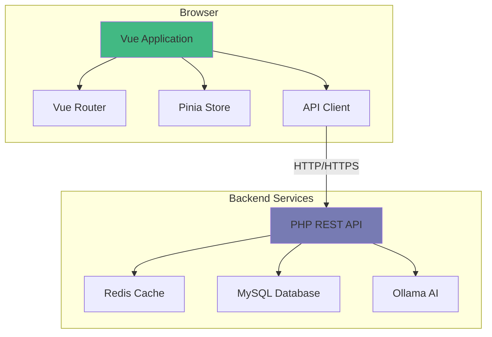
```mermaid
graph TB
    subgraph "Browser"
        A[Vue Application]
        B[Vue Router]
        C[Pinia Store]
        D[API Client]
        
        A --> B
        A --> C
        A --> D
    end
    
    subgraph "Backend Services"
        E[PHP REST API]
        F[Redis Cache]
        G[MySQL Database]
        H[Ollama AI]
    end
    
    D -->|HTTP/HTTPS| E
    E --> F
    E --> G
    E --> H
    
    style A fill:#42b983
    style E fill:#777bb3
```

### Application Layer Structure

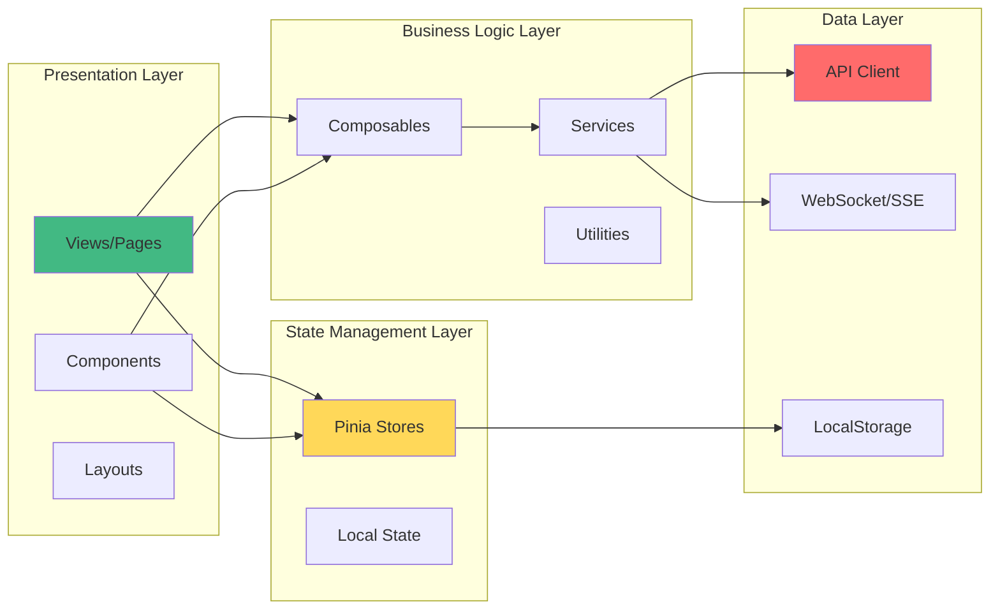
```mermaid
graph LR
    subgraph "Presentation Layer"
        A[Views/Pages]
        B[Components]
        C[Layouts]
    end
    
    subgraph "Business Logic Layer"
        D[Composables]
        E[Services]
        F[Utilities]
    end
    
    subgraph "State Management Layer"
        G[Pinia Stores]
        H[Local State]
    end
    
    subgraph "Data Layer"
        I[API Client]
        J[WebSocket/SSE]
        K[LocalStorage]
    end
    
    A --> D
    B --> D
    A --> G
    B --> G
    D --> E
    E --> I
    E --> J
    G --> K
    
    style A fill:#42b983
    style G fill:#ffd859
    style I fill:#ff6b6b
```

## Technology Stack

### Core Technologies

| Technology | Version | Purpose |
|------------|---------|---------|
| Vue.js | 3.4+ | Core framework with Composition API |
| TypeScript | 5.0+ | Type safety and enhanced developer experience |
| Vite | 5.0+ | Build tool and development server |
| Vue Router | 4.0+ | Client-side routing |
| Pinia | 2.1+ | State management |
| Axios | 1.6+ | HTTP client for API communication |

### Development Tools

| Tool | Purpose |
|------|---------|
| ESLint | Code linting with Vue-specific rules |
| Prettier | Code formatting |
| Vitest | Unit testing framework |
| Vue Test Utils | Component testing utilities |
| Cypress | End-to-end testing |
| TypeScript ESLint | TypeScript linting integration |

### UI/UX Libraries

| Library | Purpose |
|---------|---------|
| Tailwind CSS | Utility-first CSS framework (alternative to custom CSS) |
| Headless UI | Unstyled, accessible UI components |
| VueUse | Collection of essential Vue composition utilities |
| Day.js | Lightweight date manipulation library |

## Project Structure

### Directory Organization

```
frontend/
├── public/
│   ├── favicon.ico
│   └── assets/
│       └── images/
├── src/
│   ├── assets/
│   │   ├── styles/
│   │   │   ├── base/
│   │   │   │   ├── reset.css
│   │   │   │   └── typography.css
│   │   │   ├── themes/
│   │   │   │   ├── light.css
│   │   │   │   ├── dark.css
│   │   │   │   ├── green.css
│   │   │   │   ├── cream.css
│   │   │   │   ├── blue.css
│   │   │   │   └── high-contrast.css
│   │   │   └── main.css
│   │   └── images/
│   ├── components/
│   │   ├── common/
│   │   │   ├── AppButton.vue
│   │   │   ├── AppInput.vue
│   │   │   ├── AppModal.vue
│   │   │   ├── AppToast.vue
│   │   │   ├── AppDropdown.vue
│   │   │   └── AppAvatar.vue
│   │   ├── layout/
│   │   │   ├── AppHeader.vue
│   │   │   ├── AppSidebar.vue
│   │   │   ├── AppBottomNav.vue
│   │   │   └── AppWidgets.vue
│   │   ├── posts/
│   │   │   ├── PostCard.vue
│   │   │   ├── PostCreator.vue
│   │   │   ├── PostActions.vue
│   │   │   └── PostList.vue
│   │   ├── comments/
│   │   │   ├── CommentItem.vue
│   │   │   ├── CommentList.vue
│   │   │   └── CommentForm.vue
│   │   ├── ai/
│   │   │   ├── AIGeneratorForm.vue
│   │   │   ├── AIProgressTracker.vue
│   │   │   └── AIAppCard.vue
│   │   └── messaging/
│   │       ├── ConversationList.vue
│   │       ├── MessageThread.vue
│   │       └── MessageInput.vue
│   ├── composables/
│   │   ├── useAuth.ts
│   │   ├── useTheme.ts
│   │   ├── useToast.ts
│   │   ├── usePosts.ts
│   │   ├── useComments.ts
│   │   ├── useAI.ts
│   │   ├── useWebSocket.ts
│   │   └── useInfiniteScroll.ts
│   ├── layouts/
│   │   ├── DefaultLayout.vue
│   │   ├── AuthLayout.vue
│   │   └── MinimalLayout.vue
│   ├── views/
│   │   ├── HomeView.vue
│   │   ├── LoginView.vue
│   │   ├── RegisterView.vue
│   │   ├── WallView.vue
│   │   ├── ProfileView.vue
│   │   ├── DiscoverView.vue
│   │   ├── MessagesView.vue
│   │   ├── NotificationsView.vue
│   │   ├── SettingsView.vue
│   │   ├── AIGenerateView.vue
│   │   └── NotFoundView.vue
│   ├── router/
│   │   ├── index.ts
│   │   └── guards.ts
│   ├── stores/
│   │   ├── auth.ts
│   │   ├── theme.ts
│   │   ├── posts.ts
│   │   ├── users.ts
│   │   ├── notifications.ts
│   │   └── ui.ts
│   ├── services/
│   │   ├── api/
│   │   │   ├── client.ts
│   │   │   ├── auth.ts
│   │   │   ├── posts.ts
│   │   │   ├── walls.ts
│   │   │   ├── users.ts
│   │   │   ├── ai.ts
│   │   │   ├── social.ts
│   │   │   └── messages.ts
│   │   ├── websocket.ts
│   │   └── storage.ts
│   ├── types/
│   │   ├── models.ts
│   │   ├── api.ts
│   │   └── components.ts
│   ├── utils/
│   │   ├── validation.ts
│   │   ├── formatting.ts
│   │   ├── constants.ts
│   │   └── helpers.ts
│   ├── App.vue
│   ├── main.ts
│   └── env.d.ts
├── tests/
│   ├── unit/
│   └── e2e/
├── .env.development
├── .env.production
├── .eslintrc.cjs
├── .prettierrc.json
├── index.html
├── package.json
├── tsconfig.json
├── vite.config.ts
└── vitest.config.ts
```

## Core System Design

### Routing Strategy

#### Route Configuration

The application uses Vue Router with history mode for clean URLs. Routes are organized by feature area with lazy loading for optimal performance.

| Route | Component | Access Level | Description |
|-------|-----------|--------------|-------------|
| `/` | HomeView | Protected | Main feed with posts from subscribed walls |
| `/login` | LoginView | Public | User authentication |
| `/register` | RegisterView | Public | New user registration |
| `/wall/:wallId` | WallView | Protected | Individual wall with posts |
| `/profile/:username?` | ProfileView | Protected | User profile (current user if no username) |
| `/discover` | DiscoverView | Protected | Explore posts and walls |
| `/messages` | MessagesView | Protected | Direct messaging interface |
| `/messages/:conversationId` | MessagesView | Protected | Specific conversation thread |
| `/notifications` | NotificationsView | Protected | User notifications |
| `/settings` | SettingsView | Protected | User settings and preferences |
| `/ai` | AIGenerateView | Protected | AI application generator |
| `/ai/:jobId` | AIGenerateView | Protected | Track specific AI job |
| `/:pathMatch(.*)` | NotFoundView | Public | 404 error page |

#### Navigation Guards

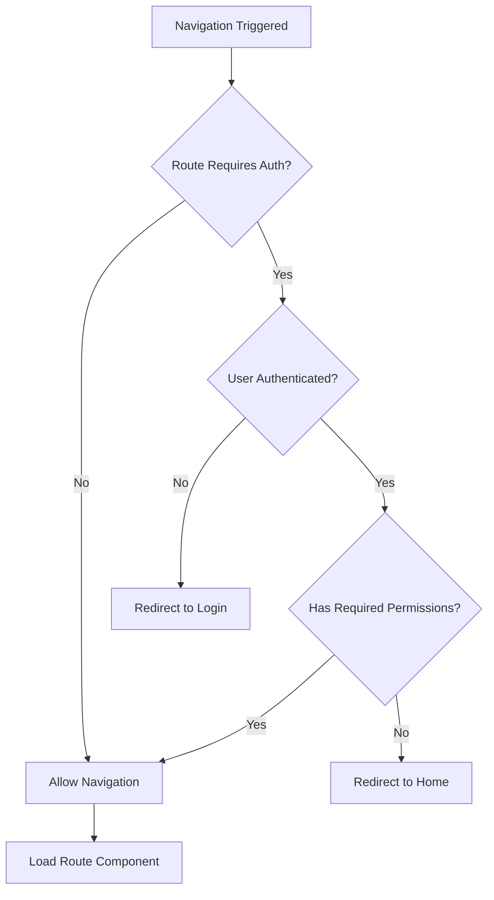
```mermaid
flowchart TD
    A[Navigation Triggered] --> B{Route Requires Auth?}
    B -->|Yes| C{User Authenticated?}
    B -->|No| F[Allow Navigation]
    C -->|Yes| D{Has Required Permissions?}
    C -->|No| E[Redirect to Login]
    D -->|Yes| F
    D -->|No| G[Redirect to Home]
    F --> H[Load Route Component]
```

### State Management Architecture

#### Store Organization

The application uses Pinia for centralized state management with the following stores:

**Auth Store**
- Manages user authentication state
- Handles login, logout, and token refresh
- Stores current user information
- Manages session persistence

**Theme Store**
- Controls active theme selection
- Persists theme preference
- Manages theme-specific configurations

**Posts Store**
- Caches post data
- Manages feed state
- Handles post creation, updates, deletion
- Tracks reactions and comments count

**Users Store**
- Caches user profiles
- Manages following/followers relationships
- Tracks user statistics

**Notifications Store**
- Manages notification state
- Handles real-time updates via SSE
- Tracks read/unread status

**UI Store**
- Controls global UI state (modals, toasts, sidebars)
- Manages loading states
- Handles responsive breakpoint tracking

#### State Flow Pattern

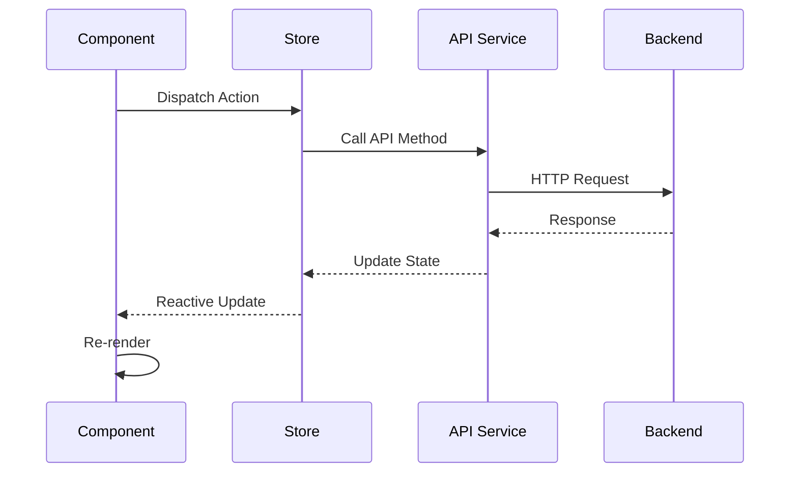
```mermaid
sequenceDiagram
    participant C as Component
    participant S as Store
    participant A as API Service
    participant B as Backend
    
    C->>S: Dispatch Action
    S->>A: Call API Method
    A->>B: HTTP Request
    B-->>A: Response
    A-->>S: Update State
    S-->>C: Reactive Update
    C->>C: Re-render
```

### API Integration Design

#### HTTP Client Configuration

The API client is built on Axios with the following features:

- Base URL configuration from environment variables
- Automatic authentication token injection
- Request/response interceptors for error handling
- Automatic token refresh on 401 responses
- Request timeout configuration
- Request cancellation support
- Response data transformation

#### Error Handling Strategy

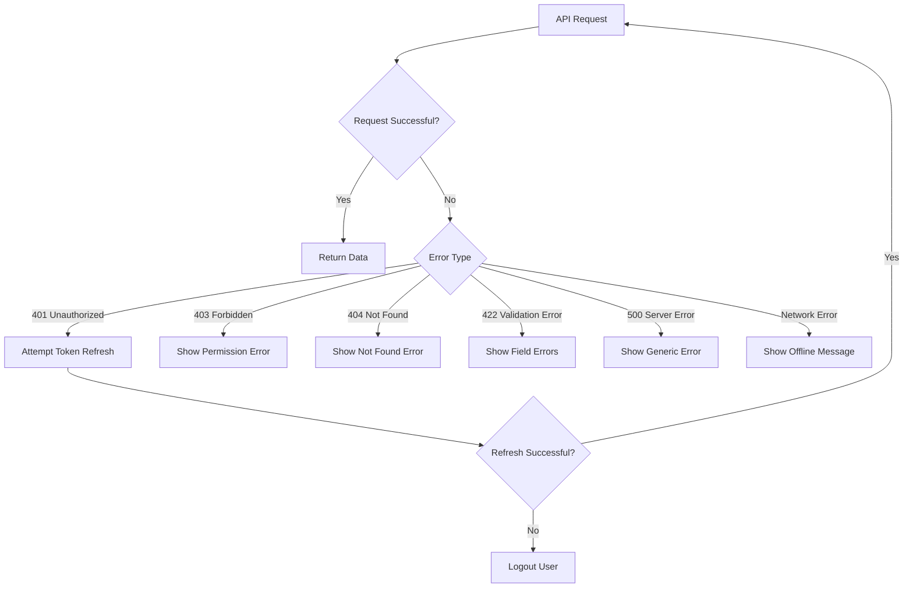
```mermaid
flowchart TD
    A[API Request] --> B{Request Successful?}
    B -->|Yes| C[Return Data]
    B -->|No| D{Error Type}
    D -->|401 Unauthorized| E[Attempt Token Refresh]
    D -->|403 Forbidden| F[Show Permission Error]
    D -->|404 Not Found| G[Show Not Found Error]
    D -->|422 Validation Error| H[Show Field Errors]
    D -->|500 Server Error| I[Show Generic Error]
    D -->|Network Error| J[Show Offline Message]
    E --> K{Refresh Successful?}
    K -->|Yes| A
    K -->|No| L[Logout User]
```

### Authentication Flow

#### Login Process

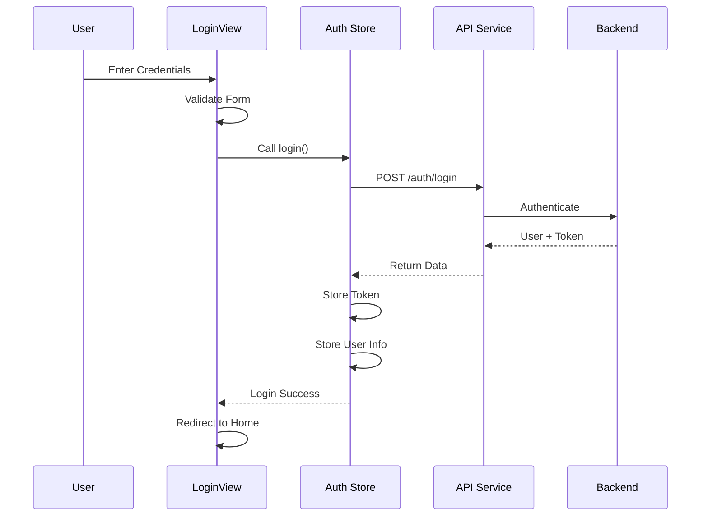
```mermaid
sequenceDiagram
    participant U as User
    participant L as LoginView
    participant A as Auth Store
    participant API as API Service
    participant B as Backend
    
    U->>L: Enter Credentials
    L->>L: Validate Form
    L->>A: Call login()
    A->>API: POST /auth/login
    API->>B: Authenticate
    B-->>API: User + Token
    API-->>A: Return Data
    A->>A: Store Token
    A->>A: Store User Info
    A-->>L: Login Success
    L->>L: Redirect to Home
```

#### Registration Process

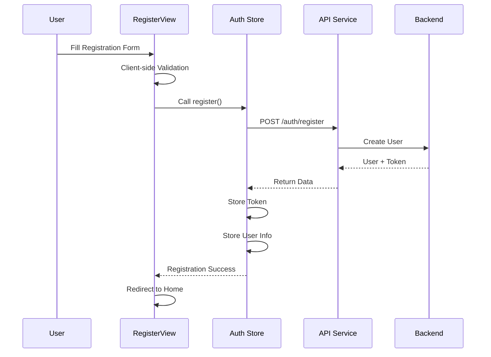
```mermaid
sequenceDiagram
    participant U as User
    participant R as RegisterView
    participant A as Auth Store
    participant API as API Service
    participant B as Backend
    
    U->>R: Fill Registration Form
    R->>R: Client-side Validation
    R->>A: Call register()
    A->>API: POST /auth/register
    API->>B: Create User
    B-->>API: User + Token
    API-->>A: Return Data
    A->>A: Store Token
    A->>A: Store User Info
    A-->>R: Registration Success
    R->>R: Redirect to Home
```

#### OAuth Flow

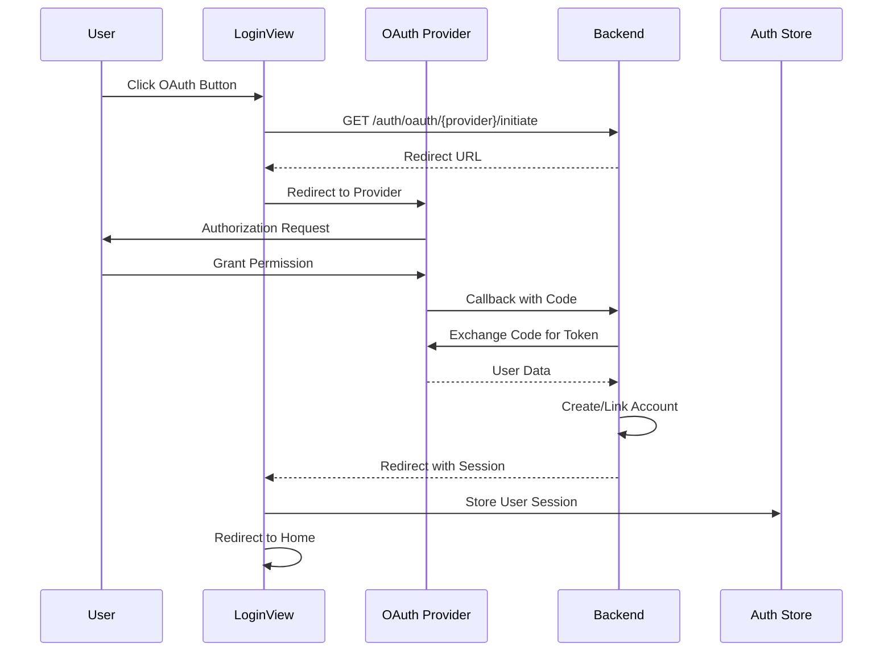
```mermaid
sequenceDiagram
    participant U as User
    participant L as LoginView
    participant P as OAuth Provider
    participant B as Backend
    participant A as Auth Store
    
    U->>L: Click OAuth Button
    L->>B: GET /auth/oauth/{provider}/initiate
    B-->>L: Redirect URL
    L->>P: Redirect to Provider
    P->>U: Authorization Request
    U->>P: Grant Permission
    P->>B: Callback with Code
    B->>P: Exchange Code for Token
    P-->>B: User Data
    B->>B: Create/Link Account
    B-->>L: Redirect with Session
    L->>A: Store User Session
    L->>L: Redirect to Home
```

### Theme System Design

#### Theme Structure

Each theme consists of CSS custom properties that define colors, spacing, typography, and other visual properties.

| Theme | Use Case | Primary Color | Background |
|-------|----------|---------------|------------|
| Light | Default, daytime use | Blue | White |
| Dark | Night mode, low light | Purple | Dark gray |
| Green | Nature theme | Green | Light green |
| Cream | Warm, cozy | Brown | Beige |
| Blue | Professional | Blue | Light blue |
| High Contrast | Accessibility | Black | White |

#### Theme Switching Mechanism

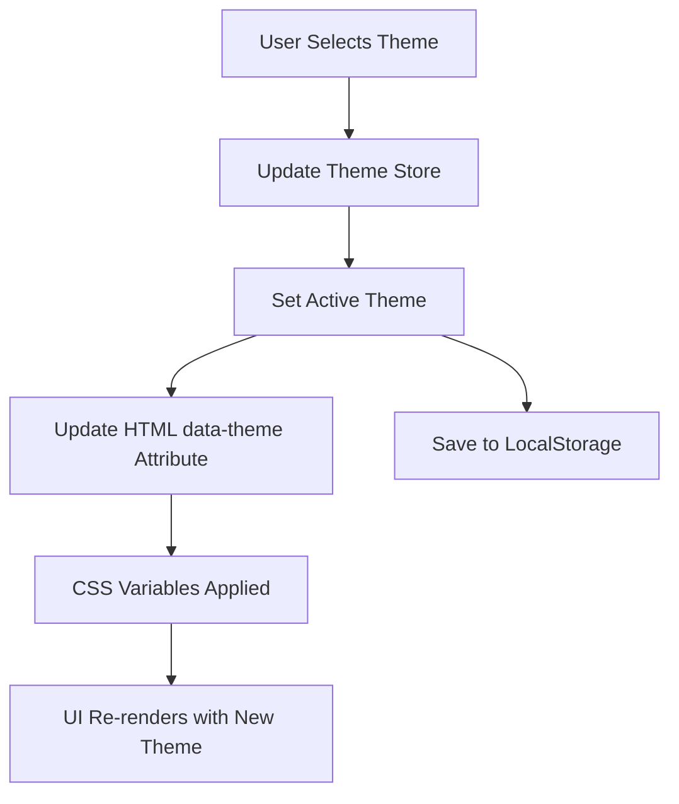
```mermaid
flowchart TD
    A[User Selects Theme] --> B[Update Theme Store]
    B --> C[Set Active Theme]
    C --> D[Update HTML data-theme Attribute]
    C --> E[Save to LocalStorage]
    D --> F[CSS Variables Applied]
    F --> G[UI Re-renders with New Theme]
```

## Feature Implementation Design

### Home Feed

#### Feed Loading Strategy

The home feed implements infinite scrolling with the following behavior:

- Initial load: Fetch 20 most recent posts from subscribed walls
- Scroll trigger: Load next page when user reaches 80% of current content
- Optimistic rendering: Show loading skeleton while fetching
- Empty state: Display onboarding message for new users
- Error state: Allow retry with exponential backoff

#### Post Filtering and Sorting

| Filter Type | Options |
|-------------|---------|
| Content Type | All, Text Only, Media, AI Apps |
| Time Range | Today, This Week, This Month, All Time |
| Source | Following, All, Specific Wall |
| Sort Order | Recent, Popular, Trending |

### Post Creation

#### Post Creation Flow

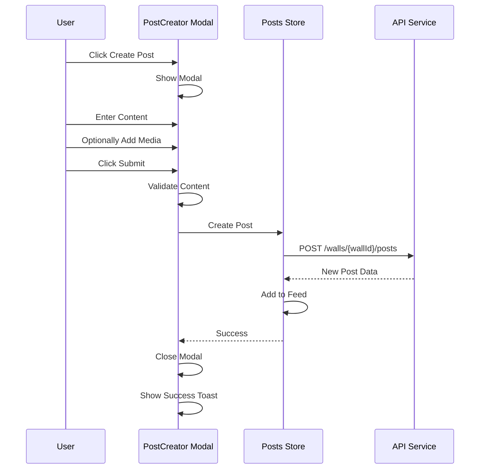
```mermaid
sequenceDiagram
    participant U as User
    participant M as PostCreator Modal
    participant S as Posts Store
    participant API as API Service
    
    U->>M: Click Create Post
    M->>M: Show Modal
    U->>M: Enter Content
    U->>M: Optionally Add Media
    U->>M: Click Submit
    M->>M: Validate Content
    M->>S: Create Post
    S->>API: POST /walls/{wallId}/posts
    API-->>S: New Post Data
    S->>S: Add to Feed
    S-->>M: Success
    M->>M: Close Modal
    M->>M: Show Success Toast
```

#### Media Upload Handling

- File type validation: Images (JPEG, PNG, WebP), Videos (MP4, WebM), GIFs
- Size limits: Images max 10MB, Videos max 100MB
- Preview generation before upload
- Progress tracking during upload
- Multiple file support (up to 4 attachments)
- Drag-and-drop interface

### AI Generation

#### Generation Request Flow

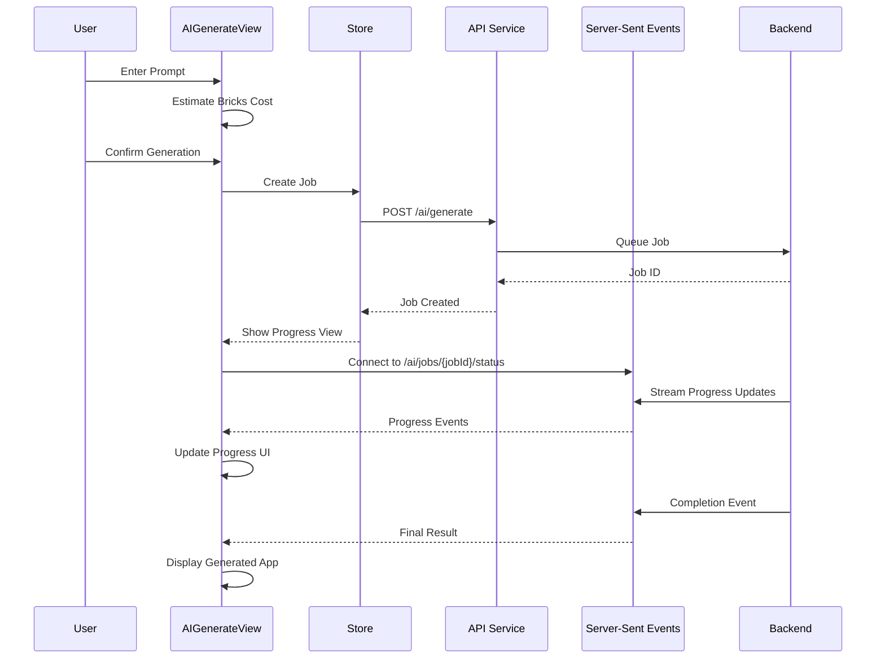
```mermaid
sequenceDiagram
    participant U as User
    participant AI as AIGenerateView
    participant S as Store
    participant API as API Service
    participant SSE as Server-Sent Events
    participant B as Backend
    
    U->>AI: Enter Prompt
    AI->>AI: Estimate Bricks Cost
    U->>AI: Confirm Generation
    AI->>S: Create Job
    S->>API: POST /ai/generate
    API->>B: Queue Job
    B-->>API: Job ID
    API-->>S: Job Created
    S-->>AI: Show Progress View
    AI->>SSE: Connect to /ai/jobs/{jobId}/status
    B->>SSE: Stream Progress Updates
    SSE-->>AI: Progress Events
    AI->>AI: Update Progress UI
    B->>SSE: Completion Event
    SSE-->>AI: Final Result
    AI->>AI: Display Generated App
```

#### Progress Tracking

The AI generation view displays real-time progress with the following information:

| Metric | Description |
|--------|-------------|
| Queue Position | Current position in FIFO queue |
| Estimated Wait Time | Based on average generation time |
| Generation Phase | Analyzing, Generating, Finalizing |
| Tokens Used | Current vs estimated token count |
| Bricks Consumed | Real-time cost tracking |
| Elapsed Time | Time since job creation |

### Comments System

#### Comment Thread Structure

Comments support nested threading with the following rules:

- Maximum nesting depth: 5 levels
- Threading indication: Visual indent and connection lines
- Collapse/expand: Ability to hide/show reply chains
- Load more: Paginated loading for long threads
- Sorting options: Newest, Oldest, Most Reactions

#### Comment Interaction Flow

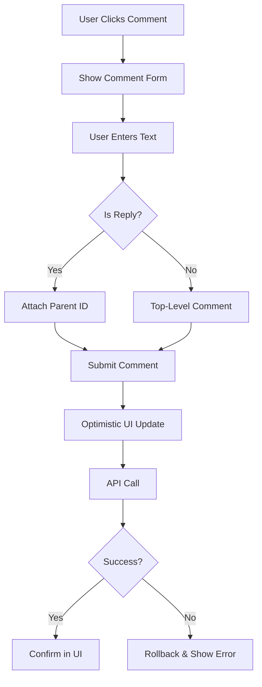
```mermaid
flowchart TD
    A[User Clicks Comment] --> B[Show Comment Form]
    B --> C[User Enters Text]
    C --> D{Is Reply?}
    D -->|Yes| E[Attach Parent ID]
    D -->|No| F[Top-Level Comment]
    E --> G[Submit Comment]
    F --> G
    G --> H[Optimistic UI Update]
    H --> I[API Call]
    I --> J{Success?}
    J -->|Yes| K[Confirm in UI]
    J -->|No| L[Rollback & Show Error]
```

### Messaging System

#### Conversation Management

The messaging interface supports:

- One-on-one conversations
- Group chats (up to 50 participants)
- Conversation search and filtering
- Unread message indicators
- Typing indicators (via WebSocket)
- Read receipts
- Message reactions

#### Real-Time Message Flow

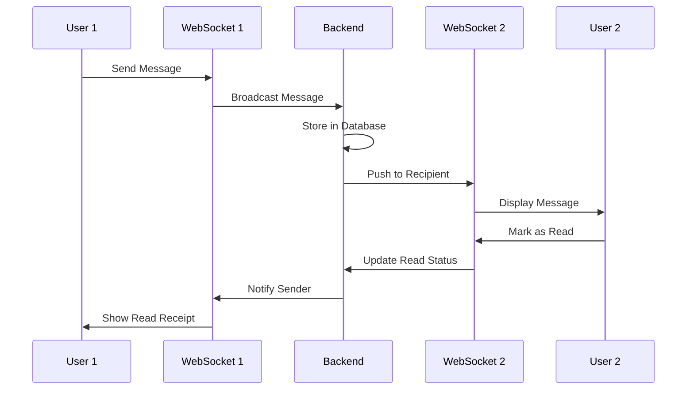
```mermaid
sequenceDiagram
    participant U1 as User 1
    participant WS1 as WebSocket 1
    participant B as Backend
    participant WS2 as WebSocket 2
    participant U2 as User 2
    
    U1->>WS1: Send Message
    WS1->>B: Broadcast Message
    B->>B: Store in Database
    B->>WS2: Push to Recipient
    WS2->>U2: Display Message
    U2->>WS2: Mark as Read
    WS2->>B: Update Read Status
    B->>WS1: Notify Sender
    WS1->>U1: Show Read Receipt
```

### Search and Discovery

#### Search Implementation

The search feature supports multi-faceted search with the following capabilities:

| Search Type | Indexed Fields | Filters |
|-------------|----------------|---------|
| Posts | Content, Tags | Date, Wall, Media Type |
| Walls | Name, Description, Tags | Category, Popularity |
| Users | Username, Display Name, Bio | Online Status, Mutual Friends |
| AI Apps | Prompt, Description, Tags | Category, Remixes Count |

#### Search Results Flow

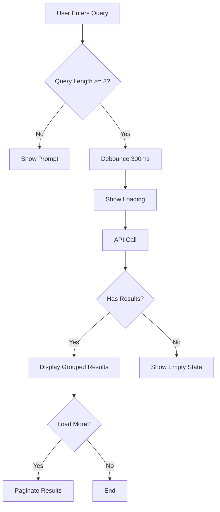
```mermaid
flowchart TD
    A[User Enters Query] --> B{Query Length >= 3?}
    B -->|No| C[Show Prompt]
    B -->|Yes| D[Debounce 300ms]
    D --> E[Show Loading]
    E --> F[API Call]
    F --> G{Has Results?}
    G -->|Yes| H[Display Grouped Results]
    G -->|No| I[Show Empty State]
    H --> J{Load More?}
    J -->|Yes| K[Paginate Results]
    J -->|No| L[End]
```

### Notifications

#### Notification Types

| Type | Trigger | Priority | Display |
|------|---------|----------|---------|
| Post Reaction | Someone reacts to user's post | Low | Icon + Count |
| Comment | New comment on user's post | Medium | Preview + Link |
| Mention | User mentioned in post/comment | High | Full Context |
| Follow | New wall subscription | Medium | User Info |
| Friend Request | Incoming friend request | Medium | Accept/Decline |
| AI Completion | Generation job finished | High | Link to Result |
| Message | New direct message | High | Message Preview |
| System | Platform announcements | Variable | Full Content |

#### Notification Delivery

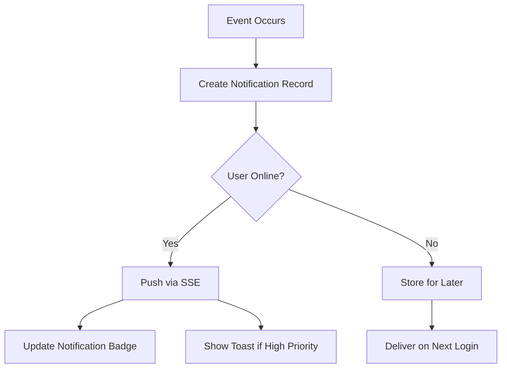
```mermaid
flowchart TD
    A[Event Occurs] --> B[Create Notification Record]
    B --> C{User Online?}
    C -->|Yes| D[Push via SSE]
    C -->|No| E[Store for Later]
    D --> F[Update Notification Badge]
    D --> G[Show Toast if High Priority]
    E --> H[Deliver on Next Login]
```

### Settings and Preferences

#### Settings Categories

**Account Settings**
- Username and display name modification
- Email and password change
- Account privacy controls
- Two-factor authentication setup

**Profile Settings**
- Avatar and cover image upload
- Bio and location information
- Social links management
- Profile visibility settings

**Notification Preferences**
- Per-type notification toggles
- Email notification settings
- Push notification preferences
- Notification frequency controls

**Theme and Appearance**
- Theme selection
- Font size preferences
- Compact/comfortable view mode
- Color customization (future)

**Privacy and Security**
- Blocked users management
- Wall privacy settings
- Message privacy controls
- Data export request

**AI and Bricks**
- Default AI model preference
- Generation budget limits
- Bricks purchase history
- Daily claim reminders

## Component Design Patterns

### Composition API Patterns

All components use the Composition API with script setup syntax for better code organization and type inference.

#### Component Structure Template

```
Component consists of:

Template Section:
- Semantic HTML structure
- Conditional rendering with v-if/v-show
- List rendering with v-for and keys
- Event bindings with v-on or @
- Two-way binding with v-model
- Dynamic classes and styles

Script Section (setup):
- Import statements for dependencies
- Props definition with TypeScript types
- Composable imports (useState, useRouter, etc.)
- Reactive state using ref() and reactive()
- Computed properties
- Methods and event handlers
- Lifecycle hooks (onMounted, onUnmounted, etc.)
- Side effects with watch/watchEffect

Style Section:
- Scoped styles specific to component
- Utilizes CSS custom properties from theme
- Responsive design considerations
```

### Composables Design

Composables encapsulate reusable logic following the "use" naming convention.

#### Example: useAuth Composable

**Responsibilities:**
- Access current authentication state
- Provide login/logout methods
- Check user permissions
- Handle token refresh
- Expose loading and error states

**Interface:**
- `user`: Reactive reference to current user object or null
- `isAuthenticated`: Computed boolean indicating auth status
- `isLoading`: Reactive boolean for async operations
- `error`: Reactive error state
- `login(credentials)`: Async method to authenticate
- `logout()`: Method to clear session
- `register(userData)`: Async method to create account
- `checkPermission(permission)`: Method to verify access rights

#### Example: useInfiniteScroll Composable

**Responsibilities:**
- Detect scroll position
- Trigger load more callback
- Manage loading state
- Handle end of data

**Interface:**
- `targetRef`: Template ref for scroll container
- `isLoading`: Reactive loading state
- `hasMore`: Reactive boolean for more data availability
- `loadMore()`: Method called when threshold reached
- `reset()`: Method to reset scroll state

### Accessibility Considerations

All components implement WCAG 2.1 Level AA standards:

- Semantic HTML elements (header, nav, main, article, section)
- ARIA labels and roles where semantic HTML insufficient
- Keyboard navigation support (Tab, Enter, Escape, Arrow keys)
- Focus management (visible focus indicators, focus trapping in modals)
- Screen reader announcements for dynamic content
- Color contrast ratios meeting 4.5:1 minimum
- Text resizable up to 200% without loss of functionality
- Skip links for main navigation

## Performance Optimization Strategy

### Code Splitting

The application implements route-based code splitting:

- Each view component loaded as separate chunk
- Heavy components lazy loaded on demand
- Third-party libraries bundled separately
- Shared components in common chunk

### Asset Optimization

| Asset Type | Optimization Strategy |
|------------|----------------------|
| Images | WebP format with fallbacks, lazy loading, responsive images |
| Fonts | WOFF2 format, font-display: swap, subset to used characters |
| CSS | Critical CSS inlined, non-critical loaded async |
| JavaScript | Tree shaking, minification, gzip/brotli compression |

### Caching Strategy

**Application Cache**
- Service Worker for offline functionality (future enhancement)
- Cache API for static assets
- IndexedDB for offline data storage (future enhancement)

**HTTP Caching**
- Immutable assets with hash-based filenames
- Cache-Control headers for optimal browser caching
- ETags for conditional requests

**State Caching**
- Store previously fetched data in Pinia stores
- Implement stale-while-revalidate pattern
- Cache invalidation on mutations

### Performance Metrics

Target performance benchmarks:

| Metric | Target | Measurement Tool |
|--------|--------|------------------|
| First Contentful Paint | < 1.5s | Lighthouse |
| Largest Contentful Paint | < 2.5s | Lighthouse |
| Time to Interactive | < 3.5s | Lighthouse |
| Cumulative Layout Shift | < 0.1 | Lighthouse |
| First Input Delay | < 100ms | Lighthouse |
| Bundle Size (gzipped) | < 300KB | webpack-bundle-analyzer |

## Build and Deployment

### Development Environment

**Local Development Setup:**

1. Prerequisites installation (Node.js 18+, npm/pnpm)
2. Clone repository and install dependencies
3. Configure environment variables
4. Start Vite development server
5. Connect to backend API (local or staging)

**Development Server Features:**
- Hot Module Replacement for instant updates
- Source maps for debugging
- API proxy configuration to avoid CORS
- Mock data option for offline development

### Build Process

**Production Build Steps:**

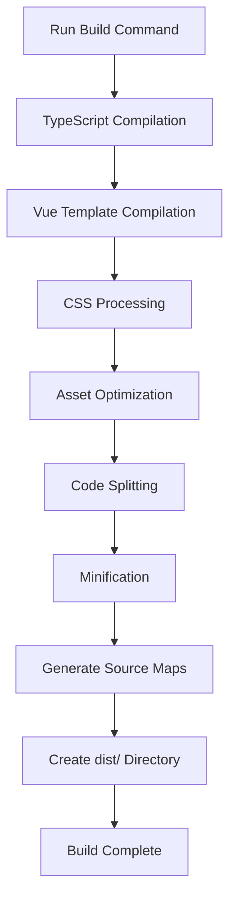
```mermaid
flowchart TD
    A[Run Build Command] --> B[TypeScript Compilation]
    B --> C[Vue Template Compilation]
    C --> D[CSS Processing]
    D --> E[Asset Optimization]
    E --> F[Code Splitting]
    F --> G[Minification]
    G --> H[Generate Source Maps]
    H --> I[Create dist/ Directory]
    I --> J[Build Complete]
```

**Build Outputs:**
- `dist/index.html`: Entry point with inlined critical CSS
- `dist/assets/`: JavaScript chunks, CSS files, optimized images
- `dist/assets/fonts/`: Web font files
- `dist/manifest.json`: PWA manifest (future)
- `dist/service-worker.js`: Service worker (future)

### Deployment Strategy

**Deployment Targets:**

| Environment | URL Pattern | Branch | Auto-Deploy |
|-------------|-------------|--------|-------------|
| Development | dev.wall.cyka.lol | develop | Yes |
| Staging | staging.wall.cyka.lol | staging | Yes |
| Production | wall.cyka.lol | main | Manual trigger |

**Deployment Process:**

1. CI/CD pipeline runs on git push
2. Install dependencies
3. Run linter and type checking
4. Execute unit tests
5. Build production bundle
6. Run E2E tests against build
7. Deploy to target environment
8. Run smoke tests
9. Notify team of deployment status

### Environment Configuration

Environment-specific settings managed through `.env` files:

| Variable | Description | Example |
|----------|-------------|---------|
| VITE_API_BASE_URL | Backend API endpoint | https://api.wall.cyka.lol |
| VITE_WS_URL | WebSocket server URL | wss://ws.wall.cyka.lol |
| VITE_OLLAMA_URL | Ollama API URL | http://localhost:11434 |
| VITE_ENABLE_ANALYTICS | Enable tracking | true/false |
| VITE_SENTRY_DSN | Error tracking DSN | https://... |
| VITE_OAUTH_GOOGLE_CLIENT_ID | Google OAuth ID | xxx.apps.googleusercontent.com |
| VITE_OAUTH_YANDEX_CLIENT_ID | Yandex OAuth ID | xxx |

## Testing Strategy

### Unit Testing

**Framework:** Vitest with Vue Test Utils

**Coverage Targets:**
- Utility functions: 90%+
- Composables: 85%+
- Components: 75%+
- Stores: 85%+
- Overall: 80%+

**Testing Focus:**
- Component rendering with various props
- User interactions (clicks, inputs, navigation)
- Computed properties and reactive state
- API response handling
- Error states and edge cases

### Integration Testing

**Framework:** Vitest with test harness

**Test Scenarios:**
- Complete user flows (login -> create post -> comment)
- Store interactions with API services
- Router navigation with guards
- Theme switching across components
- Real-time updates via SSE/WebSocket

### End-to-End Testing

**Framework:** Cypress

**Critical Paths:**
- User registration and login
- Post creation with media upload
- AI application generation
- Commenting and reactions
- Direct messaging
- Theme switching
- Mobile responsive behavior

### Accessibility Testing

**Tools:**
- axe-core for automated checks
- Manual keyboard navigation testing
- Screen reader testing (NVDA/JAWS)
- Color contrast validation

## Migration Approach

### Phased Migration Strategy

The migration from vanilla JavaScript to Vue.js follows an incremental approach:

**Phase 1: Foundation Setup (Week 1-2)**
- Initialize Vue 3 project with Vite
- Configure TypeScript, ESLint, Prettier
- Set up project structure
- Implement build pipeline
- Create base layouts and routing

**Phase 2: Authentication & Core (Week 3)**
- Migrate authentication pages
- Implement auth store and composable
- Set up API client
- Create common components (Button, Input, Modal, Toast)
- Implement theme system

**Phase 3: Home Feed & Posts (Week 4-5)**
- Build home feed view
- Create post card component
- Implement post creator
- Add infinite scrolling
- Integrate post API endpoints

**Phase 4: Walls & Profiles (Week 6)**
- Develop wall view
- Create profile page
- Build user info components
- Implement follow/subscription logic

**Phase 5: Social Features (Week 7-8)**
- Add reactions system
- Build comments components
- Implement notifications
- Create discover page

**Phase 6: AI Generation (Week 9-10)**
- Build AI generator form
- Implement SSE progress tracking
- Create AI app display components
- Add bricks management

**Phase 7: Messaging (Week 11-12)**
- Build conversation list
- Create message thread component
- Implement WebSocket integration
- Add typing indicators and read receipts

**Phase 8: Settings & Polish (Week 13)**
- Create settings views
- Add all preference controls
- Implement data export
- Build user management features

**Phase 9: Testing & Optimization (Week 14-15)**
- Write comprehensive tests
- Performance optimization
- Accessibility audit and fixes
- Cross-browser testing

**Phase 10: Deployment (Week 16)**
- Production build optimization
- Deploy to staging environment
- User acceptance testing
- Production deployment

### Data Migration Considerations

No data migration required as backend API remains unchanged. Frontend migration is purely client-side code refactoring.

### Backward Compatibility

The new Vue.js frontend will:
- Communicate with existing PHP backend APIs without modification
- Maintain current URL structure where possible
- Support existing authentication tokens
- Preserve theme preferences from localStorage
- Handle existing browser storage data gracefully

## Risk Assessment

### Technical Risks

| Risk | Impact | Likelihood | Mitigation Strategy |
|------|--------|------------|---------------------|
| Learning curve for Vue.js | Medium | Medium | Provide training resources, pair programming |
| Bundle size increase | Medium | Low | Code splitting, tree shaking, performance monitoring |
| Browser compatibility issues | Low | Low | Polyfills, progressive enhancement, testing |
| API integration problems | High | Low | Comprehensive API documentation, mock servers |
| SSE/WebSocket connection stability | Medium | Medium | Fallback polling, automatic reconnection |
| State management complexity | Medium | Medium | Clear store organization, documentation |

### Development Risks

| Risk | Impact | Likelihood | Mitigation Strategy |
|------|--------|------------|---------------------|
| Timeline overrun | High | Medium | Phased approach, regular checkpoints, buffer time |
| Scope creep | Medium | High | Clear requirements, change control process |
| Testing gaps | High | Medium | Test-driven development, automated testing |
| Team knowledge gaps | Medium | Low | Training, documentation, code reviews |

## Success Criteria

The migration is considered successful when:

### Functional Completeness
- All 10 planned pages functional
- All existing features reimplemented
- All 77 API endpoints integrated
- Real-time features operational (SSE, WebSocket)
- All 6 themes working correctly

### Performance Benchmarks
- Lighthouse score ≥ 90 across all metrics
- Initial load time < 3 seconds
- Route navigation < 500ms
- Infinite scroll smooth at 60fps

### Quality Standards
- Test coverage ≥ 80%
- Zero critical accessibility issues
- Cross-browser compatibility (Chrome, Firefox, Safari, Edge)
- Mobile responsive on all breakpoints
- No console errors or warnings

### User Experience
- Intuitive navigation
- Consistent visual design
- Smooth animations and transitions
- Helpful error messages
- Loading states for all async operations

## Maintenance and Extensibility

### Code Maintainability

**Code Quality Standards:**
- TypeScript strict mode enabled
- ESLint and Prettier enforced via pre-commit hooks
- Component naming conventions documented
- Clear file and folder organization
- Comprehensive inline documentation

**Development Practices:**
- Pull request reviews required
- Automated CI/CD checks
- Regular dependency updates
- Security vulnerability scanning

### Extensibility Considerations

The architecture supports future enhancements:

**Planned Features:**
- Progressive Web App capabilities
- Offline mode with service workers
- Push notifications
- Advanced AI features (image generation, code analysis)
- Plugin system for third-party integrations
- Theming API for custom themes
- Widget marketplace for wall customization

**Extension Points:**
- Composables for reusable logic
- Plugin system for Vue Router and Pinia
- Component slot system for customization
- Event bus for cross-component communication
- API client interceptors for custom behavior

## Documentation Requirements

### Developer Documentation

**Required Documentation:**
- Project setup and installation guide
- Architecture overview and design decisions
- Component library with usage examples
- API integration guide
- State management patterns
- Coding standards and conventions
- Testing guidelines
- Deployment procedures

### User Documentation

**End-User Guides:**
- Getting started guide
- Feature tutorials (creating posts, AI generation, etc.)
- Theme customization guide
- Privacy and security best practices
- FAQ and troubleshooting

### API Documentation

**Integration Docs:**
- Complete API endpoint reference
- Request/response examples
- Authentication guide
- Error handling reference
- WebSocket protocol documentation
- SSE event specifications

## Timeline and Milestones

### Development Schedule

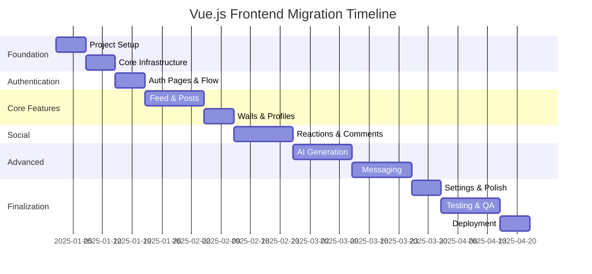
```mermaid
gantt
    title Vue.js Frontend Migration Timeline
    dateFormat YYYY-MM-DD
    section Foundation
    Project Setup           :2025-01-01, 7d
    Core Infrastructure     :2025-01-08, 7d
    section Authentication
    Auth Pages & Flow       :2025-01-15, 7d
    section Core Features
    Feed & Posts            :2025-01-22, 14d
    Walls & Profiles        :2025-02-05, 7d
    section Social
    Reactions & Comments    :2025-02-12, 14d
    section Advanced
    AI Generation           :2025-02-26, 14d
    Messaging               :2025-03-12, 14d
    section Finalization
    Settings & Polish       :2025-03-26, 7d
    Testing & QA            :2025-04-02, 14d
    Deployment              :2025-04-16, 7d
```

### Key Milestones

| Milestone | Target Date | Deliverables |
|-----------|-------------|--------------|
| M1: Foundation Complete | Week 2 | Project setup, routing, layouts |
| M2: Authentication Working | Week 3 | Login, register, auth flow |
| M3: Core Features Live | Week 7 | Feed, posts, profiles functional |
| M4: Social Complete | Week 9 | Comments, reactions, notifications |
| M5: AI Integration Done | Week 11 | AI generation with progress tracking |
| M6: Messaging Operational | Week 13 | Real-time messaging working |
| M7: Feature Complete | Week 14 | All features implemented |
| M8: Testing Complete | Week 15 | All tests passing, QA approved |
| M9: Production Ready | Week 16 | Deployed and stable |

## Appendix

### Technology Decision Matrix

| Consideration | Vue.js 3 | React 18 | Angular 15 | Selected |
|---------------|----------|----------|------------|----------|
| Learning Curve | Gentle | Moderate | Steep | Vue.js ✓ |
| Performance | Excellent | Excellent | Good | Vue.js ✓ |
| Bundle Size | Small | Small | Large | Vue.js ✓ |
| TypeScript | Excellent | Excellent | Native | Vue.js ✓ |
| Ecosystem | Mature | Mature | Mature | Tie |
| Documentation | Excellent | Good | Excellent | Vue.js ✓ |
| Community | Large | Largest | Large | React |
| Job Market | Good | Best | Good | React |

### CSS Framework Decision

| Framework | Pros | Cons | Selected |
|-----------|------|------|----------|
| Tailwind CSS | Utility-first, small bundle, flexible | Verbose HTML, learning curve | Considered |
| Custom CSS | Full control, existing styles | More maintenance | Preferred ✓ |
| Bootstrap | Complete, familiar | Opinionated, larger bundle | Not suitable |
| Vuetify | Vue-specific, Material Design | Heavy, opinionated | Not suitable |

Decision: Use custom CSS with existing theme system, optionally augment with Tailwind utilities.

### Browser Support Matrix

| Browser | Minimum Version | Support Level |
|---------|-----------------|---------------|
| Chrome | 90+ | Full |
| Firefox | 88+ | Full |
| Safari | 14+ | Full |
| Edge | 90+ | Full |
| Mobile Safari | 14+ | Full |
| Chrome Android | 90+ | Full |
| Samsung Internet | 15+ | Full |
| IE 11 | N/A | Not supported |

### Reference Materials

**Vue.js Resources:**
- Vue.js Official Documentation: https://vuejs.org
- Vue Router Documentation: https://router.vuejs.org
- Pinia Documentation: https://pinia.vuejs.org
- VueUse Documentation: https://vueuse.org

**TypeScript Resources:**
- TypeScript Handbook: https://www.typescriptlang.org/docs
- Vue TypeScript Guide: https://vuejs.org/guide/typescript

**Build Tools:**
- Vite Documentation: https://vitejs.dev
- Vitest Documentation: https://vitest.dev

**Design Patterns:**
- Vue.js Composition API Patterns: https://vuejs.org/guide/reusability/composables.html
- State Management Best Practices: https://pinia.vuejs.org/core-concepts/

### Glossary

| Term | Definition |
|------|------------|
| Composition API | Vue.js API style using setup() and composition functions |
| Composable | Reusable stateful logic function following "use" convention |
| Pinia | Official state management library for Vue.js |
| SSE | Server-Sent Events, one-way real-time communication from server |
| SFC | Single File Component, Vue file with template, script, and style |
| HMR | Hot Module Replacement, live code updates without page refresh |
| Tree Shaking | Eliminating unused code from final bundle |
| Code Splitting | Breaking application into smaller chunks loaded on demand |
| Hydration | Process of making server-rendered HTML interactive on client |
| Reactivity | Automatic UI updates when underlying data changes |
