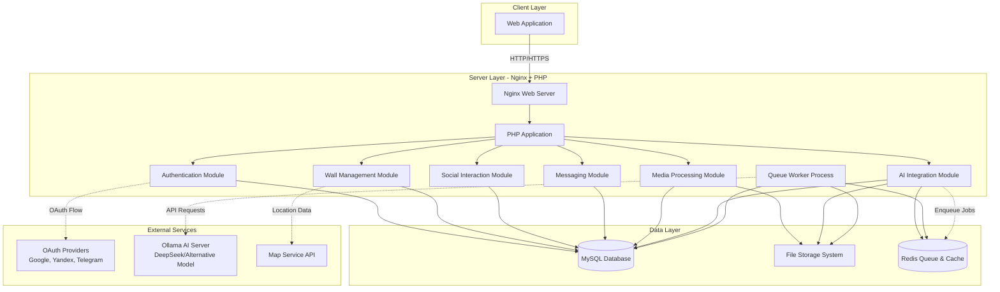
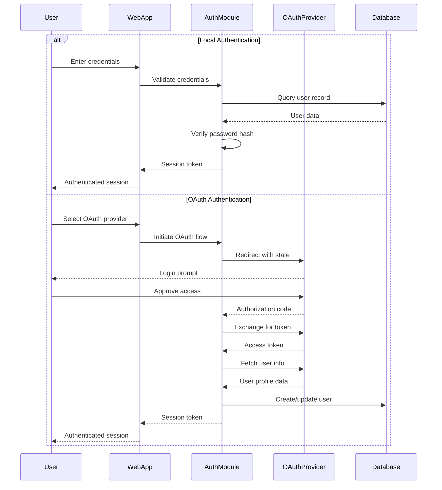
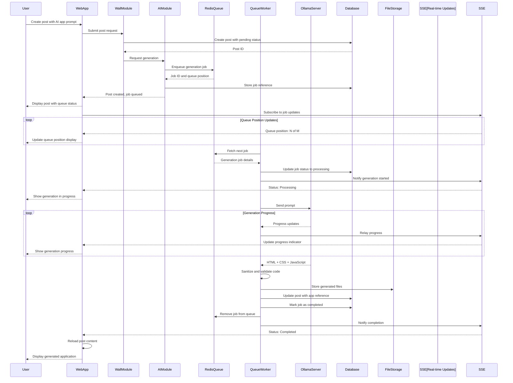
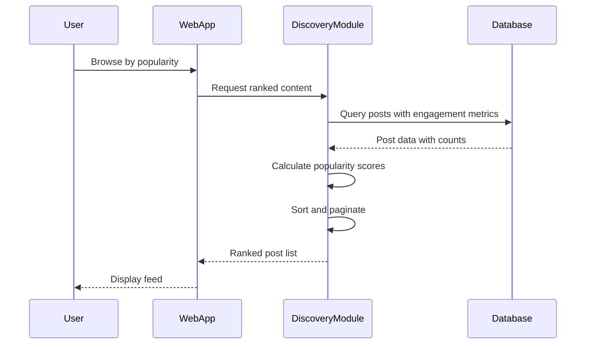
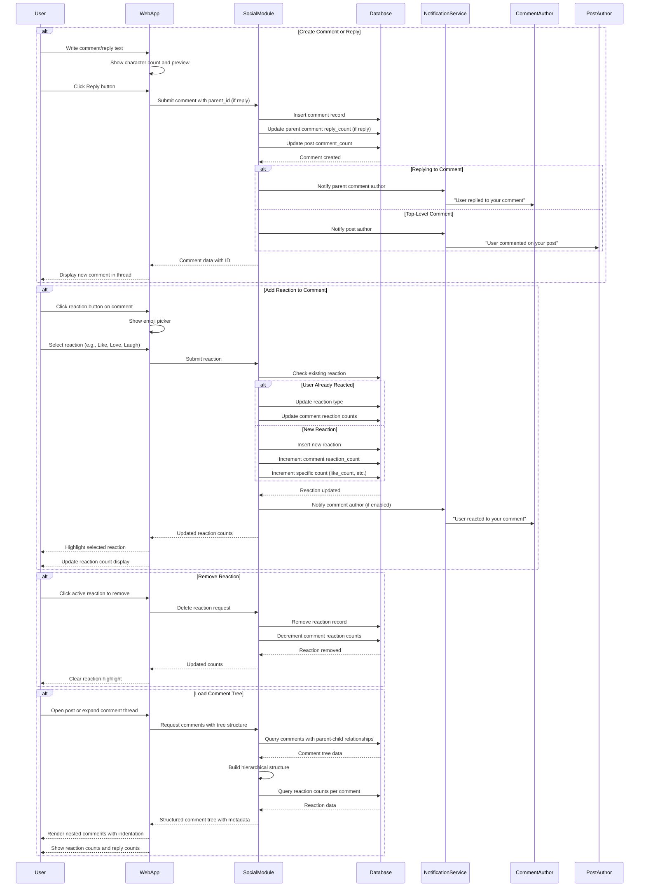
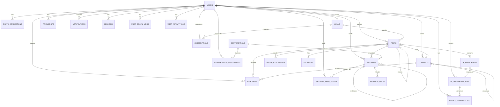

# Wall Social Platform - Design Document

## Project Overview

Wall Social Platform is a social networking service that enables users to create personalized walls where they can post messages with rich media content, AI-generated mini-applications, and interact with other users through reactions, comments, and reposts. The platform combines traditional social media features with innovative AI-powered content generation capabilities.

**Target Deployment**: Ubuntu server with Nginx, PHP, and MySQL

## Core Objectives

- Provide multiple authentication methods for easy user onboarding
- Enable users to create rich content on personal walls with media and AI-generated applications
- Foster community engagement through social interactions (reactions, comments, reposts)
- Facilitate content discovery through rating and popularity mechanisms
- Support private messaging and subscriptions for ongoing content updates

## Functional Requirements

### 1. User Authentication and Authorization

#### 1.1 Authentication Methods

**Local Authentication**
- Username/password-based registration and login
- Password requirements: minimum length, complexity rules
- Password recovery mechanism via email
- Account email verification

**Third-Party OAuth Integration**
- Google OAuth 2.0
- Yandex OAuth
- Telegram authentication
- Additional popular OAuth providers (Facebook, VK, GitHub)

**Account Linking**
- Users can link multiple authentication methods to a single account
- Primary authentication method designation
- Unlinking capability with validation (ensure at least one method remains)

#### 1.2 Session Management

- Secure session token generation and validation
- Session expiration policies (configurable timeout)
- Remember me functionality (extended session)
- Multi-device session support
- Session revocation capability

#### 1.3 Authorization Levels

- Regular User: full access to own wall and content creation
- Wall Owner: additional permissions for wall customization and moderation
- Administrator: system-level access for user management and content moderation

### 2. User Wall System

#### 2.1 Wall Structure

**Wall Properties**
- Unique wall identifier (username or custom URL slug)
- Wall display name
- Wall description/bio
- Wall avatar and cover image
- Wall theme and customization settings
- Privacy settings (public, followers-only, private)
- Creation and last update timestamps

**Wall Settings**
- Enable/disable comments globally
- Enable/disable reactions
- Enable/disable reposts
- Content moderation options (keyword filters, manual approval)
- Visibility settings for different content types

#### 2.2 Post Creation

**Post Types**
- Text post with rich text editor
- Photo post (single or multiple images)
- Video post (upload or embed)
- Location post (map point integration)
- AI-generated application post
- Mixed media post (combination of above)

**Rich Text Editor Features**
- Text formatting (bold, italic, underline, strikethrough)
- Headings and paragraphs
- Lists (ordered and unordered)
- Links and mentions
- Code blocks
- Quotes and blockquotes
- Emoji support
- Character limit (configurable)

**Media Attachments**
- Image upload (JPEG, PNG, GIF, WebP)
- Image size limits and compression
- Video upload (MP4, WebM)
- Video size and duration limits
- Video thumbnail generation
- Multiple media items per post
- Media preview and gallery view

**Location Integration**
- Map service integration (OpenStreetMap, Google Maps, or Yandex Maps)
- Point selection on map
- Location name and description
- Privacy considerations for location sharing

#### 2.3 AI-Generated Applications

**Generation Process**
- User provides text prompt describing desired application
- System creates generation job and adds to queue
- User sees queue position in real-time on the post
- When job reaches front of queue, generation begins
- User sees generation progress status in real-time
- AI model generates HTML, CSS, and JavaScript code
- Generated code is sanitized and validated
- Preview before publishing
- Option to regenerate or edit manually

**Queue Management System**
- Redis-based job queue for AI generation requests
- FIFO (First-In-First-Out) processing order
- Configurable concurrent worker limit (default: 1-2 simultaneous generations)
- Job priority levels (normal, high for premium users if implemented)
- Queue position tracking and estimation
- Automatic job timeout and retry mechanisms
- Dead letter queue for failed jobs

**Real-Time Status Updates**
- WebSocket or Server-Sent Events (SSE) for live updates
- Status stages: queued, processing, completed, failed
- Queue position display (e.g., "Position 3 of 8 in queue")
- Estimated wait time based on average generation duration
- Progress indicators during generation phase
- Real-time token usage tracking during generation
- Live token count updates (tokens used so far)
- Estimated tokens remaining (if calculable from model)
- Elapsed generation time display
- Estimated time to completion
- Retry option on failure with error details

**In-Post Generation Display**
- Embedded status widget within the post containing AI generation
- Queue phase: "Waiting in queue - Position 3 of 8, ~5 minutes"
- Processing phase: Live progress bar with percentage
- Token counter: "Tokens used: 1,234 / ~2,000 estimated"
- Time elapsed: "Generating... 15s elapsed, ~30s remaining"
- Bricks consumption meter: "Bricks spent so far: 12 / ~20 estimated"
- Auto-refresh post content upon completion
- Fallback to polling if WebSocket/SSE unavailable

**AI Model Integration**
- Ollama server integration on Ubuntu backend
- Model selection: DeepSeek-Coder or alternative code generation model
- Prompt engineering for optimal application generation
- Token limits and generation timeouts
- Error handling for failed generations
- Resource usage monitoring per generation
- Token usage tracking for bricks calculation

**Bricks Cost Calculation**
- Estimate bricks cost before generation submission
- Display estimated cost to user (e.g., "~50 bricks")
- Calculate actual cost based on prompt and completion tokens
- Conversion formula: configurable tokens-to-bricks ratio (e.g., 100 tokens = 1 brick)
- Track token usage from Ollama API response
- Deduct bricks from user balance upon job completion
- Refund bricks if generation fails
- Display actual bricks spent after completion

**Application Sandbox**
- Generated applications run in isolated iframe
- Content Security Policy restrictions
- No external resource loading without approval
- Limited API access (no localStorage, cookies, or network requests)
- Size and complexity limits

**Application Storage**
- Store generated HTML, CSS, and JavaScript separately
- Version control for edited applications
- Application thumbnail/screenshot for preview

### 3. Social Interaction Features

#### 3.1 Reaction System

**Reaction Types**
- Like (positive)
- Dislike (negative)
- Extended emoji reactions (love, laugh, wow, sad, angry, celebrate, etc.)
- Custom reaction sets (configurable per wall or system-wide)

**Reaction Behavior**
- One reaction per user per post
- Ability to change reaction
- Ability to remove reaction
- Reaction count display per type
- Reaction animation and feedback

#### 3.2 Comment System

**Comment Structure**
- Comment author with avatar and username
- Comment text (rich text support, limited formatting)
- Comment timestamp (created and edited)
- Nested comments (threading support for dialogue trees)
- Comment editing (with edit history and edit indicator)
- Comment deletion (by author or wall owner)
- Comment metadata (reply count, reaction count)

**Threaded Comment System**
- Unlimited nesting depth for comment replies
- Each comment can receive replies, forming a dialogue tree
- Reply structure: parent-child relationship tracking
- Visual hierarchy: indentation or connecting lines for nested replies
- Expandable/collapsible comment threads
- "Reply" button on each comment to create a child comment
- "Show more replies" pagination for comments with many children
- Breadcrumb trail or context display for deeply nested comments
- Jump to parent comment functionality
- Sort options for comment threads:
  - Chronological (oldest first)
  - Reverse chronological (newest first)
  - Most reactions first
  - Most replies first

**Comment Display Interface**
- Top-level comments displayed under post
- Nested replies indented beneath parent comments
- Visual indicators (lines, indentation, or cards) showing reply relationships
- Each comment shows:
  - Author name and avatar
  - Comment text with formatting
  - Timestamp (e.g., "2 hours ago") with full date on hover
  - Reaction summary (count per reaction type)
  - Reply count (e.g., "3 replies")
  - Action buttons: Reply, React, Edit (if author), Delete (if authorized)
- Load more comments button or infinite scroll for long threads
- Highlighted new comments since last view
- Direct link to individual comments (permalink)

**Comment Composition**
- Text input with rich text editor (limited formatting: bold, italic, links, mentions)
- Character limit (e.g., 2000 characters per comment)
- Emoji picker integration
- @mention autocomplete for tagging users
- Preview before posting
- Auto-save draft comments
- Real-time character count
- Reply context display (shows parent comment when replying)

**Comment Reactions**
- Full reaction system identical to posts (like, dislike, extended emoji reactions)
- Each comment can receive multiple reaction types from different users
- One reaction per user per comment (can change or remove)
- Reaction count display per type
- Reaction button with emoji selector
- Reaction animation on click
- "Who reacted" tooltip or modal showing users per reaction type
- Reaction counts contribute to comment ranking/sorting

**Comment Likes and Dislikes**
- Dedicated Like button (thumbs up)
- Dedicated Dislike button (thumbs down)
- Like/dislike counts displayed separately or as net score
- Visual feedback when user has liked/disliked (highlighted button)
- Ability to remove like/dislike
- Cannot like and dislike same comment simultaneously
- Like/dislike data stored in Reactions table with specific reaction types

**Extended Emoji Reactions on Comments**
- Same emoji reaction palette as posts:
  - Love ❤️
  - Laugh 😂
  - Wow 😮
  - Sad 😢
  - Angry 😠
  - Celebrate 🎉
  - Additional custom reactions (configurable)
- Hover/click reaction button to reveal emoji picker
- Selected reactions highlighted for current user
- Aggregate reaction counts displayed next to comment
- Most popular reactions shown inline, others in "more" menu

**Comment Moderation**
- Wall owner can delete any comment on their posts
- Post author can delete comments on their own posts
- Comment author can delete own comments at any time
- Wall owner can hide/block specific users from commenting
- Hide individual comments (visible only to author and moderators)
- Spam detection and filtering
- Report comment functionality (spam, harassment, offensive content)
- Admin review queue for reported comments
- Automatic hiding of comments from blocked users

**Comment Notifications**
- Notify post author of new top-level comments
- Notify comment author when someone replies to their comment
- Notify users mentioned in comments (@username)
- Notify comment author when someone reacts to their comment (optional, configurable)
- Notification preferences per notification type
- Batch notifications for multiple interactions

**Comment Engagement Metrics**
- Total reaction count across all reaction types
- Reply count (direct child comments)
- Net like score (likes minus dislikes)
- Engagement score combining reactions and replies
- Most reacted comment highlighting
- Most replied comment highlighting

**Comment Threading Best Practices**
- Visual cues for deeply nested comments (e.g., color coding, depth indicators)
- "View in context" link for comments accessed directly (permalink)
- Collapse/expand all threads functionality
- Remember expanded/collapsed state per user session
- Limit initial loaded depth (e.g., show first 2 levels, load more on demand)
- Performance optimization for large comment trees (lazy loading, virtualization)

#### 3.3 Repost Functionality

**Repost Types**
- Simple repost (share original post to own wall)
- Repost with commentary (add text above original post)
- Quote repost (embed original post with new context)

**Repost Tracking**
- Original post attribution
- Repost count on original post
- Repost chain visualization
- Prevent circular repost loops

### 4. Content Discovery and Feed

#### 4.1 Wall Discovery

**Discovery Methods**
- Browse by rating (algorithmic score based on engagement)
- Browse by popularity (total reactions, comments, reposts)
- Browse by recent activity
- Browse by category/tags (if implemented)
- Search by username or wall name
- Trending walls (time-based popularity)

**Rating Algorithm**
- Factors: reaction count, comment count, repost count, recency
- Weighted scoring system
- Time decay for older posts
- Personalization based on user interests (optional)

#### 4.2 Subscription and Social Connection System

**Wall Subscription**
- Subscribe/follow specific walls to receive updates
- Unsubscribe/unfollow functionality
- Subscription privacy settings (public or private follower lists)
- Notification preferences per subscription (all posts, mentions only, none)

**User Friendship System**
- Send friend requests to other users
- Accept or decline friend requests
- Mutual friendship required for "friend" status
- Remove friends (unfriend functionality)
- Friend request expiration (optional, e.g., 30 days)

**Friendship vs Subscription**
- Subscription: One-way relationship, follow a wall without mutual consent
- Friendship: Two-way relationship, requires acceptance from both parties
- Friends automatically subscribe to each other's walls
- Friendship provides additional privileges (e.g., see friend-only posts)

**Follower/Following Counts**
- Display in user profile header
- Follower count: Number of users/walls subscribed to your wall
- Following count: Number of walls you subscribe to
- Friend count: Number of mutual friendships

**Subscription and Friend Management**
- Dedicated page listing all subscriptions
- Filter subscriptions by type (walls, users)
- Search within subscriptions
- Bulk unsubscribe option
- Sort by recent activity, name, subscription date
- Separate lists for:
  - Walls you follow
  - Users you follow
  - Your followers (who follows you)
  - Friend requests (pending incoming)
  - Sent friend requests (pending outgoing)
  - Your friends (confirmed mutual friendships)

**Profile Display**
- Followers count with link to followers list
- Following count with link to following list
- Friends count with link to friends list
- Quick stats: "X followers • Y following • Z friends"
- "Follow" or "Add Friend" button on other users' profiles
- Display friendship status (Friend, Request Sent, Request Pending, Not Friends)

**Privacy Controls**
- Hide follower list from public view (privacy setting)
- Hide following list from public view (privacy setting)
- Hide friend list from public view (privacy setting)
- Control who can send friend requests (everyone, friends of friends, no one)
- Control who can follow your wall (everyone, approved only, no one)

**News Feed**
- Chronological feed of subscribed walls' posts
- Separate filter for friends-only posts
- Algorithmic feed with prioritization based on engagement
- Filter by post type (all, text, media, AI apps, etc.)
- Filter by source (all subscriptions, friends only, specific walls)
- Mark posts as read functionality
- Infinite scroll or pagination
- Feed refresh and real-time updates for new content

**Notifications**
- New follower notification
- Friend request received notification
- Friend request accepted notification
- New post from followed wall notification (configurable)
- New comment on followed post notification (optional)
- Notification preferences per subscription/friend

#### 4.3 Search Functionality

**Search Scope**
- Search walls by name or description
- Search posts by content (title, text, AI prompt)
- Search users by username or display name
- Search tags or keywords
- Filter by post type (text, media, AI-generated apps, etc.)
- Filter by date range
- Filter by wall/author

**Search Implementation**
- Full-text search using MySQL FULLTEXT indexes
- Alternative: Elasticsearch for advanced search (optional)
- Search query sanitization and validation
- Minimum query length (e.g., 3 characters)
- Support for quoted phrases for exact matches
- Wildcard support for partial matching

**Search Results**
- Relevance-based ranking
- Filter and sort options (relevance, date, popularity)
- Result type grouping (walls, posts, users)
- Highlighting of matched terms in results
- Pagination with configurable page size
- Result count display
- "No results" suggestions and alternatives

**Advanced Search**
- Search within specific wall
- Search by author
- Search by date range
- Search by engagement metrics (minimum reactions, comments)
- Combine multiple filters

### 5. Private Messaging and Conversations

#### 5.1 Conversation Types and Structure

**Direct Messages (One-on-One)**
- Private conversations between two users
- Automatic conversation creation on first message
- Conversation persists until deleted by both participants
- Unique conversation per user pair

**Group Chats**
- Multi-user conversations (3+ participants)
- Group chat creation with initial participant selection
- Group chat name and description (optional)
- Group avatar/icon (optional)
- Maximum participants limit (configurable, e.g., 50-100)

**Conversation Metadata**
- Conversation ID (unique identifier)
- Conversation type (direct, group)
- Created timestamp
- Last activity timestamp
- Total message count
- Unread message count per participant

#### 5.2 Message Features

**Text Messages**
- Plain text messages with emoji support
- Rich text formatting (bold, italic, links)
- Message length limit (configurable, e.g., 5000 characters)
- Line breaks and paragraph support
- URL auto-detection and preview

**Media Attachments**
- Image attachments (JPEG, PNG, GIF, WebP)
- Video attachments (MP4, WebM)
- Multiple media items per message (up to 10)
- Media preview thumbnails
- Full-size media viewer
- File size limits per attachment

**Wall Post Sharing**
- Share posts from your own wall to conversations
- Share posts from other users' walls to conversations
- Shared post displays as embedded card with:
  - Original author information
  - Post content preview (text, media thumbnail, AI app preview)
  - Link to original post
  - Post metadata (date, reaction count)
  - Original wall reference
- Shared AI-generated applications show preview and link
- Shared posts update if original is edited (or show "deleted" if removed)
- Multiple post shares in single message thread

**Message Actions**
- Edit own messages (with edit indicator)
- Delete own messages (soft delete or hard delete options)
- Reply to specific messages (threading/quoting)
- Forward messages to other conversations
- Copy message text
- React to messages with emoji (optional enhancement)

**Real-Time Features**
- Typing indicators ("User is typing...")
- Read receipts ("Seen by X, Y, Z")
- Online status indicators
- Delivery confirmations
- Real-time message delivery via WebSocket/SSE

#### 5.3 Group Chat Management

**Creating Group Chats**
- Select participants from friends list or search users
- Set group name and optional description
- Upload group avatar (optional)
- Minimum participants: 3 users (including creator)
- Creator becomes initial admin

**Inviting Participants**
- Current participants can invite new users
- Invitation notifications sent to invited users
- Accept/decline invitation (or auto-join based on settings)
- Maximum participant limit enforcement
- Invitation link generation (optional)

**Participant Roles**
- **Admin**: Full control over group settings, can remove participants, assign roles
- **Member**: Standard participant, can send messages and invite others
- **Read-Only**: Can view messages but not send (optional)
- Creator is permanent admin (cannot be removed)
- Multiple admins allowed

**Group Settings**
- Change group name and description (admin only)
- Change group avatar (admin only)
- Change who can invite (admins only, all members)
- Change who can send messages (all members, admins only)
- Mute notifications for group
- Leave group (any participant)
- Delete group (creator only)

**Participant Management**
- View participant list with roles
- Remove participants (admin only)
- Promote/demote to admin (admin only)
- Transfer creator ownership (creator only)
- View participant join dates
- Search participants in large groups

#### 5.4 Conversation List and Organization

**Conversation List Display**
- All conversations sorted by last activity
- Conversation name or participant names
- Last message preview (first 50-100 characters)
- Timestamp of last message
- Unread message count badge
- Conversation avatar (user avatar or group icon)
- Pinned conversations at top
- Typing indicator for active conversations

**Conversation Organization**
- Pin/unpin important conversations
- Archive conversations (hide from main list)
- Mute conversation notifications
- Mark conversation as unread
- Mark all messages as read
- Delete conversation (leaves group if applicable)

**Search and Filters**
- Search conversations by name or participant
- Search message content within conversations
- Filter by conversation type (all, direct, groups)
- Filter by unread status
- Filter by archived status
- Sort by recent activity, name, or unread count

#### 5.5 Message View and Interaction

**Message Display**
- Chronological message order (oldest to newest)
- Grouped messages by sender and time
- Sender avatar and name
- Message timestamp
- Edit indicator ("edited")
- Delivery and read status icons
- Threaded replies indented or connected

**Infinite Scroll**
- Load recent messages on conversation open
- Load older messages on scroll up
- Jump to latest message button
- Jump to first unread message on open
- Smooth scrolling performance

**Message Composition**
- Text input with multi-line support
- Media upload button with preview
- Wall post share button with post selector
- Emoji picker
- Send button or Enter key to send
- Shift+Enter for line break
- Draft message auto-save
- Character count indicator

**Post Sharing Interface**
- "Share" button on wall posts
- Opens conversation selector modal
- Select one or multiple conversations
- Add optional message with shared post
- Preview of shared post before sending
- Confirmation on successful share

#### 5.6 Privacy and Moderation

**Messaging Privacy**
- Control who can send direct messages:
  - Everyone
  - Friends only
  - No one (disable DMs)
- Control who can add to group chats:
  - Everyone
  - Friends only
  - No one
- Message requests for non-friends (accept/decline before conversation starts)

**Blocking and Reporting**
- Block users from messaging
- Blocked users cannot:
  - Send messages
  - Add to group chats
  - See online status
- Report conversations for:
  - Spam
  - Harassment
  - Inappropriate content
  - Other violations
- Report individual messages within conversation

**Message Filtering**
- Spam detection using keyword filters
- Automatic filtering of messages from non-friends (optional)
- Profanity filter (optional, user-configurable)
- Message approval for group admins (optional)

#### 5.7 Notifications

**Message Notifications**
- New message notification (in-app, email, push)
- Notification includes sender name and message preview
- Group notifications include group name
- Mute notifications per conversation
- Notification sound customization
- Do Not Disturb mode

**Group Activity Notifications**
- New participant joined
- Participant left group
- Participant removed from group
- Group name/settings changed
- Promoted to admin
- Configurable per-group notification settings

### 6. User Profile Management

#### 6.1 Profile Information

**Basic Information**
- Display name
- Username (unique identifier)
- Profile avatar
- Profile bio/description (short text, 150-500 characters)
- Extended profile description (rich text, up to 5000 characters)
- Location (optional)
- Website or social links (multiple links supported)
- Join date

**Profile Description**
- Short bio displayed prominently on profile header (150-500 characters)
- Extended description section for detailed information
- Rich text formatting support (bold, italic, links, lists)
- Character counter during editing
- Markdown or HTML rendering support
- Preview before saving
- Editable by profile owner only

**Social Media and Website Links**
- Multiple external links with labels and icons
- Supported link types:
  - Personal website or blog
  - Social media profiles (Twitter/X, Facebook, Instagram, LinkedIn, etc.)
  - Professional profiles (GitHub, Behance, Dribbble, etc.)
  - Video platforms (YouTube, TikTok, Twitch, etc.)
  - Other custom links
- Each link includes:
  - URL (validated for proper format)
  - Display label (e.g., "My Portfolio", "Twitter")
  - Automatic icon detection based on domain (Twitter icon for twitter.com)
  - Custom icon upload option
  - Link order/priority for display
  - Visibility toggle (show/hide individual links)
- Maximum number of links (e.g., 10-15 links)
- Link verification optional (verify ownership via meta tag or DNS)
- Display as clickable buttons or icon grid in profile
- Open in new tab with rel="noopener noreferrer" for security

**Link Display Interface**
- Icon grid layout showing social media icons
- Text links with icons for websites
- Hover effects showing full URL or description
- Responsive layout for mobile and desktop
- Customizable order via drag-and-drop in settings
- Link click tracking (optional analytics)

**Bricks Balance (AI Generation Currency)**
- Current bricks balance display
- Bricks spent history
- Bricks earned history
- Daily free bricks claim status
- Purchase bricks option

**Social Statistics**
- Followers count (users subscribed to your wall)
- Following count (walls you subscribe to)
- Friends count (mutual friendships)
- Display as clickable stats with links to detailed lists
- Format: "X followers • Y following • Z friends"

**Profile Statistics and Activity Tracking**

*Content Statistics*
- Total posts created on own wall
- Total comments made (across all walls)
- Total comments received on own posts
- Total reactions given to posts and comments
- Total reactions received on own content
- Total reposts made
- Total times own posts were reposted by others

*AI Generation Statistics*
- Total AI generations created
- Total tokens consumed across all generations
- Breakdown by generation status (completed, failed)
- Average tokens per generation
- Total bricks spent on AI generations
- Most complex generation (highest token count)

*Engagement Metrics*
- Average reactions per post
- Average comments per post
- Most popular post (by reactions or comments)
- Engagement rate over time (weekly/monthly trends)

*Account Activity*
- Registration date (account creation)
- Last login timestamp (last active date and time)
- Total login count
- Account age (days since registration)
- Active days count (days with at least one activity)

*Recent Activity Feed*
- Chronological list of recent user actions
- Activity types tracked:
  - Posted new content to wall
  - Commented on a post (with link to post)
  - Reacted to a post or comment
  - Reposted content
  - Created AI generation
  - Received new follower
  - Became friends with user
  - Updated profile information
- Each activity shows:
  - Activity type icon
  - Action description
  - Timestamp (relative time: "2 hours ago")
  - Link to related content (post, comment, user)
- Configurable activity feed length (default: last 20-50 activities)
- "Load more" pagination for older activities
- Filter activities by type
- Date range filter for activities

**Statistics Display Layout**

*Overview Cards*
- Dashboard-style cards showing key metrics
- Visual icons for each statistic type
- Large numbers with labels
- Comparison to previous period (optional: "↑ 15% from last month")

*Statistics Page Sections*
- Content section: Posts, comments, reactions
- AI Generation section: Tokens used, generations count, bricks spent
- Engagement section: Followers, interactions, popular content
- Activity section: Timeline of recent actions

*Data Visualization*
- Charts for token usage over time (line chart)
- Bar chart for posts vs comments count
- Pie chart for AI generation status distribution
- Activity heatmap showing most active days/hours

**Privacy Controls for Statistics**
- Toggle visibility of statistics to public, friends, or private
- Hide specific metrics from public view
- Privacy options:
  - Show all statistics publicly
  - Show only basic stats (posts, followers)
  - Show to friends only
  - Show to owner only (private)
- Recent activity feed privacy separate from statistics
- Option to exclude certain activities from public feed

**Statistics Caching and Performance**
- Cache frequently accessed statistics in Redis
- Update counters on activity events (post creation, comment, etc.)
- Denormalized counts stored in Users table for quick access
- Background job to recalculate statistics daily
- Real-time updates for own profile statistics
- Eventual consistency for public profile views

**Privacy Settings**
- Profile visibility (public, followers-only, private)
- Email visibility
- Activity visibility
- Contact preferences
- Follower list visibility (public, friends-only, private)
- Following list visibility (public, friends-only, private)
- Friend list visibility (public, friends-only, private)
- Who can send friend requests (everyone, friends of friends, no one)
- Who can follow wall (everyone, approved only, no one)

#### 6.2 Account Settings

**Security Settings**
- Change password
- Two-factor authentication (optional enhancement)
- Connected accounts management
- Active sessions view and management
- Login history

**Notification Preferences**
- Email notifications (new followers, mentions, messages)
- In-app notifications
- Push notifications (if mobile app exists)
- Notification frequency and grouping

**Appearance Preferences**
- Theme selection (color scheme for entire interface)
- Available themes:
  - Light (default): Clean white background with dark text
  - Dark: Dark background with light text for reduced eye strain
  - Green: Nature-inspired green tones
  - Cream: Warm beige/cream palette
  - Blue: Cool blue tones
  - High Contrast: Maximum contrast for accessibility
  - Custom themes (future enhancement)
- Theme persistence across sessions
- Automatic theme switching based on time of day (optional)
- Preview theme before applying

**Content Preferences**
- Default post privacy
- Content filters
- Blocked users list
- Muted keywords

### 7. Wall About Section

**Wall Information Display**
- Wall description (extended bio)
- Wall creation date
- Total post count
- Subscriber count
- Wall category or theme
- Contact information
- Links and external resources
- Wall rules or guidelines

**Customization**
- Rich text editor for about section
- Media embedding (images, videos)
- Custom sections and tabs

### 8. AI Generation Queue Monitor

#### 8.1 Queue Overview Page

**Purpose**
- Public or admin-accessible page showing all active generation jobs
- Real-time visibility into queue status and system load
- Transparency for users waiting in queue
- Performance monitoring for administrators

**Page Components**

**Current Processing Job Display**
- Highlight currently generating job at top of page
- Job details: Job ID, user (anonymized or visible based on privacy), prompt preview
- Generation start time and elapsed duration
- Real-time token usage counter (tokens generated so far)
- Progress bar if available from model
- Estimated completion time
- Live updates via WebSocket/SSE

**Queue List Display**
- Ordered list of all queued jobs waiting to be processed
- Each queue item shows:
  - Queue position number
  - Job ID
  - User (anonymized or username based on settings)
  - Prompt preview (first 50-100 characters)
  - Estimated bricks cost
  - Time in queue (how long waiting)
  - Estimated wait time until processing
- Auto-updates as queue changes
- Pagination for long queues

**Completed Jobs History**
- Recent completed generations (last 10-50)
- Each completed job shows:
  - Completion timestamp
  - Total generation time (from queue to completion)
  - Total tokens used (prompt + completion)
  - Total bricks spent
  - Success/failure status
  - Link to resulting post (if public)
- Filterable by date, user, status
- Searchable by job ID or username

**Queue Statistics**
- Total jobs in queue
- Average wait time
- Average generation time
- Average token usage per job
- System load indicator
- Jobs completed today/this week

#### 8.2 Access Control

**Public Access**
- View queue position and count
- View currently processing job (anonymized)
- View own jobs in queue with full details

**Authenticated User Access**
- View full queue with usernames
- View completed jobs history
- Access queue statistics

**Administrator Access**
- View all job details including user information
- Ability to cancel jobs
- Ability to reprioritize jobs
- Detailed system metrics and logs
- Job retry and management controls

### 9. Bricks Currency System

#### 9.1 Bricks Overview

**Purpose**
- Virtual currency for AI generation services
- Named "Bricks" to align with Wall branding (wall.cyka.lol)
- Used to manage and control AI resource consumption
- Prevents system abuse and manages server costs

**Display Units**
- Display in profile balance section
- Show as whole numbers (e.g., "1,234 bricks")
- Color-coded balance indicators (green: sufficient, yellow: low, red: depleted)

#### 9.2 Earning Bricks

**Daily Free Bricks**
- Users receive free bricks once per day upon login
- Configurable amount (e.g., 100 bricks per day)
- Claim button or automatic on first daily visit
- Reset at midnight server time (UTC or configured timezone)
- Track last claim timestamp per user
- Optional: Streak bonus for consecutive daily logins

**Initial Registration Bonus**
- New users receive welcome bonus bricks
- Configurable amount (e.g., 500 bricks)
- Helps users try AI generation immediately

**Future Earning Methods (Optional)**
- Referral bonuses
- Community contribution rewards
- Engagement rewards (active participation)

#### 9.3 Spending Bricks

**AI Generation Costs**
- Each AI generation job consumes bricks based on token usage
- Cost displayed before job submission
- User must have sufficient balance to create generation job
- Bricks reserved when job is queued
- Bricks deducted when generation completes
- Bricks refunded if generation fails

**Cost Estimation**
- Pre-generation estimate based on prompt length and complexity
- Estimation algorithm: prompt character count × complexity factor
- Display estimated range (e.g., "Estimated: 30-60 bricks")
- Show warning if estimate exceeds current balance

**Cost Calculation**
- Actual cost based on total tokens used (prompt + completion)
- Token data from Ollama API response
- Conversion formula: configurable ratio (e.g., 100 tokens = 1 brick, 1000 tokens = 10 bricks)
- Round up to nearest whole brick
- Maximum cost cap per generation (e.g., 1000 bricks)

#### 9.4 Purchasing Bricks

**Purchase Options**
- Multiple brick packages (e.g., 1000, 5000, 10000 bricks)
- Tiered pricing with discounts for larger packages
- Payment integration (Stripe, PayPal, cryptocurrency, or local payment methods)
- Instant balance update after successful payment

**Pricing Tiers (Example)**
- Starter: 1,000 bricks - $4.99
- Standard: 5,000 bricks - $19.99 (20% bonus)
- Premium: 10,000 bricks - $34.99 (40% bonus)
- Enterprise: 25,000 bricks - $74.99 (67% bonus)

**Transaction Records**
- Purchase history tracking
- Transaction ID and timestamp
- Payment method used
- Receipt generation and email confirmation

#### 9.5 Balance Management

**Balance Display**
- Prominent display in user profile
- Always visible in navigation bar or user menu
- Real-time balance updates after transactions
- Low balance notifications

**Balance Tracking**
- Transaction ledger for all bricks movements
- Types: earned (daily claim, bonus), spent (AI generation), purchased, refunded
- Transaction history accessible in profile settings
- Filterable and searchable transaction log

**Insufficient Balance Handling**
- Prevent job submission if balance too low
- Show purchase prompt when attempting generation without sufficient bricks
- Display required vs. available bricks
- Quick purchase link from generation interface

#### 9.6 User Experience

**Pre-Generation Interface**
- Show current balance before prompt submission
- Display estimated bricks cost for current prompt
- Real-time cost estimate updates as user types prompt
- Warning message if balance insufficient
- "Get More Bricks" button when needed

**Post-Generation Feedback**
- Show actual bricks spent after generation completes
- Display tokens used breakdown (prompt tokens, completion tokens, total)
- Show remaining balance after deduction
- Transaction added to history

**Transparency**
- Clear explanation of bricks system in help/FAQ
- Token-to-brick conversion rate documented
- Average generation costs displayed in examples
- Cost history visible for past generations

## Non-Functional Requirements

### 1. Performance Requirements

**Response Time**
- Page load time: under 2 seconds for initial load
- API response time: under 500ms for most operations
- AI generation: under 30 seconds for typical application
- Media upload: support for files up to 50MB with progress indication

**Scalability**
- Support for 10,000+ concurrent users
- Efficient database indexing for fast queries
- Media CDN integration for static content delivery
- Caching strategy for frequently accessed content

### 2. Security Requirements

**Data Protection**
- Password hashing using bcrypt or Argon2
- SQL injection prevention through prepared statements
- XSS protection through input sanitization and output encoding
- CSRF token validation for state-changing operations
- Secure file upload validation (type, size, content scanning)

**OAuth Security**
- Secure token storage
- State parameter validation
- Token expiration and refresh handling
- Redirect URI validation

**AI-Generated Content Security**
- Code sanitization to prevent malicious scripts
- Sandbox execution environment
- Resource usage limits
- Content Security Policy enforcement

**API Security**
- Rate limiting to prevent abuse
- Authentication token validation
- Input validation and sanitization
- Secure HTTPS communication

### 3. Reliability Requirements

**Data Integrity**
- Database transaction support
- Foreign key constraints
- Data validation at application and database level
- Regular automated backups

**Error Handling**
- Graceful degradation on service failures
- User-friendly error messages
- Server-side logging for debugging
- Retry mechanisms for transient failures

### 4. Usability Requirements

**User Experience**
- Fully responsive design for mobile, tablet, and desktop devices
- Adaptive layout that adjusts to different screen sizes and orientations
- Touch-friendly interface for mobile devices with appropriate tap targets
- Intuitive navigation and information architecture
- Consistent UI components and patterns across all devices
- Accessibility compliance (WCAG 2.1 Level AA)
- Loading indicators for asynchronous operations
- Informative success and error feedback
- Theme-based color scheme support for visual customization
- Smooth theme transitions without page reload
- Progressive enhancement approach (core functionality works without JavaScript)

**Responsive Design Strategy**

*Breakpoints*
- Mobile (Portrait): 320px - 480px
- Mobile (Landscape): 481px - 767px
- Tablet (Portrait): 768px - 1024px
- Desktop (Small): 1025px - 1366px
- Desktop (Large): 1367px - 1920px
- Desktop (Extra Large): 1921px+

*Layout Adaptations*
- Mobile: Single-column layout, stacked navigation, hamburger menu
- Tablet: Two-column layout where appropriate, collapsible sidebar
- Desktop: Multi-column layout, persistent sidebar, expanded navigation

*Touch Optimization*
- Minimum touch target size: 44x44 pixels (iOS) / 48x48 pixels (Android)
- Sufficient spacing between interactive elements
- Swipe gestures for navigation on mobile (optional)
- Pull-to-refresh functionality on mobile feeds
- Long-press context menus for mobile actions

*Mobile-Specific Features*
- Bottom navigation bar for primary actions on mobile
- Floating action button (FAB) for quick post creation
- Sticky headers during scroll
- Mobile-optimized modals (full-screen on small devices)
- Native-like animations and transitions

*Performance Optimization*
- Lazy loading images below the fold
- Responsive images with srcset for different resolutions
- Minified and compressed CSS/JavaScript
- Critical CSS inlining for above-the-fold content
- Service worker for offline support (optional enhancement)

**Responsive Theming System**

*CSS Architecture*
- CSS custom properties (variables) for theme values
- Mobile-first CSS approach with min-width media queries
- Modular CSS structure: base, components, themes, responsive
- CSS Grid and Flexbox for flexible layouts
- Avoid fixed widths, use relative units (%, em, rem, vw, vh)

*Theme Implementation*
- Base stylesheet: Layout structure, typography, spacing (device-agnostic)
- Theme stylesheets: Color schemes only (light.css, dark.css, etc.)
- Responsive stylesheet: Breakpoint-specific adjustments
- Component stylesheets: Reusable UI components with responsive variants

*Theme Loading Strategy*
```
<link rel="stylesheet" href="/assets/css/base.css">
<link rel="stylesheet" href="/assets/css/themes/{user_theme}.css" id="theme-stylesheet">
<link rel="stylesheet" href="/assets/css/responsive.css">
```

*Theme Variables Structure*
```
:root {
  /* Colors */
  --color-primary: #value;
  --color-secondary: #value;
  --color-background: #value;
  --color-surface: #value;
  --color-text-primary: #value;
  --color-text-secondary: #value;
  --color-border: #value;
  --color-error: #value;
  --color-success: #value;
  
  /* Spacing (responsive) */
  --spacing-xs: 0.25rem;
  --spacing-sm: 0.5rem;
  --spacing-md: 1rem;
  --spacing-lg: 1.5rem;
  --spacing-xl: 2rem;
  
  /* Typography (responsive) */
  --font-size-xs: 0.75rem;
  --font-size-sm: 0.875rem;
  --font-size-base: 1rem;
  --font-size-lg: 1.125rem;
  --font-size-xl: 1.5rem;
  --font-size-2xl: 2rem;
  
  /* Responsive adjustments */
  @media (min-width: 768px) {
    --spacing-lg: 2rem;
    --spacing-xl: 3rem;
    --font-size-xl: 1.75rem;
    --font-size-2xl: 2.5rem;
  }
}
```

*Dynamic Theme Switching*
- JavaScript updates theme stylesheet href on user selection
- Preserves scroll position during theme switch
- Smooth CSS transitions for theme changes (color transitions)
- localStorage stores theme preference for persistence
- Fallback to system preference if no user selection (prefers-color-scheme)

*Theme Consistency Across Devices*
- All six themes (light, dark, green, cream, blue, high contrast) work on all devices
- Responsive adjustments maintain theme color scheme
- Touch states use theme-appropriate colors
- Focus indicators visible in all themes for accessibility
- High contrast mode ensures sufficient color contrast on all screen sizes

**Component Responsive Behavior**

*Navigation*
- Desktop: Horizontal navigation bar with dropdowns
- Tablet: Collapsible horizontal nav or off-canvas sidebar
- Mobile: Hamburger menu with slide-out drawer, bottom tab bar for primary actions

*Wall Feed*
- Desktop: Multi-column masonry layout (2-3 columns)
- Tablet: Two-column layout or single column based on orientation
- Mobile: Single-column vertical scroll

*Post Cards*
- Desktop: Fixed max-width with side margins, inline media
- Tablet: Responsive width, stacked media if multiple
- Mobile: Full-width cards, vertically stacked elements

*Comment Threads*
- Desktop: Nested indentation with connecting lines
- Tablet: Reduced indentation, collapsible threads
- Mobile: Minimal indentation, tap to expand nested replies

*Modals and Overlays*
- Desktop: Centered modal with backdrop (max 600-800px wide)
- Tablet: Larger modal with margins
- Mobile: Full-screen overlay, slide-up from bottom animation

*Forms*
- Desktop: Multi-column forms where appropriate
- Tablet: Responsive grid, some fields side-by-side
- Mobile: Single-column, full-width inputs, large tap targets

*Media Gallery*
- Desktop: Grid view with hover effects, lightbox on click
- Tablet: Grid view with reduced columns, tap for lightbox
- Mobile: Swipeable carousel, pinch-to-zoom in lightbox

*User Profile*
- Desktop: Sidebar with avatar/stats, main content area for posts
- Tablet: Stacked layout with collapsible sidebar
- Mobile: Vertical stack, tabs for sections (posts, about, activity)

*AI Generation Queue Monitor*
- Desktop: Table view with multiple columns
- Tablet: Reduced columns, horizontal scroll if needed
- Mobile: Card-based list view, essential info only

*Statistics Dashboard*
- Desktop: Multi-column grid with charts
- Tablet: Two-column grid, stacked charts
- Mobile: Single-column vertical scroll, simplified charts

**Accessibility in Responsive Design**

- Semantic HTML5 elements (nav, main, article, aside)
- ARIA labels for screen readers on all devices
- Keyboard navigation support (tab order, focus management)
- Skip-to-content links for keyboard users
- Sufficient color contrast in all themes (WCAG AA minimum 4.5:1)
- Scalable text (users can zoom to 200% without breaking layout)
- Alt text for all images
- Descriptive link text (avoid "click here")
- Form labels and error messages
- Focus indicators visible in all themes

**Testing Strategy**

*Device Testing*
- Real device testing: iPhone (multiple sizes), Android phones, tablets
- Desktop browsers: Chrome, Firefox, Safari, Edge (latest 2 versions)
- Mobile browsers: Safari iOS, Chrome Android, Firefox Mobile
- Tablet browsers: iPad Safari, Android Chrome

*Responsive Testing Tools*
- Browser DevTools responsive mode
- BrowserStack or similar cross-browser testing service
- Lighthouse audits for performance and accessibility
- Manual testing on physical devices

*Theme Testing*
- Verify all six themes on all breakpoints
- Test theme switching on different devices
- Validate color contrast in all themes
- Check theme persistence across sessions
- Test system preference detection (prefers-color-scheme)

**Internationalization**
- Multi-language support capability
- UTF-8 encoding for all content
- Right-to-left language support (optional)

### 5. Maintainability Requirements

**Code Quality**
- Modular architecture with separation of concerns
- Consistent coding standards
- Comprehensive inline documentation
- Version control with Git

**Monitoring and Logging**
- Application performance monitoring
- Error tracking and alerting
- User activity analytics
- Server resource monitoring

## System Architecture

### High-Level Architecture



### Component Interaction Flow

#### User Authentication Flow



#### Post Creation with AI Application Flow (Queue-Based)



#### Content Discovery Flow



#### Nested Comment and Reaction Flow



## Data Model

### Core Entities

#### Users Table

| Field | Type | Description | Constraints |
|-------|------|-------------|-------------|
| user_id | INT | Primary key | AUTO_INCREMENT, PRIMARY KEY |
| username | VARCHAR(50) | Unique username | UNIQUE, NOT NULL |
| email | VARCHAR(255) | User email | UNIQUE, NOT NULL |
| password_hash | VARCHAR(255) | Hashed password | NULLABLE (for OAuth-only users) |
| display_name | VARCHAR(100) | Display name | NOT NULL |
| avatar_url | VARCHAR(500) | Profile avatar path | NULLABLE |
| bio | VARCHAR(500) | Short profile bio | NULLABLE |
| extended_bio | TEXT | Extended profile description | NULLABLE |
| location | VARCHAR(255) | User location | NULLABLE |
| bricks_balance | INT | Current bricks balance | DEFAULT 0, NOT NULL |
| last_daily_claim | DATE | Last daily bricks claim | NULLABLE |
| theme_preference | VARCHAR(50) | UI theme selection | DEFAULT 'light', NOT NULL |
| posts_count | INT | Total posts created | DEFAULT 0, NOT NULL |
| comments_count | INT | Total comments made | DEFAULT 0, NOT NULL |
| reactions_given_count | INT | Total reactions given | DEFAULT 0, NOT NULL |
| total_tokens_used | BIGINT | Total AI tokens consumed | DEFAULT 0, NOT NULL |
| ai_generations_count | INT | Total AI generations | DEFAULT 0, NOT NULL |
| last_login_at | TIMESTAMP | Last login timestamp | NULLABLE |
| login_count | INT | Total login count | DEFAULT 0, NOT NULL |
| created_at | TIMESTAMP | Account creation time | DEFAULT CURRENT_TIMESTAMP |
| updated_at | TIMESTAMP | Last update time | ON UPDATE CURRENT_TIMESTAMP |
| is_active | BOOLEAN | Account status | DEFAULT TRUE |
| email_verified | BOOLEAN | Email verification status | DEFAULT FALSE |

#### OAuth Connections Table

| Field | Type | Description | Constraints |
|-------|------|-------------|-------------|
| connection_id | INT | Primary key | AUTO_INCREMENT, PRIMARY KEY |
| user_id | INT | User reference | FOREIGN KEY (users.user_id) |
| provider | VARCHAR(50) | OAuth provider name | NOT NULL |
| provider_user_id | VARCHAR(255) | Provider's user ID | NOT NULL |
| access_token | TEXT | OAuth access token | ENCRYPTED, NULLABLE |
| refresh_token | TEXT | OAuth refresh token | ENCRYPTED, NULLABLE |
| token_expires_at | TIMESTAMP | Token expiration | NULLABLE |
| connected_at | TIMESTAMP | Connection time | DEFAULT CURRENT_TIMESTAMP |
| **Unique Constraint** | | | (provider, provider_user_id) |

#### Walls Table

| Field | Type | Description | Constraints |
|-------|------|-------------|-------------|
| wall_id | INT | Primary key | AUTO_INCREMENT, PRIMARY KEY |
| user_id | INT | Wall owner | FOREIGN KEY (users.user_id) |
| wall_slug | VARCHAR(100) | URL-friendly identifier | UNIQUE, NOT NULL |
| display_name | VARCHAR(100) | Wall display name | NOT NULL |
| description | TEXT | Wall description | NULLABLE |
| cover_image_url | VARCHAR(500) | Cover image path | NULLABLE |
| theme_settings | JSON | Customization settings | NULLABLE |
| privacy_level | ENUM | Visibility setting | 'public', 'followers', 'private' |
| allow_comments | BOOLEAN | Comments enabled | DEFAULT TRUE |
| allow_reactions | BOOLEAN | Reactions enabled | DEFAULT TRUE |
| allow_reposts | BOOLEAN | Reposts enabled | DEFAULT TRUE |
| created_at | TIMESTAMP | Wall creation time | DEFAULT CURRENT_TIMESTAMP |
| updated_at | TIMESTAMP | Last update time | ON UPDATE CURRENT_TIMESTAMP |

#### Posts Table

| Field | Type | Description | Constraints |
|-------|------|-------------|-------------|
| post_id | INT | Primary key | AUTO_INCREMENT, PRIMARY KEY |
| wall_id | INT | Wall reference | FOREIGN KEY (walls.wall_id) |
| author_id | INT | Post author | FOREIGN KEY (users.user_id) |
| post_type | ENUM | Content type | 'text', 'media', 'location', 'ai_app', 'mixed' |
| content_text | TEXT | Post text content | NULLABLE |
| content_html | TEXT | Formatted HTML content | NULLABLE |
| is_repost | BOOLEAN | Repost flag | DEFAULT FALSE |
| original_post_id | INT | Original post if repost | FOREIGN KEY (posts.post_id), NULLABLE |
| repost_commentary | TEXT | Added text for repost | NULLABLE |
| created_at | TIMESTAMP | Post creation time | DEFAULT CURRENT_TIMESTAMP |
| updated_at | TIMESTAMP | Last edit time | ON UPDATE CURRENT_TIMESTAMP |
| is_deleted | BOOLEAN | Soft delete flag | DEFAULT FALSE |

#### Media Attachments Table

| Field | Type | Description | Constraints |
|-------|------|-------------|-------------|
| media_id | INT | Primary key | AUTO_INCREMENT, PRIMARY KEY |
| post_id | INT | Associated post | FOREIGN KEY (posts.post_id) |
| media_type | ENUM | Media category | 'image', 'video' |
| file_url | VARCHAR(500) | Storage path | NOT NULL |
| thumbnail_url | VARCHAR(500) | Preview image path | NULLABLE |
| file_size | INT | Size in bytes | NOT NULL |
| mime_type | VARCHAR(100) | File MIME type | NOT NULL |
| width | INT | Media width | NULLABLE |
| height | INT | Media height | NULLABLE |
| duration | INT | Video duration (seconds) | NULLABLE |
| display_order | INT | Attachment order | DEFAULT 0 |
| uploaded_at | TIMESTAMP | Upload time | DEFAULT CURRENT_TIMESTAMP |

#### Locations Table

| Field | Type | Description | Constraints |
|-------|------|-------------|-------------|
| location_id | INT | Primary key | AUTO_INCREMENT, PRIMARY KEY |
| post_id | INT | Associated post | FOREIGN KEY (posts.post_id) |
| latitude | DECIMAL(10,8) | Latitude coordinate | NOT NULL |
| longitude | DECIMAL(11,8) | Longitude coordinate | NOT NULL |
| location_name | VARCHAR(255) | Place name | NULLABLE |
| location_description | TEXT | Place description | NULLABLE |
| created_at | TIMESTAMP | Creation time | DEFAULT CURRENT_TIMESTAMP |

#### AI Applications Table

| Field | Type | Description | Constraints |
|-------|------|-------------|-------------|
| app_id | INT | Primary key | AUTO_INCREMENT, PRIMARY KEY |
| post_id | INT | Associated post | FOREIGN KEY (posts.post_id) |
| job_id | VARCHAR(255) | Queue job identifier | UNIQUE, NULLABLE |
| user_prompt | TEXT | User's generation prompt | NOT NULL |
| html_content | TEXT | Generated HTML | NULLABLE |
| css_content | TEXT | Generated CSS | NULLABLE |
| js_content | TEXT | Generated JavaScript | NULLABLE |
| preview_image_url | VARCHAR(500) | App screenshot | NULLABLE |
| generation_model | VARCHAR(100) | AI model used | NULLABLE |
| generation_time | INT | Generation duration (ms) | NULLABLE |
| status | ENUM | Generation status | 'queued', 'processing', 'completed', 'failed' |
| queue_position | INT | Position in queue | NULLABLE |
| error_message | TEXT | Error details if failed | NULLABLE |
| original_app_id | INT | Original app if remix/fork | FOREIGN KEY (ai_applications.app_id), NULLABLE |
| remix_type | ENUM | Type of derivative | 'original', 'remix', 'fork', DEFAULT 'original' |
| allow_remixing | BOOLEAN | Allow others to remix | DEFAULT TRUE |
| remix_count | INT | Number of remixes created | DEFAULT 0, NOT NULL |
| created_at | TIMESTAMP | Generation time | DEFAULT CURRENT_TIMESTAMP |
| updated_at | TIMESTAMP | Last edit time | ON UPDATE CURRENT_TIMESTAMP |

#### Prompt Templates Table

| Field | Type | Description | Constraints |
|-------|------|-------------|-------------|
| template_id | INT | Primary key | AUTO_INCREMENT, PRIMARY KEY |
| user_id | INT | Creator user | FOREIGN KEY (users.user_id) |
| title | VARCHAR(200) | Template title | NOT NULL |
| description | TEXT | Template description | NULLABLE |
| prompt_text | TEXT | Template prompt content | NOT NULL |
| category | VARCHAR(50) | Template category | 'game', 'tool', 'visualization', 'form', 'animation', 'other' |
| is_public | BOOLEAN | Public visibility | DEFAULT TRUE |
| use_count | INT | Times template used | DEFAULT 0, NOT NULL |
| rating_average | DECIMAL(3,2) | Average user rating | DEFAULT 0.00 |
| rating_count | INT | Number of ratings | DEFAULT 0 |
| tags | JSON | Searchable tags array | NULLABLE |
| created_at | TIMESTAMP | Creation time | DEFAULT CURRENT_TIMESTAMP |
| updated_at | TIMESTAMP | Last update time | ON UPDATE CURRENT_TIMESTAMP |

#### Template Ratings Table

| Field | Type | Description | Constraints |
|-------|------|-------------|-------------|
| rating_id | INT | Primary key | AUTO_INCREMENT, PRIMARY KEY |
| template_id | INT | Rated template | FOREIGN KEY (prompt_templates.template_id) |
| user_id | INT | User who rated | FOREIGN KEY (users.user_id) |
| rating | INT | Rating value (1-5) | CHECK (rating >= 1 AND rating <= 5) |
| review_text | TEXT | Optional review | NULLABLE |
| created_at | TIMESTAMP | Rating time | DEFAULT CURRENT_TIMESTAMP |
| **Unique Constraint** | | | (template_id, user_id) |

#### App Collections Table

| Field | Type | Description | Constraints |
|-------|------|-------------|-------------|
| collection_id | INT | Primary key | AUTO_INCREMENT, PRIMARY KEY |
| user_id | INT | Collection owner | FOREIGN KEY (users.user_id) |
| title | VARCHAR(200) | Collection title | NOT NULL |
| description | TEXT | Collection description | NULLABLE |
| is_public | BOOLEAN | Public visibility | DEFAULT TRUE |
| follower_count | INT | Number of followers | DEFAULT 0 |
| created_at | TIMESTAMP | Creation time | DEFAULT CURRENT_TIMESTAMP |
| updated_at | TIMESTAMP | Last update time | ON UPDATE CURRENT_TIMESTAMP |

#### Collection Items Table

| Field | Type | Description | Constraints |
|-------|------|-------------|-------------|
| item_id | INT | Primary key | AUTO_INCREMENT, PRIMARY KEY |
| collection_id | INT | Parent collection | FOREIGN KEY (app_collections.collection_id) |
| app_id | INT | AI application | FOREIGN KEY (ai_applications.app_id) |
| display_order | INT | Item order in collection | DEFAULT 0 |
| notes | TEXT | Curator's notes | NULLABLE |
| added_at | TIMESTAMP | Addition time | DEFAULT CURRENT_TIMESTAMP |
| **Unique Constraint** | | | (collection_id, app_id) |

#### Reactions Table

| Field | Type | Description | Constraints |
|-------|------|-------------|-------------|
| reaction_id | INT | Primary key | AUTO_INCREMENT, PRIMARY KEY |
| user_id | INT | User who reacted | FOREIGN KEY (users.user_id) |
| target_type | ENUM | Reaction target | 'post', 'comment' |
| target_id | INT | Target reference | NOT NULL |
| reaction_type | VARCHAR(50) | Emoji or reaction name | NOT NULL |
| created_at | TIMESTAMP | Reaction time | DEFAULT CURRENT_TIMESTAMP |
| **Unique Constraint** | | | (user_id, target_type, target_id) |

#### Comments Table

| Field | Type | Description | Constraints |
|-------|------|-------------|-------------|
| comment_id | INT | Primary key | AUTO_INCREMENT, PRIMARY KEY |
| post_id | INT | Associated post | FOREIGN KEY (posts.post_id) |
| author_id | INT | Comment author | FOREIGN KEY (users.user_id) |
| parent_comment_id | INT | Parent for threading | FOREIGN KEY (comments.comment_id), NULLABLE |
| content_text | TEXT | Comment text | NOT NULL |
| content_html | TEXT | Formatted HTML | NULLABLE |
| reply_count | INT | Number of direct child comments | DEFAULT 0, NOT NULL |
| reaction_count | INT | Total reactions received | DEFAULT 0, NOT NULL |
| like_count | INT | Number of likes | DEFAULT 0, NOT NULL |
| dislike_count | INT | Number of dislikes | DEFAULT 0, NOT NULL |
| depth_level | INT | Nesting level (0 = top-level) | DEFAULT 0, NOT NULL |
| is_hidden | BOOLEAN | Hidden by moderator | DEFAULT FALSE |
| created_at | TIMESTAMP | Comment creation time | DEFAULT CURRENT_TIMESTAMP |
| updated_at | TIMESTAMP | Last edit time | ON UPDATE CURRENT_TIMESTAMP |
| is_edited | BOOLEAN | Edit indicator | DEFAULT FALSE |
| is_deleted | BOOLEAN | Soft delete flag | DEFAULT FALSE |

#### Subscriptions Table

| Field | Type | Description | Constraints |
|-------|------|-------------|-------------|
| subscription_id | INT | Primary key | AUTO_INCREMENT, PRIMARY KEY |
| subscriber_id | INT | Following user | FOREIGN KEY (users.user_id) |
| wall_id | INT | Followed wall | FOREIGN KEY (walls.wall_id) |
| notification_level | ENUM | Notification preference | 'all', 'mentions', 'none', DEFAULT 'all' |
| is_muted | BOOLEAN | Mute subscription | DEFAULT FALSE |
| subscribed_at | TIMESTAMP | Subscription time | DEFAULT CURRENT_TIMESTAMP |
| **Unique Constraint** | | | (subscriber_id, wall_id) |

#### Friendships Table

| Field | Type | Description | Constraints |
|-------|------|-------------|-------------|
| friendship_id | INT | Primary key | AUTO_INCREMENT, PRIMARY KEY |
| user_id_1 | INT | First user (lower ID) | FOREIGN KEY (users.user_id) |
| user_id_2 | INT | Second user (higher ID) | FOREIGN KEY (users.user_id) |
| status | ENUM | Friendship status | 'pending', 'accepted', 'blocked' |
| initiated_by | INT | User who sent request | FOREIGN KEY (users.user_id) |
| requested_at | TIMESTAMP | Friend request time | DEFAULT CURRENT_TIMESTAMP |
| accepted_at | TIMESTAMP | Acceptance time | NULLABLE |
| updated_at | TIMESTAMP | Last status change | ON UPDATE CURRENT_TIMESTAMP |
| **Unique Constraint** | | | (user_id_1, user_id_2) |
| **Check Constraint** | | | user_id_1 < user_id_2 |

#### Notifications Table

| Field | Type | Description | Constraints |
|-------|------|-------------|-------------|
| notification_id | INT | Primary key | AUTO_INCREMENT, PRIMARY KEY |
| user_id | INT | Recipient user | FOREIGN KEY (users.user_id) |
| notification_type | ENUM | Notification category | 'new_follower', 'friend_request', 'friend_accepted', 'new_post', 'new_comment', 'mention', 'reaction' |
| actor_id | INT | User who triggered | FOREIGN KEY (users.user_id), NULLABLE |
| target_type | VARCHAR(50) | Related entity type | 'post', 'comment', 'wall', 'user', NULLABLE |
| target_id | INT | Related entity ID | NULLABLE |
| message | TEXT | Notification message | NOT NULL |
| is_read | BOOLEAN | Read status | DEFAULT FALSE |
| created_at | TIMESTAMP | Notification time | DEFAULT CURRENT_TIMESTAMP |
| read_at | TIMESTAMP | Time when marked read | NULLABLE |

#### Conversations Table

| Field | Type | Description | Constraints |
|-------|------|-------------|-------------|
| conversation_id | INT | Primary key | AUTO_INCREMENT, PRIMARY KEY |
| conversation_type | ENUM | Conversation category | 'direct', 'group' |
| group_name | VARCHAR(100) | Group chat name | NULLABLE |
| group_description | TEXT | Group chat description | NULLABLE |
| group_avatar_url | VARCHAR(500) | Group avatar path | NULLABLE |
| creator_id | INT | User who created | FOREIGN KEY (users.user_id) |
| created_at | TIMESTAMP | Conversation start | DEFAULT CURRENT_TIMESTAMP |
| updated_at | TIMESTAMP | Last message time | ON UPDATE CURRENT_TIMESTAMP |
| is_deleted | BOOLEAN | Soft delete flag | DEFAULT FALSE |

#### Conversation Participants Table

| Field | Type | Description | Constraints |
|-------|------|-------------|-------------|
| participant_id | INT | Primary key | AUTO_INCREMENT, PRIMARY KEY |
| conversation_id | INT | Conversation reference | FOREIGN KEY (conversations.conversation_id) |
| user_id | INT | Participant user | FOREIGN KEY (users.user_id) |
| role | ENUM | Participant role | 'admin', 'member', 'read_only', DEFAULT 'member' |
| joined_at | TIMESTAMP | Join time | DEFAULT CURRENT_TIMESTAMP |
| left_at | TIMESTAMP | Leave time | NULLABLE |
| last_read_at | TIMESTAMP | Last read timestamp | NULLABLE |
| is_archived | BOOLEAN | Archive status | DEFAULT FALSE |
| is_muted | BOOLEAN | Mute notifications | DEFAULT FALSE |
| is_pinned | BOOLEAN | Pin conversation | DEFAULT FALSE |
| **Unique Constraint** | | | (conversation_id, user_id) |

#### Messages Table

| Field | Type | Description | Constraints |
|-------|------|-------------|-------------|
| message_id | INT | Primary key | AUTO_INCREMENT, PRIMARY KEY |
| conversation_id | INT | Conversation reference | FOREIGN KEY (conversations.conversation_id) |
| sender_id | INT | Message sender | FOREIGN KEY (users.user_id) |
| message_text | TEXT | Message content | NULLABLE |
| message_type | ENUM | Message category | 'text', 'media', 'shared_post', 'system' |
| reply_to_message_id | INT | Replied message reference | FOREIGN KEY (messages.message_id), NULLABLE |
| shared_post_id | INT | Shared wall post | FOREIGN KEY (posts.post_id), NULLABLE |
| created_at | TIMESTAMP | Send time | DEFAULT CURRENT_TIMESTAMP |
| updated_at | TIMESTAMP | Edit time | NULLABLE |
| is_edited | BOOLEAN | Edit flag | DEFAULT FALSE |
| is_deleted | BOOLEAN | Deletion status | DEFAULT FALSE |

#### Message Media Table

| Field | Type | Description | Constraints |
|-------|------|-------------|-------------|
| media_id | INT | Primary key | AUTO_INCREMENT, PRIMARY KEY |
| message_id | INT | Associated message | FOREIGN KEY (messages.message_id) |
| media_type | ENUM | Media category | 'image', 'video' |
| file_url | VARCHAR(500) | Storage path | NOT NULL |
| thumbnail_url | VARCHAR(500) | Preview image path | NULLABLE |
| file_size | INT | Size in bytes | NOT NULL |
| mime_type | VARCHAR(100) | File MIME type | NOT NULL |
| width | INT | Media width | NULLABLE |
| height | INT | Media height | NULLABLE |
| duration | INT | Video duration (seconds) | NULLABLE |
| display_order | INT | Attachment order | DEFAULT 0 |
| uploaded_at | TIMESTAMP | Upload time | DEFAULT CURRENT_TIMESTAMP |

#### Message Read Status Table

| Field | Type | Description | Constraints |
|-------|------|-------------|-------------|
| read_status_id | INT | Primary key | AUTO_INCREMENT, PRIMARY KEY |
| message_id | INT | Message reference | FOREIGN KEY (messages.message_id) |
| user_id | INT | User who read | FOREIGN KEY (users.user_id) |
| read_at | TIMESTAMP | Read time | DEFAULT CURRENT_TIMESTAMP |
| **Unique Constraint** | | | (message_id, user_id) |

#### Sessions Table

| Field | Type | Description | Constraints |
|-------|------|-------------|-------------|
| session_id | VARCHAR(255) | Primary key | PRIMARY KEY |
| user_id | INT | Session owner | FOREIGN KEY (users.user_id) |
| session_token | VARCHAR(255) | Authentication token | UNIQUE, NOT NULL |
| ip_address | VARCHAR(45) | Client IP | NULLABLE |
| user_agent | TEXT | Client info | NULLABLE |
| created_at | TIMESTAMP | Session start | DEFAULT CURRENT_TIMESTAMP |
| expires_at | TIMESTAMP | Expiration time | NOT NULL |
| last_activity_at | TIMESTAMP | Last activity | DEFAULT CURRENT_TIMESTAMP |

#### AI Generation Jobs Table

| Field | Type | Description | Constraints |
|-------|------|-------------|-------------|
| job_id | VARCHAR(255) | Primary key (UUID) | PRIMARY KEY |
| app_id | INT | Associated AI application | FOREIGN KEY (ai_applications.app_id) |
| user_id | INT | Job creator | FOREIGN KEY (users.user_id) |
| status | ENUM | Job status | 'queued', 'processing', 'completed', 'failed' |
| priority | INT | Job priority level | DEFAULT 0 |
| attempts | INT | Retry count | DEFAULT 0 |
| max_attempts | INT | Maximum retries | DEFAULT 3 |
| progress_percentage | INT | Generation progress | DEFAULT 0 |
| estimated_bricks_cost | INT | Pre-generation cost estimate | NULLABLE |
| actual_bricks_cost | INT | Actual bricks spent | NULLABLE |
| prompt_tokens | INT | Tokens in prompt | NULLABLE |
| completion_tokens | INT | Tokens in completion | NULLABLE |
| total_tokens | INT | Total tokens used | NULLABLE |
| estimated_wait_time | INT | Estimated wait (seconds) | NULLABLE |
| started_at | TIMESTAMP | Processing start time | NULLABLE |
| completed_at | TIMESTAMP | Completion time | NULLABLE |
| failed_at | TIMESTAMP | Failure time | NULLABLE |
| error_message | TEXT | Error details | NULLABLE |
| created_at | TIMESTAMP | Job creation time | DEFAULT CURRENT_TIMESTAMP |
| updated_at | TIMESTAMP | Last update time | ON UPDATE CURRENT_TIMESTAMP |

#### Bricks Transactions Table

| Field | Type | Description | Constraints |
|-------|------|-------------|-------------|
| transaction_id | INT | Primary key | AUTO_INCREMENT, PRIMARY KEY |
| user_id | INT | User reference | FOREIGN KEY (users.user_id) |
| transaction_type | ENUM | Transaction category | 'earned', 'spent', 'purchased', 'refunded', 'bonus' |
| amount | INT | Bricks amount (positive or negative) | NOT NULL |
| balance_after | INT | User balance after transaction | NOT NULL |
| source | VARCHAR(100) | Transaction source | NOT NULL |
| description | TEXT | Transaction description | NULLABLE |
| job_id | VARCHAR(255) | Related generation job | FOREIGN KEY (ai_generation_jobs.job_id), NULLABLE |
| payment_id | VARCHAR(255) | Payment provider transaction ID | NULLABLE |
| metadata | JSON | Additional transaction data | NULLABLE |
| created_at | TIMESTAMP | Transaction time | DEFAULT CURRENT_TIMESTAMP |

#### User Social Links Table

| Field | Type | Description | Constraints |
|-------|------|-------------|-------------|
| link_id | INT | Primary key | AUTO_INCREMENT, PRIMARY KEY |
| user_id | INT | User reference | FOREIGN KEY (users.user_id) |
| link_type | VARCHAR(50) | Link category | NOT NULL |
| link_url | VARCHAR(1000) | External URL | NOT NULL |
| link_label | VARCHAR(100) | Display label | NOT NULL |
| icon_url | VARCHAR(500) | Custom icon path | NULLABLE |
| display_order | INT | Display priority | DEFAULT 0, NOT NULL |
| is_visible | BOOLEAN | Visibility toggle | DEFAULT TRUE |
| is_verified | BOOLEAN | Link verification status | DEFAULT FALSE |
| created_at | TIMESTAMP | Link creation time | DEFAULT CURRENT_TIMESTAMP |
| updated_at | TIMESTAMP | Last update time | ON UPDATE CURRENT_TIMESTAMP |

#### User Activity Log Table

| Field | Type | Description | Constraints |
|-------|------|-------------|-------------|
| activity_id | INT | Primary key | AUTO_INCREMENT, PRIMARY KEY |
| user_id | INT | User who performed action | FOREIGN KEY (users.user_id) |
| activity_type | ENUM | Type of activity | 'post_created', 'comment_created', 'reaction_given', 'repost_created', 'ai_generated', 'profile_updated', 'friend_added', 'follower_gained', 'wall_subscribed' |
| target_type | VARCHAR(50) | Related entity type | 'post', 'comment', 'user', 'wall', 'ai_app', NULLABLE |
| target_id | INT | Related entity ID | NULLABLE |
| metadata | JSON | Additional activity data | NULLABLE |
| created_at | TIMESTAMP | Activity timestamp | DEFAULT CURRENT_TIMESTAMP, INDEX |

**Indexes**:
- (user_id, created_at DESC) for user activity feed retrieval
- (activity_type, created_at DESC) for filtering by activity type
- created_at for cleanup of old activities

### Entity Relationships



## API Design Principles

### RESTful API Structure

**Base URL**: `https://wall.cyka.lol/api/v1`

**Authentication**: Bearer token in Authorization header or session cookie

**Response Format**: JSON

**Standard Response Structure**:
```
Success Response:
{
  "success": true,
  "data": { ... },
  "message": "Operation completed successfully"
}

Error Response:
{
  "success": false,
  "error": {
    "code": "ERROR_CODE",
    "message": "Human-readable error message"
  }
}
```

### Key API Endpoint Categories

#### Authentication Endpoints

| Endpoint | Method | Purpose |
|----------|--------|---------|
| /auth/register | POST | Register with username/password |
| /auth/login | POST | Login with credentials |
| /auth/logout | POST | Invalidate session |
| /auth/oauth/{provider}/initiate | GET | Start OAuth flow |
| /auth/oauth/{provider}/callback | GET | Handle OAuth redirect |
| /auth/reset-password | POST | Request password reset |
| /auth/verify-email | POST | Verify email address |

#### Wall Management Endpoints

| Endpoint | Method | Purpose |
|----------|--------|---------|
| /walls | GET | List walls (discovery) |
| /walls/{wallId} | GET | Get wall details |
| /walls/{wallId} | PATCH | Update wall settings |
| /walls/{wallId}/about | GET | Get wall about section |
| /walls/{wallId}/about | PUT | Update about section |
| /walls/{wallId}/subscribe | POST | Subscribe to wall |
| /walls/{wallId}/unsubscribe | POST | Unsubscribe from wall |

#### Post Management Endpoints

| Endpoint | Method | Purpose |
|----------|--------|---------|
| /walls/{wallId}/posts | GET | List posts on wall |
| /walls/{wallId}/posts | POST | Create new post |
| /posts/{postId} | GET | Get single post |
| /posts/{postId} | PATCH | Edit post |
| /posts/{postId} | DELETE | Delete post |
| /posts/{postId}/repost | POST | Repost to own wall |

#### AI Application Endpoints

| Endpoint | Method | Purpose |
|----------|--------|------|
| /ai/generate | POST | Create generation job and enqueue |
| /ai/jobs/{jobId} | GET | Get job status and queue position |
| /ai/jobs/{jobId}/status | GET | Subscribe to real-time job updates (SSE) |
| /ai/applications/{appId} | GET | Retrieve completed application code |
| /ai/applications/{appId} | PATCH | Update application code |
| /ai/jobs/{jobId}/cancel | POST | Cancel queued or processing job |
| /ai/jobs/{jobId}/retry | POST | Retry failed generation job |

#### Social Interaction Endpoints

| Endpoint | Method | Purpose |
|----------|--------|---------|
| /posts/{postId}/reactions | POST | Add/change reaction |
| /posts/{postId}/reactions | DELETE | Remove reaction |
| /posts/{postId}/comments | GET | List top-level comments |
| /posts/{postId}/comments | POST | Create top-level comment |
| /posts/{postId}/comments/tree | GET | Get full comment tree structure |
| /comments/{commentId} | GET | Get single comment with context |
| /comments/{commentId} | PATCH | Edit comment |
| /comments/{commentId} | DELETE | Delete comment |
| /comments/{commentId}/replies | GET | List direct child comments |
| /comments/{commentId}/replies | POST | Create reply to comment |
| /comments/{commentId}/reactions | GET | Get reaction summary and details |
| /comments/{commentId}/reactions | POST | Add/change reaction to comment |
| /comments/{commentId}/reactions | DELETE | Remove reaction from comment |
| /comments/{commentId}/like | POST | Add like to comment |
| /comments/{commentId}/like | DELETE | Remove like from comment |
| /comments/{commentId}/dislike | POST | Add dislike to comment |
| /comments/{commentId}/dislike | DELETE | Remove dislike from comment |
| /comments/{commentId}/hide | POST | Hide comment (moderator) |
| /comments/{commentId}/unhide | POST | Unhide comment (moderator) |
| /comments/{commentId}/report | POST | Report comment for moderation |

#### Feed and Discovery Endpoints

| Endpoint | Method | Purpose |
|----------|--------|---------|
| /feed | GET | Get subscribed walls feed |
| /discover/popular | GET | Get popular posts |
| /discover/trending | GET | Get trending walls |
| /search | GET | Global search (walls, posts, users) |
| /search/posts | GET | Search posts only |
| /search/walls | GET | Search walls only |
| /search/users | GET | Search users only |

#### Messaging Endpoints

| Endpoint | Method | Purpose |
|----------|--------|---------|
| /conversations | GET | List user's conversations |
| /conversations | POST | Start new conversation |
| /conversations/{convId} | GET | Get conversation details |
| /conversations/{convId}/messages | GET | List messages |
| /conversations/{convId}/messages | POST | Send message |
| /messages/{messageId} | PATCH | Edit message |
| /messages/{messageId} | DELETE | Delete message |

#### User Profile Endpoints

| Endpoint | Method | Purpose |
|----------|--------|---------|
| /users/me | GET | Get current user profile |
| /users/me | PATCH | Update profile information |
| /users/{userId} | GET | Get user public profile |
| /users/me/settings | GET | Get user settings |
| /users/me/settings | PATCH | Update settings |
| /users/me/bio | PATCH | Update bio and extended description |
| /users/me/links | GET | Get user's social links |
| /users/me/links | POST | Add new social link |
| /users/me/links/{linkId} | PATCH | Update social link |
| /users/me/links/{linkId} | DELETE | Remove social link |
| /users/me/links/reorder | POST | Reorder social links display |
| /users/{userId}/links | GET | Get public user's social links |
| /users/{userId}/statistics | GET | Get user profile statistics |
| /users/me/statistics | GET | Get own detailed statistics |
| /users/{userId}/activity | GET | Get user recent activity feed |
| /users/me/activity | GET | Get own activity feed |

#### Subscription and Social Endpoints

| Endpoint | Method | Purpose |
|----------|--------|------|
| /walls/{wallId}/subscribe | POST | Subscribe to wall |
| /walls/{wallId}/unsubscribe | POST | Unsubscribe from wall |
| /subscriptions | GET | Get user's subscriptions |
| /subscriptions/{subscriptionId} | PATCH | Update subscription settings |
| /subscriptions/{subscriptionId} | DELETE | Remove subscription |
| /followers | GET | Get user's followers list |
| /following | GET | Get walls user is following |
| /friends | GET | Get user's friends list |
| /friends/requests | GET | Get pending friend requests |
| /friends/requests/sent | GET | Get sent friend requests |
| /friends/{userId}/request | POST | Send friend request |
| /friends/requests/{requestId}/accept | POST | Accept friend request |
| /friends/requests/{requestId}/decline | POST | Decline friend request |
| /friends/{userId} | DELETE | Remove friend (unfriend) |
| /notifications | GET | Get user notifications |
| /notifications/{notificationId}/read | POST | Mark notification as read |
| /notifications/read-all | POST | Mark all notifications as read |

#### Messaging and Conversation Endpoints

| Endpoint | Method | Purpose |
|----------|--------|------|
| /conversations | GET | List user's conversations |
| /conversations | POST | Create new direct or group conversation |
| /conversations/{convId} | GET | Get conversation details |
| /conversations/{convId} | PATCH | Update conversation (name, settings) |
| /conversations/{convId} | DELETE | Delete/leave conversation |
| /conversations/{convId}/messages | GET | List messages in conversation |
| /conversations/{convId}/messages | POST | Send message |
| /conversations/{convId}/participants | GET | List conversation participants |
| /conversations/{convId}/participants | POST | Add participants (invite) |
| /conversations/{convId}/participants/{userId} | DELETE | Remove participant |
| /conversations/{convId}/participants/{userId}/role | PATCH | Update participant role |
| /conversations/{convId}/archive | POST | Archive conversation |
| /conversations/{convId}/unarchive | POST | Unarchive conversation |
| /conversations/{convId}/pin | POST | Pin conversation |
| /conversations/{convId}/unpin | POST | Unpin conversation |
| /conversations/{convId}/mute | POST | Mute conversation notifications |
| /conversations/{convId}/unmute | POST | Unmute conversation notifications |
| /conversations/{convId}/read | POST | Mark all messages as read |
| /conversations/{convId}/typing | POST | Send typing indicator |
| /messages/{messageId} | GET | Get single message |
| /messages/{messageId} | PATCH | Edit message |
| /messages/{messageId} | DELETE | Delete message |
| /messages/{messageId}/read | POST | Mark message as read |
| /posts/{postId}/share | POST | Share post to conversation(s) |
| /conversations/{convId}/live | GET | Subscribe to live updates (SSE) |

#### Bricks Management Endpoints

| Endpoint | Method | Purpose |
|----------|--------|------|
| /bricks/balance | GET | Get current bricks balance |
| /bricks/estimate | POST | Estimate bricks cost for prompt |
| /bricks/claim-daily | POST | Claim daily free bricks |
| /bricks/transactions | GET | Get transaction history |
| /bricks/purchase | POST | Initiate bricks purchase |
| /bricks/purchase/{transactionId} | GET | Get purchase status |

#### Queue Monitor Endpoints

| Endpoint | Method | Purpose |
|----------|--------|------|
| /queue/status | GET | Get overall queue status |
| /queue/jobs | GET | List all jobs in queue |
| /queue/jobs/current | GET | Get currently processing job |
| /queue/jobs/completed | GET | Get recent completed jobs |
| /queue/stats | GET | Get queue statistics |
| /queue/live | GET | Subscribe to queue updates (SSE) |

### Comment API Data Structures

#### Comment Object Structure

A standard comment object returned by the API includes:

**Basic Comment Fields**
- comment_id: Unique identifier (integer)
- post_id: Associated post identifier (integer)
- author: User object with id, username, display_name, avatar_url
- parent_comment_id: Parent comment ID for replies (integer, null for top-level)
- content_text: Plain text content (string)
- content_html: Formatted HTML content (string, sanitized)
- depth_level: Nesting depth (0 = top-level, 1 = first reply, etc.)
- created_at: ISO 8601 timestamp (string)
- updated_at: ISO 8601 timestamp (string, null if not edited)
- is_edited: Boolean indicating if comment has been edited
- is_deleted: Boolean soft delete flag
- is_hidden: Boolean moderator hidden flag

**Engagement Metrics**
- reply_count: Number of direct child comments (integer)
- reaction_count: Total reactions across all types (integer)
- like_count: Number of likes (integer)
- dislike_count: Number of dislikes (integer)
- net_score: Likes minus dislikes (integer)

**Reaction Data**
- reactions: Array of reaction summary objects
  - reaction_type: Reaction name (e.g., "like", "love", "laugh")
  - count: Number of users who used this reaction (integer)
  - emoji: Unicode emoji character (string)
- user_reaction: Current user's reaction on this comment (string, null if no reaction)

**Nested Replies**
- replies: Array of child comment objects (recursive structure)
- has_more_replies: Boolean indicating if all replies are loaded
- replies_page: Pagination info for replies (current page, total pages)

**Permissions**
- can_edit: Boolean (true if current user is author)
- can_delete: Boolean (true if current user is author or wall owner/admin)
- can_reply: Boolean (true if comments are enabled and user is not blocked)
- can_react: Boolean (true if reactions are enabled)

#### Example Comment Response

Flat Comment List (Top-Level Only):
```
GET /posts/123/comments

Response:
{
  "success": true,
  "data": {
    "comments": [
      {
        "comment_id": 456,
        "post_id": 123,
        "author": {
          "user_id": 789,
          "username": "john_doe",
          "display_name": "John Doe",
          "avatar_url": "/uploads/avatars/789.jpg"
        },
        "parent_comment_id": null,
        "content_text": "Great post! This is very interesting.",
        "content_html": "<p>Great post! This is very interesting.</p>",
        "depth_level": 0,
        "created_at": "2024-01-15T14:30:00Z",
        "updated_at": null,
        "is_edited": false,
        "is_deleted": false,
        "is_hidden": false,
        "reply_count": 5,
        "reaction_count": 12,
        "like_count": 10,
        "dislike_count": 1,
        "net_score": 9,
        "reactions": [
          {"reaction_type": "like", "count": 10, "emoji": "👍"},
          {"reaction_type": "love", "count": 1, "emoji": "❤️"},
          {"reaction_type": "dislike", "count": 1, "emoji": "👎"}
        ],
        "user_reaction": "like",
        "can_edit": false,
        "can_delete": false,
        "can_reply": true,
        "can_react": true
      }
    ],
    "pagination": {
      "current_page": 1,
      "total_pages": 3,
      "per_page": 20,
      "total_comments": 57
    }
  }
}
```

Nested Comment Tree Structure:
```
GET /posts/123/comments/tree

Response:
{
  "success": true,
  "data": {
    "comments": [
      {
        "comment_id": 456,
        "reply_count": 2,
        "replies": [
          {
            "comment_id": 457,
            "parent_comment_id": 456,
            "content_text": "I agree with your point!",
            "depth_level": 1,
            "reply_count": 1,
            "replies": [
              {
                "comment_id": 458,
                "parent_comment_id": 457,
                "content_text": "Same here, well said.",
                "depth_level": 2,
                "reply_count": 0,
                "replies": []
              }
            ]
          }
        ],
        "has_more_replies": false
      }
    ]
  }
}
```

Comment Creation Request:
```
POST /posts/123/comments

Request Body:
{
  "content_text": "This is my comment on the post.",
  "parent_comment_id": null
}

Response:
{
  "success": true,
  "data": {
    "comment": { /* full comment object */ },
    "message": "Comment created successfully"
  }
}
```

Reply Creation Request:
```
POST /comments/456/replies

Request Body:
{
  "content_text": "This is my reply to your comment."
}

Response:
{
  "success": true,
  "data": {
    "comment": {
      "comment_id": 459,
      "parent_comment_id": 456,
      "depth_level": 1,
      /* other comment fields */
    }
  }
}
```

Add Reaction to Comment:
```
POST /comments/456/reactions

Request Body:
{
  "reaction_type": "love"
}

Response:
{
  "success": true,
  "data": {
    "reaction": {
      "reaction_id": 1001,
      "reaction_type": "love",
      "emoji": "❤️"
    },
    "updated_counts": {
      "reaction_count": 13,
      "like_count": 10,
      "love_count": 2,
      "dislike_count": 1
    }
  }
}
```

Remove Reaction from Comment:
```
DELETE /comments/456/reactions

Response:
{
  "success": true,
  "data": {
    "updated_counts": {
      "reaction_count": 12,
      "like_count": 10,
      "love_count": 1,
      "dislike_count": 1
    },
    "message": "Reaction removed"
  }
}
```

#### Comment Query Parameters

**List Comments Endpoint**: GET /posts/{postId}/comments
- sort: Sort order (options: newest, oldest, most_reactions, most_replies) - default: newest
- page: Page number for pagination - default: 1
- per_page: Results per page (10-100) - default: 20
- depth: Maximum nesting depth to load (0 = top-level only) - default: 0
- include_replies: Include nested replies in response - default: false

**Comment Tree Endpoint**: GET /posts/{postId}/comments/tree
- max_depth: Maximum depth to load (null = unlimited) - default: null
- sort: Sort order for each level - default: newest
- include_deleted: Include soft-deleted comments (admin only) - default: false

**List Replies Endpoint**: GET /comments/{commentId}/replies
- sort: Sort order - default: newest
- page: Page number - default: 1
- per_page: Results per page - default: 10

## Technical Implementation Considerations

### 1. Redis Queue System for AI Generation

**Queue Architecture**
- Use Redis as message broker and job queue
- Implement reliable queue pattern with Redis Lists or Redis Streams
- Alternative: Consider BullMQ (Node.js) or php-resque for PHP-based queue management
- Maintain separate queues for different priority levels if needed

**Queue Operations**
- Job enqueueing: RPUSH to add jobs to queue tail
- Job dequeuing: BLPOP for blocking pop from queue head
- Job tracking: Store job metadata in Redis hashes
- Queue inspection: LLEN for queue length, LRANGE for viewing jobs
- Dead letter queue: Separate list for failed jobs after max retries

**Job Structure in Redis**
- Job ID: Unique UUID for each generation request
- Job data: User ID, post ID, app ID, prompt, timestamp, priority
- Job status: Stored in separate Redis hash (queued/processing/completed/failed)
- Job progress: Real-time progress percentage updated during generation
- Queue position: Calculated dynamically based on job position in list

**Queue Worker Process**
- Long-running PHP daemon or separate worker script
- Use supervisor or systemd to manage worker processes
- Configurable number of concurrent workers (1-3 recommended for Ollama)
- Worker polls Redis queue using blocking operations
- Worker updates job status in Redis and MySQL
- Worker publishes progress updates to Redis pub/sub channel

**Alternative Queue Solutions**
- RabbitMQ: More robust for complex routing and guaranteed delivery
- Beanstalkd: Lightweight, simple work queue
- Amazon SQS: Cloud-based managed queue service
- Database-based queue: Fallback using MySQL with polling (not recommended for high load)

**Why Redis is Recommended**
- In-memory speed for real-time status updates
- Built-in pub/sub for live progress notifications
- Simple to set up and integrate with PHP
- Atomic operations prevent race conditions
- Persistence options available (RDB/AOF)
- Already useful for general caching needs

### 2. Real-Time Status Updates

**Server-Sent Events (SSE) Implementation**
- Recommended for one-way server-to-client updates
- PHP script maintains open connection to client
- Worker publishes updates to Redis pub/sub channel
- SSE endpoint subscribes to Redis channel and streams to client
- Auto-reconnection on connection loss
- Lower overhead than WebSockets for this use case

**WebSocket Alternative**
- Use Ratchet (PHP WebSocket library) or separate Node.js service
- Bidirectional communication capability
- More complex setup and resource requirements
- Better for future features requiring client-to-server real-time messages

**Status Update Flow**
- Queue worker updates job status in Redis
- Worker publishes event to Redis pub/sub channel
- SSE endpoint receives event and pushes to connected clients
- Frontend receives update and refreshes UI

**Status Information Provided**
- Current queue position (e.g., "Position 3 of 8")
- Estimated wait time (based on average generation time)
- Generation stage: initializing, generating, post-processing, completed
- Progress percentage (0-100)
- Real-time token count (tokens generated so far)
- Estimated tokens remaining (if calculable)
- Elapsed generation time in seconds
- Estimated time to completion
- Bricks consumed so far (live calculation)
- Error details if generation fails

**Frontend Display Components**
- Queue position indicator with live countdown
- Progress bar during generation phase
- Animated loading spinner
- Token usage meter ("Tokens: 1,234 / ~2,000")
- Time elapsed counter ("Generating... 15s")
- Estimated time remaining ("~30s remaining")
- Bricks consumption indicator ("Bricks used: 12 / ~20")
- Error message display with retry button
- Success notification on completion

**Real-Time Update Mechanisms**
- Worker publishes granular updates every 1-2 seconds during generation
- Updates include: current_tokens, elapsed_time, progress_percentage
- Calculate bricks_used_so_far = (current_tokens / tokens_per_brick)
- Estimate completion_time based on tokens_per_second rate
- Push updates via Redis pub/sub to SSE endpoint
- Frontend subscribes and updates UI without page reload

### 3. Ollama Integration with Queue System

**Server Setup**
- Install Ollama on Ubuntu server
- Pull appropriate model (DeepSeek-Coder or alternative)
- Configure model parameters (temperature, max tokens, timeout)
- Set up local API endpoint (default: http://localhost:11434)
- Allocate sufficient GPU/CPU resources

**Worker-to-Ollama Communication**
- Queue worker processes jobs sequentially
- Worker makes HTTP request to Ollama API
- Handle streaming responses if supported by Ollama
- Parse generated code in real-time
- Update progress as tokens are generated
- Implement timeout (60-120 seconds) to prevent hung jobs

**PHP Integration**
- Use Guzzle HTTP client for Ollama API requests
- Implement streaming response handling
- Parse response to extract HTML, CSS, and JavaScript sections
- Handle connection errors and timeouts gracefully
- Log all Ollama interactions for debugging

**Prompt Engineering**
- Create template prompts for optimal code generation
- Include constraints in prompt (no external dependencies, size limits)
- Request structured output (separate HTML, CSS, JS sections)
- Implement retry logic with prompt refinement on failures

**Code Sanitization**
- Parse generated code to extract HTML, CSS, and JavaScript
- Remove dangerous JavaScript functions (eval, Function constructor, setTimeout with string)
- Validate HTML structure and remove potentially malicious tags
- Strip inline event handlers (onclick, onerror, etc.)
- Remove external resource references (fetch, XMLHttpRequest, import)
- Apply Content Security Policy headers for iframe execution
- Implement allowlist for safe JavaScript APIs

**Queue-Specific Considerations**
- Single worker processing ensures Ollama is not overloaded
- Multiple workers possible if Ollama has sufficient resources
- Job timeout handling: Move to dead letter queue after max time
- Retry logic: Re-enqueue failed jobs with exponential backoff
- Priority handling: Process high-priority jobs first (premium users)

**Token Usage Tracking and Bricks Calculation**
- Extract token counts from Ollama API response
- Response typically includes: prompt_tokens, completion_tokens, total_tokens
- Store token data in AI Generation Jobs table
- Apply conversion formula: total_tokens ÷ tokens_per_brick = bricks_cost
- Example: 1000 tokens ÷ 100 = 10 bricks
- Round up to nearest whole brick for billing
- Update user bricks balance atomically using database transaction
- Create bricks transaction record with job reference
- Refund bricks if generation fails (transaction type: 'refunded')

**Real-Time Token Tracking During Generation**
- Monitor streaming response from Ollama for token count updates
- Some models provide incremental token counts in streaming mode
- Update Redis job hash with current token count every 1-2 seconds
- Calculate live bricks consumption: current_tokens ÷ tokens_per_brick
- Publish token update events to Redis pub/sub channel
- SSE endpoint relays to connected clients for live UI updates
- Display format: "Tokens: 1,234 used, ~800 remaining" (if estimable)
- Note: Token remaining estimate based on average completion length

### 4. Media Processing

**Image Processing**
- Use GD or ImageMagick for PHP image manipulation
- Generate multiple sizes (thumbnail, medium, full)
- Apply EXIF orientation correction
- Strip metadata for privacy
- Convert to WebP for better compression (optional)

**Video Processing**
- Use FFmpeg for video processing
- Generate thumbnail from first frame or mid-point
- Transcode to standard format (MP4 with H.264)
- Extract video metadata (duration, resolution)
- Consider async processing for large files

**Storage Strategy**
- Organize files in date-based directory structure
- Use unique identifiers for filenames
- Consider CDN integration for serving static files
- Implement cleanup for orphaned files

### 5. Caching Strategy

**Application-Level Caching**
- Cache rendered HTML fragments
- Cache computed rating scores
- Cache user session data
- Use Redis or Memcached for distributed caching

**Database Query Caching**
- Cache frequently accessed queries
- Implement cache invalidation on data changes
- Use database query cache features

**HTTP Caching**
- Set appropriate Cache-Control headers
- Use ETags for conditional requests
- Configure Nginx caching for static assets

### 6. Database Optimization

**Indexing Strategy**
- Index foreign keys
- Index frequently queried fields (username, wall_slug)
- Composite indexes for common query patterns
- Full-text indexes for search functionality
- Index on bricks_balance for quick balance checks
- Index on last_daily_claim for daily claim eligibility checks
- Index on transaction_type and created_at for transaction history queries

**Query Optimization**
- Use JOINs efficiently
- Implement pagination for large result sets
- Avoid N+1 query problems
- Use EXPLAIN to analyze query performance

**Data Archival**
- Soft delete for posts and comments
- Archive old conversations
- Periodic cleanup of expired sessions

### 7. Security Hardening

**Input Validation**
- Validate all user inputs server-side
- Whitelist allowed characters
- Enforce length limits
- Validate file uploads (type, size, content)

**Output Encoding**
- Escape HTML output to prevent XSS
- Use parameterized queries for SQL
- Encode JSON responses properly

**Rate Limiting**
- Implement per-user rate limits
- Limit API endpoint access
- Throttle expensive operations (AI generation, media upload)
- Prevent bricks balance manipulation attempts
- Rate limit daily claim requests (once per 24 hours per user)

**Content Security Policy**
- Restrict script sources
- Prevent inline script execution in user content
- Sandbox iframes for AI applications

### 8. Bricks System Implementation

**Balance Management**
- Use database transactions for all balance modifications
- Atomic increment/decrement operations to prevent race conditions
- Lock user row during balance updates
- Validate sufficient balance before job enqueueing
- Double-entry bookkeeping: every transaction recorded in transactions table

**Cost Estimation Algorithm**
- Character-based estimation before API call
- Formula: estimated_tokens = (prompt_length ÷ 4) × complexity_multiplier
- Complexity multiplier based on prompt keywords and structure (1.5-3.0)
- Add buffer percentage (e.g., +20%) for safety
- Convert estimated tokens to bricks using configured ratio
- Display as range: "Estimated: X-Y bricks"

**Daily Claim System**
- Check last_daily_claim date against current date
- Claim eligible if last_daily_claim is NULL or before today
- Update last_daily_claim to current date upon claim
- Add configured daily_bricks_amount to balance
- Create transaction record (type: 'earned', source: 'daily_claim')
- Optional: Implement streak tracking for consecutive days

**Registration Bonus**
- Grant initial bricks upon user registration
- Create transaction record (type: 'bonus', source: 'registration')
- Configurable welcome bonus amount

**Purchase Integration**
- Payment gateway integration (Stripe recommended for global, add local providers)
- Create pending transaction record
- Process payment through gateway
- On success: add bricks, update transaction status to 'completed'
- On failure: update transaction status to 'failed'
- Send email receipt on successful purchase
- Handle webhooks for async payment confirmations

**Transaction Ledger**
- Immutable transaction history (no deletions)
- All balance changes recorded with before/after amounts
- Audit trail for financial reconciliation
- Paginated transaction history API
- Filter by transaction type, date range
- Export capability for user records

### 9. Search Implementation

**Full-Text Search Setup**
- MySQL FULLTEXT indexes on searchable fields
- Index posts.content_text and posts.content_html
- Index walls.display_name and walls.description
- Index users.username and users.display_name
- Index ai_applications.user_prompt for AI generation searches

**Search Query Processing**
- Sanitize user input to prevent SQL injection
- Remove special characters and escape wildcards
- Split query into individual terms
- Support quoted phrases for exact matching
- Apply stemming for better matching (optional with MySQL plugin)

**Post Search**
- Search across content_text, content_html, and AI prompts
- Filter by post type (text, media, AI app, etc.)
- Filter by date range (last day, week, month, year, all time)
- Filter by specific wall or author
- Sort by relevance score (default) or date
- Exclude deleted posts (is_deleted = false)

**Wall Search**
- Search wall display_name and description
- Filter by privacy level (only show public or accessible walls)
- Sort by relevance, popularity, or subscriber count
- Include wall statistics in results (post count, subscriber count)

**User Search**
- Search username and display_name
- Filter by account status (only active users)
- Sort by relevance or registration date
- Privacy considerations (respect profile visibility settings)

**Search Results Pagination**
- Default page size: 20 results
- Configurable page size (10, 20, 50, 100)
- Include total result count in response
- Include pagination metadata (current page, total pages, has next/previous)

**Search Performance Optimization**
- Cache frequently searched queries (Redis)
- Index optimization for common search patterns
- Limit result set size for performance
- Use query hints for MySQL optimization
- Consider Elasticsearch for large-scale deployments

**Search Result Format**
- Highlight matching terms in result snippets
- Truncate long content with ellipsis
- Include relevant metadata (author, date, wall, reaction count)
- Thumbnail images for media posts
- Preview for AI-generated apps

### 10. Queue Monitor Implementation

**Real-Time Queue Data Collection**
- Worker process updates Redis with job progress every 1-2 seconds
- Store current job details in Redis hash
- Maintain queue list in Redis for live position tracking
- Track completed jobs in Redis sorted set (by completion time)
- Expire completed job data after 24-48 hours

**Queue Monitor Page Data Sources**
- Current job: Redis hash with live updates
- Queue list: Redis list with all pending jobs
- Completed jobs: MySQL query for historical data + Redis for recent
- Statistics: Calculated from MySQL and Redis data

**Live Updates via SSE**
- SSE endpoint subscribes to Redis pub/sub channel for queue events
- Events: job_started, job_progress, job_completed, job_failed, queue_position_changed
- Frontend subscribes to SSE endpoint
- Automatic UI updates without polling

**Privacy and Access Control**
- Anonymous users: see queue count and position only
- Authenticated users: see usernames and full queue details
- Users see full details for their own jobs
- Administrators: see all details and management controls

**Performance Considerations**
- Limit completed jobs display to recent 50-100 entries
- Pagination for longer history
- Cache queue statistics (update every 10-30 seconds)
- Rate limit SSE connections to prevent abuse

### 11. Theme System Implementation

**Theme Architecture**
- CSS variable-based color system for dynamic theming
- Base stylesheet contains layout and structure (theme-independent)
- Each theme defines color palette using CSS custom properties
- JavaScript theme switcher applies theme class to document root
- Theme preference persisted in database and localStorage

**Available Themes**

| Theme Name | Primary Use Case | Color Characteristics |
|------------|-----------------|----------------------|
| Light (Default) | Daytime use, general purpose | White/light gray backgrounds, dark text, blue accents |
| Dark | Low-light environments, reduced eye strain | Dark gray/black backgrounds, light text, muted accents |
| Green | Nature theme, calming aesthetic | Green tones, earth colors, natural palette |
| Cream | Warm, comfortable reading | Beige/cream backgrounds, brown text, warm accents |
| Blue | Professional, cool tones | Blue-dominant palette, cool grays, crisp contrast |
| High Contrast | Accessibility, visual impairments | Maximum contrast, bold colors, clear boundaries |

**CSS Variable Structure**
- Primary colors: --color-primary, --color-primary-hover, --color-primary-active
- Background colors: --color-bg-primary, --color-bg-secondary, --color-bg-tertiary
- Text colors: --color-text-primary, --color-text-secondary, --color-text-muted
- Border colors: --color-border-light, --color-border-medium, --color-border-dark
- Status colors: --color-success, --color-warning, --color-error, --color-info
- Shadow definitions: --shadow-small, --shadow-medium, --shadow-large

**Theme Application Flow**
- On page load: check user theme_preference from profile
- If authenticated and theme set: apply user's theme
- If not authenticated: check localStorage for theme preference
- If no preference: apply default Light theme
- Load corresponding theme CSS file dynamically
- Apply theme class to document root (e.g., class="theme-dark")
- Store preference in localStorage for unauthenticated persistence

**Theme Switching**
- User selects theme from settings dropdown
- Frontend sends API request to update user profile
- Update theme_preference in database
- Update localStorage
- Dynamically load new theme stylesheet
- Apply new theme class to document root
- Smooth transition using CSS transitions (0.3s ease-in-out)
- No page reload required

**Theme Preview**
- Settings page displays theme selector with live preview tiles
- Each theme shows sample card with colors and components
- Click theme tile to preview without saving
- Apply temporary theme class for preview
- "Save" button commits theme selection to database
- "Cancel" reverts to current saved theme

**Accessibility Considerations**
- All themes meet WCAG 2.1 Level AA contrast requirements
- High Contrast theme exceeds AAA standards
- Focus indicators visible in all themes
- Color is not the only means of conveying information
- Theme switching accessible via keyboard navigation

**Performance Optimization**
- Minify and compress theme CSS files
- Use Nginx caching for theme stylesheets
- Preload user's theme on initial page load
- Avoid flash of unstyled content (FOUC)
- Cache theme preference to reduce database queries

### 12. Subscription and Friendship System Implementation

**Friendship Data Model**
- Store friendships with normalized user IDs (user_id_1 < user_id_2)
- Prevents duplicate friendship records
- Status field tracks: pending, accepted, blocked
- initiated_by field identifies who sent the request
- Symmetric relationship: one record represents mutual friendship

**Friendship Request Flow**
- User A sends friend request to User B
- Create friendship record with status='pending', initiated_by=User A
- Create notification for User B (type='friend_request')
- User B can accept or decline
- On accept: update status='accepted', set accepted_at timestamp
- On accept: create notification for User A (type='friend_accepted')
- On accept: automatically create mutual subscriptions (both users follow each other)
- On decline: delete friendship record or keep with declined status

**Friendship Query Patterns**
- Get all friends: query where status='accepted' and (user_id_1=X OR user_id_2=X)
- Get pending requests: query where status='pending' and user_id_1=X or user_id_2=X
- Check friendship: query where (user_id_1=min(A,B) AND user_id_2=max(A,B))
- Friend count: COUNT where status='accepted' and (user_id_1=X OR user_id_2=X)

**Subscription Management**
- Subscriptions are one-way relationships (A follows B, B may not follow A)
- notification_level controls what updates user receives (all, mentions, none)
- is_muted flag allows temporary silencing without unsubscribing
- Automatic subscription on friendship acceptance
- Maintain subscription even if friendship ends (user choice to unsubscribe)

**Subscription Queries**
- Get followers: SELECT subscriber_id FROM subscriptions WHERE wall_id = user's wall
- Get following: SELECT wall_id FROM subscriptions WHERE subscriber_id = user
- Follower count: COUNT subscriptions WHERE wall_id = user's wall
- Following count: COUNT subscriptions WHERE subscriber_id = user

**Notification System**
- Create notifications for key social events
- Event types: new_follower, friend_request, friend_accepted, new_post, new_comment, mention, reaction
- actor_id references user who triggered the event
- target_type and target_id reference related entity (post, comment, wall, user)
- Batch notifications to prevent spam (e.g., "User A and 5 others liked your post")
- Mark as read individually or in bulk
- Auto-expire old notifications after 30-90 days

**Feed Generation**
- Query posts from subscribed walls ordered by created_at DESC
- Apply filters: post type, friends-only, date range
- Pagination with cursor-based or offset-based approach
- Cache recent feed items in Redis for performance
- Invalidate cache on new post from subscribed wall
- Alternative: Pre-compute feeds asynchronously and store in cache

**Privacy Enforcement**
- Check wall privacy_level before showing content
- Public walls: visible to everyone
- Followers-only: visible to subscribers only
- Private: visible to owner and friends only
- Enforce privacy at API level and database query level
- Respect follower/following list visibility settings

**Performance Optimization**
- Index on (subscriber_id, wall_id) for subscription lookups
- Index on (user_id_1, user_id_2) for friendship lookups
- Composite index on (status, user_id_1, user_id_2) for friend queries
- Cache follower/following counts in Redis with TTL
- Update counts asynchronously after subscription changes
- Denormalize counts in users table for quick profile display

**Bulk Operations**
- Export subscriptions list (CSV, JSON)
- Import subscriptions from file (with validation)
- Bulk unsubscribe with confirmation
- Bulk notification management (mark all read, clear old)

**Social Graph Features**
- Mutual friends discovery ("Users you may know")
- Friend recommendations based on common subscriptions
- Popular walls among friends
- Activity feed showing friends' interactions

### 13. Messaging and Conversation System Implementation

**Conversation Creation**
- Direct messages: Auto-create conversation on first message between two users
- Query for existing conversation: SELECT WHERE participants are exactly User A and User B
- If exists, use existing conversation_id; if not, create new conversation
- Group chats: Explicit creation with minimum 3 participants
- Set conversation_type appropriately ('direct' or 'group')

**Group Chat Management**
- Store group metadata in conversations table (name, description, avatar)
- Track creator_id for ownership and admin rights
- Participant roles: admin (full control), member (standard), read_only (view only)
- Creator is permanent admin (cannot be removed or demoted)
- Multiple admins allowed via role promotion
- Admin actions: change group settings, add/remove participants, assign roles

**Message Storage and Retrieval**
- Store all messages in messages table with conversation_id reference
- message_type enum: 'text', 'media', 'shared_post', 'system'
- System messages for group events (user joined, left, name changed, etc.)
- Soft delete messages (is_deleted flag) to preserve conversation history
- Edit tracking with is_edited flag and updated_at timestamp

**Post Sharing Implementation**
- Share button on wall posts triggers conversation selector
- Create message with message_type='shared_post'
- Store shared_post_id as foreign key to posts table
- Include optional message_text alongside shared post
- Shared post rendered as embedded card in message view
- Card displays: author, post preview, media thumbnail, link to original
- Handle deleted posts gracefully (show "Post no longer available")

**Media Attachments in Messages**
- Separate message_media table for multiple attachments per message
- Support images and videos with thumbnails
- Store file metadata (size, mime type, dimensions, duration)
- Display order for multiple media items
- Same upload validation as wall post media

**Read Receipts and Tracking**
- message_read_status table tracks which users have read each message
- Create read status record when user views message
- Query to get unread count: COUNT messages WHERE no read_status for user
- Display "Seen by User A, User B" in group chats
- Update last_read_at in conversation_participants on read

**Real-Time Messaging**
- Use WebSocket or SSE for instant message delivery
- Subscribe to conversation channel on conversation open
- Publish new messages to Redis pub/sub channel
- All active participants receive real-time updates
- Typing indicators via temporary Redis keys with TTL
- Online status via Redis presence tracking

**Typing Indicators**
- User starts typing: send "typing_start" event to server
- Store in Redis: SET typing:{conversation_id}:{user_id} EX 5
- Broadcast typing status to other participants
- Auto-expire after 5 seconds if no activity
- User stops typing or sends message: remove indicator

**Message Threading**
- reply_to_message_id field enables message replies
- Display replied message as quote above new message
- Visual thread indicators (indentation, connecting lines)
- Jump to original message on reply click

**Conversation Organization**
- Pin important conversations: is_pinned flag in participants table
- Pinned conversations appear at top of list
- Archive old conversations: is_archived flag
- Archived conversations hidden from main list but searchable
- Mute notifications per conversation: is_muted flag
- Muted conversations still update but don't send notifications

**Privacy and Access Control**
- Direct message requests for non-friends (pending approval)
- Create conversation with status='pending' if users aren't friends
- Recipient must accept before conversation becomes active
- Block user prevention: blocked users cannot create conversations
- Check block status before allowing message send

**Notification System for Messages**
- New message notification (in-app, email, push)
- Respect mute settings (don't notify if conversation muted)
- Badge count for total unread messages
- Group message notifications include sender name
- "X new messages in Group Name" for multiple messages

**Performance Optimization**
- Index on (conversation_id, created_at) for message retrieval
- Index on (conversation_id, user_id) for participant lookups
- Index on (user_id, last_read_at) for unread count queries
- Paginate messages (load recent first, load older on scroll)
- Cache conversation list in Redis with TTL
- Cache unread counts in Redis, update on new message
- Denormalize last message info in conversation record

**Conversation List Query**
- Get user's conversations: JOIN conversation_participants ON user_id
- Exclude conversations where user has left (left_at IS NOT NULL)
- Include last message, unread count, typing indicators
- Order by pinned first, then updated_at DESC
- Filter archived conversations unless explicitly requested

**Message Delivery Confirmation**
- Track message delivery via WebSocket acknowledgment
- Store delivery_status in message record (sent, delivered, read)
- Show delivery icons: single check (sent), double check (delivered), blue checks (read)

**Search Within Conversations**
- Full-text search on message_text field
- Filter by sender, date range, media type
- Highlight matched terms in results
- Jump to message in conversation on result click

**Group Admin Actions**
- Change group name/description: UPDATE conversations table
- Change group avatar: upload and update group_avatar_url
- Add participants: INSERT into conversation_participants
- Remove participants: UPDATE left_at timestamp
- Promote to admin: UPDATE role='admin'
- Transfer ownership: UPDATE creator_id (admin-initiated)

**Leaving and Deleting Conversations**
- Leave group: UPDATE conversation_participants SET left_at
- Can rejoin if invited again (new participant record)
- Delete conversation (direct only): both participants must delete
- Mark conversation as deleted for user: soft delete approach
- Delete group: creator only, marks conversation as deleted for all

## Responsive Frontend Implementation

### HTML Structure for Responsive Design

**Viewport Meta Tag**
```
<meta name="viewport" content="width=device-width, initial-scale=1.0, maximum-scale=5.0, user-scalable=yes">
```
- Sets initial viewport width to device width
- Allows user zoom up to 5x for accessibility
- Prevents automatic zoom on input focus on iOS

**Semantic HTML5**
```
<body>
  <header role="banner">
    <nav role="navigation" aria-label="Main navigation">
      <!-- Desktop: horizontal nav, Mobile: hamburger menu -->
    </nav>
  </header>
  
  <main role="main">
    <aside role="complementary" class="sidebar">
      <!-- Desktop: visible sidebar, Mobile: hidden or off-canvas -->
    </aside>
    
    <section class="content">
      <!-- Main content area, adapts to available space -->
    </section>
  </main>
  
  <footer role="contentinfo">
    <!-- Footer content -->
  </footer>
</body>
```

### CSS Responsive Architecture

**Mobile-First Approach**

Base styles target mobile devices, then use min-width media queries for larger screens:

```
/* Mobile (default) */
.post-card {
  width: 100%;
  padding: var(--spacing-md);
  margin-bottom: var(--spacing-md);
}

/* Tablet */
@media (min-width: 768px) {
  .post-card {
    max-width: 600px;
    padding: var(--spacing-lg);
  }
}

/* Desktop */
@media (min-width: 1025px) {
  .post-card {
    max-width: 700px;
  }
}
```

**Responsive Grid Layouts**

```
/* Mobile: single column */
.wall-feed {
  display: grid;
  grid-template-columns: 1fr;
  gap: var(--spacing-md);
}

/* Tablet: two columns */
@media (min-width: 768px) {
  .wall-feed {
    grid-template-columns: repeat(2, 1fr);
    gap: var(--spacing-lg);
  }
}

/* Desktop: three columns */
@media (min-width: 1200px) {
  .wall-feed {
    grid-template-columns: repeat(3, 1fr);
  }
}
```

**Flexible Navigation**

```
/* Mobile: stacked vertical menu */
.main-nav {
  display: flex;
  flex-direction: column;
  position: fixed;
  top: 0;
  left: -100%;
  width: 80%;
  height: 100vh;
  background: var(--color-surface);
  transition: left 0.3s ease;
  z-index: 1000;
}

.main-nav.open {
  left: 0;
}

/* Tablet/Desktop: horizontal menu */
@media (min-width: 768px) {
  .main-nav {
    position: static;
    flex-direction: row;
    width: auto;
    height: auto;
  }
}
```

### Responsive Component Patterns

**Adaptive Navigation Bar**

Mobile:
```
<header class="navbar">
  <button class="hamburger-menu" aria-label="Toggle menu">
    <span class="hamburger-icon"></span>
  </button>
  <div class="logo">Wall</div>
  <button class="user-avatar-btn" aria-label="User menu">
    
  </button>
</header>

<nav class="main-nav" aria-label="Main navigation">
  <a href="/feed">Feed</a>
  <a href="/discover">Discover</a>
  <a href="/messages">Messages</a>
  <a href="/profile">Profile</a>
</nav>
```

Desktop:
```
<header class="navbar">
  <div class="logo">Wall</div>
  <nav class="main-nav" aria-label="Main navigation">
    <a href="/feed">Feed</a>
    <a href="/discover">Discover</a>
    <a href="/messages">Messages</a>
  </nav>
  <div class="user-menu">
    <span class="bricks-balance">1,250 bricks</span>
    <button class="notifications-btn">🔔 <span class="badge">3</span></button>
    <button class="user-avatar-btn">
      
    </button>
  </div>
</header>
```

**Responsive Post Card**

```
<article class="post-card">
  <header class="post-header">
    
    <div class="post-meta">
      <span class="author-name">John Doe</span>
      <time datetime="2024-01-20">2 hours ago</time>
    </div>
    <button class="post-menu-btn" aria-label="Post options">⋮</button>
  </header>
  
  <div class="post-content">
    <p>Post text content here...</p>
  </div>
  
  <div class="post-media">
    <!-- Responsive images with srcset -->
    
  </div>
  
  <footer class="post-actions">
    <!-- Mobile: icon buttons -->
    <!-- Desktop: labeled buttons -->
    <button class="reaction-btn">
      <span class="icon">👍</span>
      <span class="label desktop-only">Like</span>
      <span class="count">45</span>
    </button>
    <button class="comment-btn">
      <span class="icon">💬</span>
      <span class="label desktop-only">Comment</span>
      <span class="count">12</span>
    </button>
    <button class="share-btn">
      <span class="icon">↗</span>
      <span class="label desktop-only">Share</span>
    </button>
  </footer>
</article>
```

**Responsive Comment Thread**

```
/* Mobile: minimal indentation */
.comment {
  padding-left: calc(var(--comment-depth) * 0.5rem);
  max-depth: 3; /* Limit visual nesting on mobile */
}

/* Desktop: full indentation */
@media (min-width: 1025px) {
  .comment {
    padding-left: calc(var(--comment-depth) * 2rem);
    max-depth: 10;
  }
}
```

**Responsive Modal**

```
/* Mobile: full-screen modal */
.modal {
  position: fixed;
  top: 0;
  left: 0;
  width: 100%;
  height: 100%;
  background: var(--color-background);
  z-index: 9999;
  overflow-y: auto;
}

/* Desktop: centered modal with backdrop */
@media (min-width: 768px) {
  .modal {
    top: 50%;
    left: 50%;
    transform: translate(-50%, -50%);
    width: 90%;
    max-width: 600px;
    height: auto;
    max-height: 90vh;
    border-radius: 8px;
    box-shadow: 0 4px 20px rgba(0, 0, 0, 0.3);
  }
  
  .modal-backdrop {
    position: fixed;
    top: 0;
    left: 0;
    width: 100%;
    height: 100%;
    background: rgba(0, 0, 0, 0.5);
    z-index: 9998;
  }
}
```

### Theme System Implementation

**Theme Stylesheet Structure**

base.css (layout, typography, spacing):
```
:root {
  /* Spacing scale */
  --spacing-xs: 0.25rem;
  --spacing-sm: 0.5rem;
  --spacing-md: 1rem;
  --spacing-lg: 1.5rem;
  --spacing-xl: 2rem;
  
  /* Typography scale */
  --font-family-base: -apple-system, BlinkMacSystemFont, 'Segoe UI', Roboto, sans-serif;
  --font-size-xs: 0.75rem;
  --font-size-sm: 0.875rem;
  --font-size-base: 1rem;
  --font-size-lg: 1.125rem;
  --font-size-xl: 1.5rem;
  --font-size-2xl: 2rem;
  
  /* Responsive adjustments */
  @media (min-width: 768px) {
    --spacing-lg: 2rem;
    --spacing-xl: 3rem;
  }
}

body {
  font-family: var(--font-family-base);
  font-size: var(--font-size-base);
  line-height: 1.5;
  margin: 0;
  padding: 0;
}
```

light.css (light theme colors):
```
:root {
  --color-primary: #3b82f6;
  --color-primary-hover: #2563eb;
  --color-secondary: #8b5cf6;
  --color-background: #ffffff;
  --color-surface: #f9fafb;
  --color-surface-elevated: #ffffff;
  --color-border: #e5e7eb;
  --color-text-primary: #111827;
  --color-text-secondary: #6b7280;
  --color-text-muted: #9ca3af;
  --color-error: #ef4444;
  --color-success: #10b981;
  --color-warning: #f59e0b;
  
  /* Component-specific colors */
  --color-navbar-bg: #ffffff;
  --color-card-bg: #ffffff;
  --color-input-bg: #ffffff;
  --color-button-primary-bg: var(--color-primary);
  --color-button-primary-text: #ffffff;
}
```

dark.css (dark theme colors):
```
:root {
  --color-primary: #60a5fa;
  --color-primary-hover: #3b82f6;
  --color-secondary: #a78bfa;
  --color-background: #111827;
  --color-surface: #1f2937;
  --color-surface-elevated: #374151;
  --color-border: #374151;
  --color-text-primary: #f9fafb;
  --color-text-secondary: #d1d5db;
  --color-text-muted: #9ca3af;
  --color-error: #f87171;
  --color-success: #34d399;
  --color-warning: #fbbf24;
  
  --color-navbar-bg: #1f2937;
  --color-card-bg: #1f2937;
  --color-input-bg: #374151;
  --color-button-primary-bg: var(--color-primary);
  --color-button-primary-text: #111827;
}
```

**JavaScript Theme Switcher**

```javascript
class ThemeSwitcher {
  constructor() {
    this.themeStylesheet = document.getElementById('theme-stylesheet');
    this.currentTheme = this.loadTheme();
    this.applyTheme(this.currentTheme);
  }
  
  loadTheme() {
    // Check localStorage first
    const saved = localStorage.getItem('user-theme');
    if (saved) return saved;
    
    // Fallback to system preference
    if (window.matchMedia('(prefers-color-scheme: dark)').matches) {
      return 'dark';
    }
    
    return 'light'; // Default
  }
  
  applyTheme(themeName) {
    // Update stylesheet href
    this.themeStylesheet.href = `/assets/css/themes/${themeName}.css`;
    
    // Store preference
    localStorage.setItem('user-theme', themeName);
    
    // Update data attribute for CSS hooks
    document.documentElement.setAttribute('data-theme', themeName);
    
    // Sync with server
    this.syncThemeToServer(themeName);
    
    this.currentTheme = themeName;
  }
  
  switchTheme(newTheme) {
    // Add transition class for smooth color changes
    document.documentElement.classList.add('theme-transitioning');
    
    this.applyTheme(newTheme);
    
    // Remove transition class after animation
    setTimeout(() => {
      document.documentElement.classList.remove('theme-transitioning');
    }, 300);
  }
  
  async syncThemeToServer(theme) {
    try {
      await fetch('/api/v1/users/me/settings', {
        method: 'PATCH',
        headers: {
          'Content-Type': 'application/json',
          'Authorization': `Bearer ${this.getAuthToken()}`
        },
        body: JSON.stringify({ theme_preference: theme })
      });
    } catch (error) {
      console.error('Failed to sync theme:', error);
    }
  }
  
  getAuthToken() {
    // Retrieve from cookie or localStorage
    return localStorage.getItem('auth_token');
  }
}

// Initialize theme switcher
const themeSwitcher = new ThemeSwitcher();

// Theme selector UI event listener
document.querySelectorAll('.theme-option').forEach(option => {
  option.addEventListener('click', (e) => {
    const theme = e.target.dataset.theme;
    themeSwitcher.switchTheme(theme);
  });
});
```

**Smooth Theme Transitions**

```css
/* Transition colors when theme changes */
html.theme-transitioning,
html.theme-transitioning * {
  transition: background-color 0.3s ease,
              color 0.3s ease,
              border-color 0.3s ease !important;
}
```

### Touch Optimization

**Touch Target Sizing**

```css
/* Ensure minimum touch target size on mobile */
.btn,
.link,
.icon-button {
  min-width: 44px;
  min-height: 44px;
  display: inline-flex;
  align-items: center;
  justify-content: center;
}

@media (min-width: 1025px) {
  /* Can be smaller on desktop with mouse */
  .icon-button {
    min-width: 32px;
    min-height: 32px;
  }
}
```

**Swipe Gestures (Mobile)**

```javascript
class SwipeHandler {
  constructor(element, callbacks) {
    this.element = element;
    this.callbacks = callbacks;
    this.startX = 0;
    this.startY = 0;
    this.distX = 0;
    this.distY = 0;
    
    this.element.addEventListener('touchstart', this.handleTouchStart.bind(this), { passive: true });
    this.element.addEventListener('touchmove', this.handleTouchMove.bind(this), { passive: true });
    this.element.addEventListener('touchend', this.handleTouchEnd.bind(this));
  }
  
  handleTouchStart(e) {
    this.startX = e.touches[0].clientX;
    this.startY = e.touches[0].clientY;
  }
  
  handleTouchMove(e) {
    this.distX = e.touches[0].clientX - this.startX;
    this.distY = e.touches[0].clientY - this.startY;
  }
  
  handleTouchEnd() {
    const threshold = 50; // minimum swipe distance
    
    if (Math.abs(this.distX) > Math.abs(this.distY)) {
      // Horizontal swipe
      if (this.distX > threshold && this.callbacks.onSwipeRight) {
        this.callbacks.onSwipeRight();
      } else if (this.distX < -threshold && this.callbacks.onSwipeLeft) {
        this.callbacks.onSwipeLeft();
      }
    } else {
      // Vertical swipe
      if (this.distY > threshold && this.callbacks.onSwipeDown) {
        this.callbacks.onSwipeDown();
      } else if (this.distY < -threshold && this.callbacks.onSwipeUp) {
        this.callbacks.onSwipeUp();
      }
    }
    
    this.distX = 0;
    this.distY = 0;
  }
}

// Usage: Swipe to dismiss modal on mobile
const modal = document.querySelector('.modal');
if (window.innerWidth < 768) {
  new SwipeHandler(modal, {
    onSwipeDown: () => closeModal()
  });
}
```

### Responsive Images and Media

**Responsive Image Implementation**

```html
<!-- Responsive image with srcset and sizes -->

```

**Video Player Responsiveness**

```css
.video-container {
  position: relative;
  width: 100%;
  padding-bottom: 56.25%; /* 16:9 aspect ratio */
  height: 0;
  overflow: hidden;
}

.video-container video,
.video-container iframe {
  position: absolute;
  top: 0;
  left: 0;
  width: 100%;
  height: 100%;
}
```

### Performance Optimization

**Lazy Loading**

```javascript
// Intersection Observer for lazy loading images
const imageObserver = new IntersectionObserver((entries, observer) => {
  entries.forEach(entry => {
    if (entry.isIntersecting) {
      const img = entry.target;
      img.src = img.dataset.src;
      img.classList.remove('lazy');
      observer.unobserve(img);
    }
  });
});

document.querySelectorAll('img.lazy').forEach(img => {
  imageObserver.observe(img);
});
```

**Critical CSS Inlining**

```html
<head>
  <!-- Inline critical CSS for above-the-fold content -->
  <style>
    /* Critical styles here */
    body { margin: 0; font-family: sans-serif; }
    .navbar { height: 60px; background: #fff; }
    /* ... */
  </style>
  
  <!-- Async load non-critical CSS -->
  <link rel="preload" href="/assets/css/base.css" as="style" onload="this.onload=null;this.rel='stylesheet'">
  <link rel="preload" href="/assets/css/themes/light.css" as="style" id="theme-stylesheet" onload="this.onload=null;this.rel='stylesheet'">
</head>
```

## Deployment Architecture

### Server Configuration

**Nginx Configuration**
- Serve static files directly
- Proxy PHP requests to PHP-FPM
- Configure HTTPS with Let's Encrypt
- Enable gzip compression
- Set up URL rewriting for clean URLs

**PHP Configuration**
- PHP-FPM for process management
- Optimize memory limits for file uploads
- Configure session handling
- Enable OPcache for performance

**MySQL Configuration**
- InnoDB engine for transaction support
- Configure connection pooling
- Set up regular backup schedule
- Optimize buffer sizes

**Ollama Service**
- Run as systemd service
- Configure resource limits (CPU, memory)
- Monitor service health
- Set up logging

### File System Structure

```
/var/www/wall.cyka.lol/
├── public/                  # Document root
│   ├── index.php           # Main entry point
│   ├── assets/             # Static assets (CSS, JS, images)
│   │   ├── css/            # Stylesheets
│   │   │   ├── themes/     # Theme-specific CSS files
│   │   │   │   ├── light.css
│   │   │   │   ├── dark.css
│   │   │   │   ├── green.css
│   │   │   │   ├── cream.css
│   │   │   │   ├── blue.css
│   │   │   │   └── high-contrast.css
│   │   │   └── base.css    # Base styles (theme-independent)
│   │   ├── js/             # JavaScript files
│   │   └── images/         # Static images
│   └── uploads/            # User-uploaded media
├── src/                    # Application source code
│   ├── Controllers/        # Request handlers
│   ├── Models/             # Data models
│   ├── Services/           # Business logic
│   ├── Middleware/         # Request middleware
│   └── Utils/              # Helper functions
├── config/                 # Configuration files
├── templates/              # HTML templates
├── storage/                # Application storage
│   ├── logs/               # Application logs
│   ├── cache/              # Cache files
│   └── sessions/           # Session data
└── vendor/                 # Composer dependencies
```

### Backup Strategy

**Database Backups**
- Daily automated MySQL dumps
- Retention policy (daily for 7 days, weekly for 4 weeks, monthly for 12 months)
- Off-site backup storage
- Regular restore testing

**File Backups**
- Daily backup of uploaded media
- Incremental backups for efficiency
- Synchronized to remote storage

### Monitoring and Maintenance

**Application Monitoring**
- Error logging and tracking
- Performance metrics collection
- User activity analytics
- Resource usage monitoring

**Health Checks**
- Database connectivity
- Ollama service availability
- Disk space monitoring
- SSL certificate expiration

**Maintenance Tasks**
- Regular security updates
- Database optimization
- Log rotation
- Cache clearing

## Comment System Implementation Considerations

### Comment Tree Retrieval Strategy

**Approach 1: Recursive Queries**
- Use MySQL recursive Common Table Expressions (CTEs) for tree traversal
- Single query retrieves entire comment hierarchy
- Performance degrades with very deep trees (100+ levels)
- Best for moderate-depth comment trees (typical social platforms)

**Approach 2: Adjacency List with Application-Level Recursion**
- Fetch all comments for a post in single query
- Build tree structure in PHP application layer
- Cache tree structure for frequently accessed posts
- More flexible for custom sorting and filtering

**Approach 3: Materialized Path**
- Store full path from root to each comment (e.g., "1/5/23")
- Enable fast subtree queries using path prefix matching
- Requires path updates when moving comments (if feature added)
- Excellent query performance for large trees

**Recommended Approach**: Adjacency List with Application-Level Recursion
- Simplest to implement with existing schema
- Sufficient performance for typical use cases
- Easy to add caching layer if needed
- Flexible for UI requirements

### Comment Loading Strategies

**Initial Page Load**
- Load top-level comments only (depth 0)
- Include metadata: reply count, reaction counts
- Limit to first 20-50 top-level comments
- Provide "Load More Comments" pagination

**Lazy Loading Nested Replies**
- Load child comments on-demand when user expands thread
- "Show N replies" button on comments with children
- Load all direct children in single request
- Recursively repeat for deeper levels as user expands

**Pagination Within Threads**
- For comments with many replies (e.g., >10), paginate children
- "Show more replies" button loads next batch
- Preserve context by always showing first few and last few

**Performance Optimization**
- Index on (post_id, parent_comment_id, created_at) for fast queries
- Denormalize reply_count and reaction_count for quick display
- Cache frequently viewed comment trees (Redis)
- Use LIMIT and OFFSET for pagination

### Comment Reaction Performance

**Reaction Count Updates**
- Increment/decrement denormalized counts on Comments table
- Update specific type counts (like_count, dislike_count)
- Maintain total reaction_count for sorting
- Use database transactions to ensure consistency

**Reaction Display**
- Show top 3-5 most common reactions inline
- Aggregate less common reactions into "more" section
- Display current user's reaction prominently
- Load detailed reaction breakdown (who reacted with what) on hover/click

**Reaction Aggregation Query**
- Single query per comment to fetch all reactions
- Group by reaction_type to get counts
- Join with current user to highlight their reaction
- Cache aggregated data for popular comments

### Real-Time Updates for Comments

**New Comment Notifications**
- WebSocket or Server-Sent Events (SSE) for live updates
- Notify users viewing post when new comment added
- Show "New comments available" banner
- Auto-load or manual refresh to view new comments

**Reaction Updates**
- Real-time reaction count updates for all viewers
- Animate reaction count changes
- Throttle updates to prevent excessive traffic (batch updates)

**Typing Indicators (Optional Enhancement)**
- Show "User is typing a reply..." in comment thread
- Debounce typing events to reduce server load
- Display for 3-5 seconds after last typing activity

### Comment Moderation Workflow

**User-Reported Comments**
- Report button on each comment
- Report reasons: spam, harassment, offensive, other
- Reports stored in moderation queue
- Automatic hiding after threshold (e.g., 5 reports)
- Notify wall owner and/or admins

**Moderator Actions**
- Delete comment (soft delete, preserves structure)
- Hide comment (visible to author and mods only)
- Ban user from commenting on wall
- Bulk actions for managing multiple reports

**Deleted Comment Display**
- Show placeholder: "[Comment deleted by author/moderator]"
- Preserve comment tree structure (don't collapse replies)
- Optionally show deleted comment to author/mods with strikethrough

### Comment Notification Strategy

**Notification Types**
- New top-level comment on your post
- Reply to your comment
- Reaction to your comment (optional, configurable)
- Mention in comment (@username)

**Notification Batching**
- Group multiple reactions/replies within time window (e.g., 15 minutes)
- "5 people reacted to your comment" instead of 5 separate notifications
- Reduce notification fatigue

**Notification Preferences**
- Per-post notification settings (follow/unfollow comment thread)
- Global preferences for comment notifications
- Email digest options (immediate, hourly, daily, never)

### Database Indexing for Comments

**Essential Indexes**
- Primary key: comment_id
- Foreign key: post_id (for fetching all comments on post)
- Foreign key: parent_comment_id (for tree traversal)
- Composite: (post_id, parent_comment_id, created_at) for sorted queries
- Foreign key: author_id (for user's comment history)

**Performance Indexes**
- (post_id, reaction_count DESC) for "most reacted" sorting
- (post_id, reply_count DESC) for "most replies" sorting
- (post_id, created_at DESC) for chronological sorting
- (author_id, created_at DESC) for user profile comment list

### Comment Search and Discovery

**Search Within Comments**
- Full-text search across comment_text
- Filter by post, author, date range
- Highlight matching text in results
- Show comment context (parent comments, post)

**Comment Permalinks**
- Direct URL to specific comment: `/posts/{postId}/comments/{commentId}`
- Auto-scroll to comment on page load
- Highlight target comment temporarily
- Show parent comment(s) for context

**User Comment History**
- Profile page shows user's recent comments
- Link to original post and comment thread
- Filter by date, post, reactions received
- Privacy settings (show to everyone, friends only, private)

## Profile and Social Links Implementation

### Profile Description Management

**Short Bio (Header Bio)**
- Displayed prominently in profile header
- Character limit: 150-500 characters
- Plain text or minimal formatting
- Editable via profile settings
- Validation: no HTML tags, sanitize input
- Real-time character counter during editing
- Preview before saving

**Extended Bio (About Section)**
- Rich text editor for detailed profile information
- Character limit: up to 5,000 characters
- Formatting options:
  - Bold, italic, underline, strikethrough
  - Headings (H3-H6)
  - Bulleted and numbered lists
  - Links (auto-detected and validated)
  - Blockquotes
  - Line breaks and paragraphs
- Markdown or WYSIWYG editor support
- HTML sanitization to prevent XSS attacks
- Preview rendering before saving
- Auto-save draft functionality
- Located in dedicated "About" tab on profile page

**Bio Display**
- Short bio appears under username in profile header
- Extended bio in separate collapsible or tabbed section
- Responsive layout for mobile and desktop
- Proper text overflow handling (ellipsis for long text)
- "Read more" expansion for truncated extended bio

### Social Links Management

**Link Categories**

Predefined link types with automatic icon detection:
- **Personal**: Website, Blog, Portfolio
- **Social Media**: Twitter/X, Facebook, Instagram, LinkedIn, TikTok, Snapchat, Pinterest
- **Professional**: GitHub, GitLab, Behance, Dribbble, Stack Overflow, Medium
- **Video Platforms**: YouTube, Twitch, Vimeo
- **Music**: Spotify, SoundCloud, Apple Music, Bandcamp
- **Messaging**: Telegram, Discord, WhatsApp (business)
- **Other**: Custom link with manual label

**Link Icon Detection**
- Automatic icon assignment based on domain matching
- Icon library: Font Awesome, Simple Icons, or custom SVG set
- Fallback generic link icon for unrecognized domains
- Custom icon upload support (SVG or PNG, max 100KB)
- Icon color customization per theme

**Link Validation**
- URL format validation (must start with http:// or https://)
- Domain name validation using DNS lookup (optional)
- URL reachability check (HTTP HEAD request, optional)
- Prevent malicious URLs (blacklist check)
- Prevent duplicate URLs for same user
- Maximum URL length: 1000 characters

**Adding Links**
- "Add Link" button in profile settings
- Modal or inline form with fields:
  - Link URL (required, validated)
  - Display label (required, max 100 chars)
  - Link type selection (dropdown with categories)
  - Custom icon upload (optional)
  - Visibility toggle (show/hide)
- Auto-detect link type from URL domain
- Suggest label based on detected type (e.g., "Twitter" for twitter.com)
- Preview link appearance before saving
- Maximum links per user: 10-15 (configurable)

**Managing Links**
- List view showing all saved links
- Each link entry displays:
  - Icon preview
  - Display label
  - URL (truncated)
  - Visibility status (visible/hidden)
  - Edit and delete buttons
- Drag-and-drop reordering for display priority
- Bulk actions: hide all, show all, delete selected
- Quick toggle visibility without opening edit modal

**Link Display on Profile**
- Icon grid layout (4-6 icons per row on desktop, 3-4 on mobile)
- Icon button with tooltip showing label on hover
- Opens link in new tab with rel="noopener noreferrer"
- Smooth hover animations (scale, color change)
- Verified badge icon overlay for verified links (optional)
- Responsive grid adjusts to screen size
- Located below bio section or in sidebar
- Option to show as icon grid or text list with icons

**Link Verification (Optional Feature)**
- Prove ownership of linked website
- Verification methods:
  - Meta tag verification: Add specific meta tag to website HTML
  - DNS TXT record: Add TXT record to domain DNS
  - File upload: Upload verification file to website root
- Verification status badge displayed on profile
- Increased trust and credibility indicator
- Admin approval for manual verification requests

### Profile API Data Structures

**User Profile Response Example**

```
GET /users/{userId}

Response:
{
  "success": true,
  "data": {
    "user": {
      "user_id": 123,
      "username": "john_doe",
      "display_name": "John Doe",
      "avatar_url": "/uploads/avatars/123.jpg",
      "bio": "Software developer passionate about web technologies and AI.",
      "extended_bio": "<p>I'm a full-stack developer with 5+ years of experience...</p>",
      "location": "San Francisco, CA",
      "bricks_balance": 1250,
      "theme_preference": "dark",
      "created_at": "2023-06-15T10:30:00Z",
      "is_active": true,
      "followers_count": 342,
      "following_count": 128,
      "friends_count": 56,
      "social_links": [
        {
          "link_id": 1,
          "link_type": "github",
          "link_url": "https://github.com/johndoe",
          "link_label": "GitHub",
          "icon_url": null,
          "display_order": 0,
          "is_visible": true,
          "is_verified": true
        },
        {
          "link_id": 2,
          "link_type": "twitter",
          "link_url": "https://twitter.com/johndoe",
          "link_label": "Twitter",
          "icon_url": null,
          "display_order": 1,
          "is_visible": true,
          "is_verified": false
        },
        {
          "link_id": 3,
          "link_type": "website",
          "link_url": "https://johndoe.dev",
          "link_label": "My Portfolio",
          "icon_url": "/uploads/icons/custom_123.svg",
          "display_order": 2,
          "is_visible": true,
          "is_verified": true
        }
      ]
    }
  }
}
```

**Update Profile Bio Request**

```
PATCH /users/me/bio

Request Body:
{
  "bio": "Updated short bio text here.",
  "extended_bio": "<p>Updated extended biography with <strong>rich formatting</strong>.</p>"
}

Response:
{
  "success": true,
  "data": {
    "bio": "Updated short bio text here.",
    "extended_bio": "<p>Updated extended biography with <strong>rich formatting</strong>.</p>"
  },
  "message": "Profile bio updated successfully"
}
```

**Add Social Link Request**

```
POST /users/me/links

Request Body:
{
  "link_url": "https://linkedin.com/in/johndoe",
  "link_label": "LinkedIn",
  "link_type": "linkedin",
  "is_visible": true
}

Response:
{
  "success": true,
  "data": {
    "link": {
      "link_id": 4,
      "link_type": "linkedin",
      "link_url": "https://linkedin.com/in/johndoe",
      "link_label": "LinkedIn",
      "icon_url": null,
      "display_order": 3,
      "is_visible": true,
      "is_verified": false,
      "created_at": "2024-01-20T15:45:00Z"
    }
  },
  "message": "Social link added successfully"
}
```

**Reorder Links Request**

```
POST /users/me/links/reorder

Request Body:
{
  "link_order": [3, 1, 2, 4]
}

Response:
{
  "success": true,
  "message": "Link order updated successfully"
}
```

**User Statistics Response**

```
GET /users/{userId}/statistics

Response:
{
  "success": true,
  "data": {
    "user_id": 123,
    "username": "john_doe",
    "statistics": {
      "content": {
        "posts_created": 45,
        "comments_made": 238,
        "comments_received": 412,
        "reactions_given": 1523,
        "reactions_received": 2847,
        "reposts_made": 12,
        "times_reposted": 34
      },
      "ai_generation": {
        "total_generations": 18,
        "completed_generations": 16,
        "failed_generations": 2,
        "total_tokens_used": 245680,
        "average_tokens_per_generation": 13649,
        "total_bricks_spent": 2457,
        "highest_token_generation": {
          "tokens": 45230,
          "post_id": 567,
          "created_at": "2024-01-10T14:22:00Z"
        }
      },
      "engagement": {
        "average_reactions_per_post": 63.3,
        "average_comments_per_post": 9.2,
        "most_popular_post": {
          "post_id": 890,
          "reaction_count": 245,
          "comment_count": 56,
          "created_at": "2023-12-20T09:15:00Z"
        },
        "engagement_rate": 0.72
      },
      "account": {
        "created_at": "2023-06-15T10:30:00Z",
        "last_login_at": "2024-01-20T18:45:30Z",
        "total_logins": 342,
        "account_age_days": 219,
        "active_days": 156
      },
      "social": {
        "followers_count": 342,
        "following_count": 128,
        "friends_count": 56
      }
    }
  }
}
```

**User Activity Feed Response**

```
GET /users/{userId}/activity?limit=20&offset=0&type=all

Query Parameters:
- limit: Number of activities to return (1-100, default: 20)
- offset: Pagination offset (default: 0)
- type: Filter by activity type (all, posts, comments, reactions, ai, social)
- from_date: Start date filter (ISO 8601)
- to_date: End date filter (ISO 8601)

Response:
{
  "success": true,
  "data": {
    "activities": [
      {
        "activity_id": 9876,
        "activity_type": "post_created",
        "target_type": "post",
        "target_id": 1234,
        "description": "Created a new post on their wall",
        "metadata": {
          "post_title": "Interesting thoughts on AI...",
          "post_type": "text",
          "reaction_count": 23,
          "comment_count": 5
        },
        "created_at": "2024-01-20T15:30:00Z",
        "relative_time": "2 hours ago"
      },
      {
        "activity_id": 9875,
        "activity_type": "comment_created",
        "target_type": "comment",
        "target_id": 5678,
        "description": "Commented on a post by @jane_smith",
        "metadata": {
          "post_id": 999,
          "post_author": "jane_smith",
          "comment_preview": "Great point! I totally agree with..."
        },
        "created_at": "2024-01-20T12:15:00Z",
        "relative_time": "5 hours ago"
      },
      {
        "activity_id": 9874,
        "activity_type": "ai_generated",
        "target_type": "ai_app",
        "target_id": 345,
        "description": "Generated an AI application",
        "metadata": {
          "post_id": 1200,
          "tokens_used": 15420,
          "bricks_spent": 154,
          "generation_time_ms": 23400
        },
        "created_at": "2024-01-19T20:45:00Z",
        "relative_time": "1 day ago"
      },
      {
        "activity_id": 9873,
        "activity_type": "friend_added",
        "target_type": "user",
        "target_id": 456,
        "description": "Became friends with @bob_jones",
        "metadata": {
          "friend_username": "bob_jones",
          "friend_display_name": "Bob Jones",
          "friend_avatar_url": "/uploads/avatars/456.jpg"
        },
        "created_at": "2024-01-19T16:20:00Z",
        "relative_time": "1 day ago"
      },
      {
        "activity_id": 9872,
        "activity_type": "reaction_given",
        "target_type": "post",
        "target_id": 777,
        "description": "Reacted with ❤️ to a post",
        "metadata": {
          "reaction_type": "love",
          "post_author": "alice_wonder",
          "post_preview": "Amazing sunset photo from..."
        },
        "created_at": "2024-01-19T11:30:00Z",
        "relative_time": "1 day ago"
      }
    ],
    "pagination": {
      "current_offset": 0,
      "limit": 20,
      "total_activities": 487,
      "has_more": true
    }
  }
}
```

### Profile Privacy Considerations

**Bio Visibility**
- Short bio always public (visible to all users)
- Extended bio respects profile privacy settings:
  - Public: visible to everyone
  - Followers only: visible to followers and friends
  - Friends only: visible to friends only
  - Private: visible only to profile owner

**Social Links Visibility**
- Each link has individual visibility toggle
- Hidden links not shown to anyone except profile owner
- Visible links respect overall profile privacy level
- Privacy levels same as bio visibility options

**Link Click Tracking**
- Optional analytics for link owners
- Track number of clicks per link
- No personal data about who clicked (privacy-preserving)
- Displayed in profile settings: "GitHub: 45 clicks"
- Can be disabled per link or globally

### Security and Validation

**Input Sanitization**
- Strip malicious HTML/JavaScript from bio content
- Use HTML purifier library (e.g., HTMLPurifier for PHP)
- Whitelist allowed HTML tags and attributes
- Validate URL schemes (only http/https allowed)
- Prevent SQL injection via prepared statements

**Rate Limiting**
- Limit profile updates: 10 per hour
- Limit link additions: 5 per hour
- Limit link reordering: 20 per hour
- Prevent spam and abuse

**Content Moderation**
- Flag inappropriate bio content for review
- Report malicious or spam links
- Admin dashboard for reviewing flagged profiles
- Automatic suspension for repeated violations

## Profile Statistics and Activity Tracking Implementation

### Statistics Counter Updates

**Real-Time Counter Increments**

Update denormalized counters in Users table on activity events:

**Post Creation**
- Increment users.posts_count when new post created
- Trigger: INSERT into posts table
- Update query: `UPDATE users SET posts_count = posts_count + 1 WHERE user_id = ?`

**Comment Creation**
- Increment users.comments_count when comment created
- Trigger: INSERT into comments table
- Also log activity to user_activity_log table

**Reaction Given**
- Increment users.reactions_given_count
- Trigger: INSERT into reactions table

**AI Generation Completion**
- Increment users.ai_generations_count
- Add tokens to users.total_tokens_used
- Trigger: UPDATE ai_generation_jobs SET status = 'completed'
- Update query: `UPDATE users SET ai_generations_count = ai_generations_count + 1, total_tokens_used = total_tokens_used + ? WHERE user_id = ?`

**Login Tracking**
- Update users.last_login_at on successful authentication
- Increment users.login_count
- Trigger: POST /auth/login success

**Database Transactions**
- Use transactions to ensure atomicity
- Example: Post creation increments counter and creates activity log in single transaction
- Rollback counters if activity log fails

### Activity Log Recording

**Activity Logging Strategy**

Record activities to user_activity_log table for feed generation:

**Activities to Log**
- Post created: activity_type = 'post_created', target_type = 'post', target_id = post_id
- Comment created: activity_type = 'comment_created', target_type = 'comment', target_id = comment_id
- Reaction given: activity_type = 'reaction_given', target_type based on reaction target
- Repost created: activity_type = 'repost_created', target_type = 'post'
- AI generation: activity_type = 'ai_generated', target_type = 'ai_app'
- Profile updated: activity_type = 'profile_updated'
- Friend added: activity_type = 'friend_added', target_type = 'user', target_id = friend_user_id
- Follower gained: activity_type = 'follower_gained', target_type = 'user', target_id = follower_user_id
- Wall subscribed: activity_type = 'wall_subscribed', target_type = 'wall', target_id = wall_id

**Metadata Storage**

Store contextual information in JSON metadata field:

```
// Post created metadata
{
  "post_title": "First 100 characters of post",
  "post_type": "text",
  "has_media": false,
  "is_ai_generated": false
}

// Comment created metadata
{
  "post_id": 123,
  "post_author": "username",
  "comment_preview": "First 100 characters",
  "is_reply": true,
  "parent_comment_id": 456
}

// AI generation metadata
{
  "post_id": 789,
  "tokens_used": 15420,
  "bricks_spent": 154,
  "generation_time_ms": 23400,
  "model_used": "deepseek-coder"
}
```

**Activity Feed Retrieval**

Query activity log with pagination:

```
SELECT * FROM user_activity_log
WHERE user_id = ?
ORDER BY created_at DESC
LIMIT 20 OFFSET 0
```

Join with related tables to enrich activity data:

```
SELECT 
  ual.*,
  p.content_text AS post_preview,
  u.username AS target_username
FROM user_activity_log ual
LEFT JOIN posts p ON ual.target_type = 'post' AND ual.target_id = p.post_id
LEFT JOIN users u ON ual.target_type = 'user' AND ual.target_id = u.user_id
WHERE ual.user_id = ?
ORDER BY ual.created_at DESC
LIMIT 20
```

**Activity Retention Policy**

Manage activity log size:
- Keep last 1000 activities per user
- Or keep activities for last 12 months
- Background job to clean up old activities
- Aggregate old activities into monthly summaries (optional)

### Statistics Calculation

**Aggregated Statistics**

Compute statistics not stored in denormalized counters:

**Comments Received**
```
SELECT COUNT(*) AS comments_received
FROM comments c
JOIN posts p ON c.post_id = p.post_id
WHERE p.author_id = ?
```

**Reactions Received**
```
SELECT COUNT(*) AS reactions_on_posts
FROM reactions r
JOIN posts p ON r.target_type = 'post' AND r.target_id = p.post_id
WHERE p.author_id = ?

UNION ALL

SELECT COUNT(*) AS reactions_on_comments
FROM reactions r
JOIN comments c ON r.target_type = 'comment' AND r.target_id = c.comment_id
WHERE c.author_id = ?
```

**Average Reactions Per Post**
```
SELECT AVG(reaction_count) AS avg_reactions
FROM (
  SELECT p.post_id, COUNT(r.reaction_id) AS reaction_count
  FROM posts p
  LEFT JOIN reactions r ON r.target_type = 'post' AND r.target_id = p.post_id
  WHERE p.author_id = ?
  GROUP BY p.post_id
) AS post_reactions
```

**Most Popular Post**
```
SELECT 
  p.post_id,
  COUNT(DISTINCT r.reaction_id) AS reaction_count,
  COUNT(DISTINCT c.comment_id) AS comment_count,
  p.created_at
FROM posts p
LEFT JOIN reactions r ON r.target_type = 'post' AND r.target_id = p.post_id
LEFT JOIN comments c ON c.post_id = p.post_id
WHERE p.author_id = ?
GROUP BY p.post_id
ORDER BY reaction_count DESC, comment_count DESC
LIMIT 1
```

**AI Generation Statistics**
```
SELECT 
  COUNT(*) AS total_generations,
  SUM(CASE WHEN status = 'completed' THEN 1 ELSE 0 END) AS completed,
  SUM(CASE WHEN status = 'failed' THEN 1 ELSE 0 END) AS failed,
  SUM(total_tokens) AS total_tokens_used,
  AVG(total_tokens) AS avg_tokens,
  SUM(actual_bricks_cost) AS total_bricks_spent,
  MAX(total_tokens) AS max_tokens
FROM ai_generation_jobs
WHERE user_id = ?
```

**Active Days Count**
```
SELECT COUNT(DISTINCT DATE(created_at)) AS active_days
FROM user_activity_log
WHERE user_id = ?
```

### Caching Strategy

**Redis Cache for Statistics**

Cache computed statistics to reduce database load:

**Cache Keys**
- `user:stats:{user_id}` - Full statistics object
- `user:activity:{user_id}:page:{offset}` - Activity feed pages
- TTL: 5 minutes for real-time stats, 1 hour for aggregated stats

**Cache Invalidation**
- Invalidate user stats cache on activity events
- Use cache-aside pattern: check cache, query DB on miss, store in cache
- Background job refreshes cache for active users every 5 minutes

**Cache Warming**
- Pre-compute statistics for top users (most followers)
- Refresh cache during low-traffic periods
- Progressive cache updates (update only changed metrics)

### Performance Optimization

**Database Indexing**

Optimize queries with indexes:
- (user_id, created_at) on activity log for feed retrieval
- (author_id, created_at) on posts for user's posts
- (author_id, created_at) on comments for user's comments
- (target_type, target_id) on reactions for aggregation

**Denormalization Trade-offs**

Balance between normalization and performance:
- Store counters in Users table for instant retrieval
- Recalculate periodically to fix drift (background job)
- Use database triggers or application-level updates

**Lazy Loading**

Load statistics on-demand:
- Basic stats (posts, comments, followers) always loaded with profile
- Detailed AI stats loaded only when statistics tab opened
- Activity feed loaded on scroll (infinite scroll pagination)

**Background Jobs**

Scheduled tasks for statistics maintenance:
- Daily: Recalculate all user statistics for accuracy
- Hourly: Update top users cache
- Weekly: Generate engagement trend reports
- Monthly: Archive old activity logs

### Privacy and Visibility

**Statistics Privacy Levels**

Implement privacy controls in API:

```
if (requesting_user_id !== profile_user_id) {
  if (privacy_setting === 'private') {
    return limited_stats; // Only followers, following, friends counts
  } else if (privacy_setting === 'friends_only') {
    if (!is_friend(requesting_user_id, profile_user_id)) {
      return limited_stats;
    }
  }
}
return full_stats;
```

**Activity Feed Privacy**

Filter activities based on visibility:
- Public: All users can see activity feed
- Friends only: Only friends see detailed activities
- Private: Only owner sees activity feed
- Exclude sensitive activities from public view (profile updates, settings changes)

**Anonymous Statistics**

Provide aggregate platform statistics without user identification:
- Total posts created today/this week/this month
- Total AI generations across all users
- Average engagement metrics
- Displayed on homepage or about page

## Future Enhancement Possibilities

### AI-Powered Social Features (Core Platform Enhancements)

These features enhance the platform's core value proposition: collaborative AI-generated content creation, remixing, and community learning.

#### 1. AI App Remixing and Forking System

**Remix Functionality**
- "Remix" button on any AI-generated application post
- Creates new generation job pre-filled with original prompt
- User can modify prompt to create variations
- System tracks remix lineage (original → remix chain)
- Display "Remixed from @username's app" attribution
- Original creator receives notification when their app is remixed

**Fork and Edit**
- "Fork" button to copy existing app code (HTML/CSS/JS)
- Opens in code editor with original code as starting point
- User can manually edit code before publishing
- Option to regenerate specific parts with AI
- Maintains link to original app ("Forked from...")
- Version tree visualization showing fork relationships

**Remix Gallery**
- View all remixes of a particular AI app
- Compare different versions side-by-side
- Filter by most popular remixes, recent, or by author
- "Evolution" view showing how an app changed through remixes
- Community voting on best remix variations

**Attribution System**
- Automatic credit chain: "Based on @user1's version, remixed from @user2's original"
- Optional remix permissions: allow all, friends only, require approval, disable
- Remix counter displayed on original post
- "Remix tree" visualization showing branching versions

**Implementation Notes**
- Store remix relationships in database (remix_id → original_app_id)
- Track full lineage chain for attribution
- Generate diff view comparing original and remix
- Maintain references even if original is deleted (show "[deleted]")

#### 2. Collaborative AI Generation

**Multi-User Prompt Building**
- Start collaborative generation session
- Invite friends to contribute to prompt
- Each participant adds ideas to shared prompt document
- Real-time collaborative editing (like Google Docs)
- Vote on which prompt sections to include
- AI generates based on final combined prompt
- All contributors credited on resulting post

**Prompt Challenges**
- Create themed generation challenges ("Build a calculator", "Create a game")
- Time-limited competitions (24-hour challenge)
- Users submit their AI-generated apps as entries
- Community votes on best implementations
- Winner featured on platform homepage
- Leaderboard for challenge winners

**Team Projects**
- Create project workspace for team collaboration
- Multiple users can generate components
- Combine different AI-generated pieces into larger app
- Shared resource pool (bricks budget for project)
- Project timeline showing contributions
- Final assembly and publishing as team

#### 3. AI Prompt Sharing and Templates

**Prompt Library**
- Users can save successful prompts as templates
- Make prompts public or keep private
- Browse community-shared prompt templates
- Search prompts by category (games, tools, visualizations, forms)
- Copy prompt template and customize parameters
- Rate and review prompts ("This prompt works great!")

**Prompt Collections**
- Curate collections of related prompts
- Example: "Data Visualization Prompts", "Interactive Game Prompts"
- Follow prompt creators for new template notifications
- Import entire collection at once
- Export prompt collections to share externally

**Prompt Versioning**
- Save iterations of same prompt as versions
- Compare results from different prompt versions
- "A/B test" two prompts and share results
- Rollback to previous prompt version
- Show success rate (% of successful generations)

**Smart Prompt Suggestions**
- AI analyzes user's partial prompt and suggests improvements
- "Users who used similar prompts also tried..."
- Auto-complete common prompt patterns
- Suggest missing details to improve generation quality
- Warning if prompt is too vague or too complex

#### 4. AI Learning and Iteration Features

**Iterative Refinement**
- Generate initial app from prompt
- "Improve this" button to refine result
- AI analyzes generated code and user feedback
- Generates improved version based on specific instructions
- Example: "Make colors brighter", "Add error handling", "Simplify layout"
- Track iteration history (v1 → v2 → v3)
- Compare versions side-by-side

**AI Code Explanation**
- "Explain this code" button on generated apps
- AI provides line-by-line explanation in comments
- Educational tooltips explaining HTML/CSS/JS concepts
- "How does this work?" section below app
- Interactive code walkthrough for learning

**Generation Insights**
- Show what the AI "understood" from prompt
- Display key features AI planned to implement
- Explain why certain design choices were made
- Suggest alternative approaches AI considered
- Help users learn better prompt engineering

**Feedback Loop**
- Rate generation quality (1-5 stars)
- Flag issues: "Doesn't work", "Missing features", "Poor design"
- AI learns from community feedback on generations
- Improved prompts suggested based on feedback patterns
- Statistics: "90% of users rated this generation 4+ stars"

#### 5. AI App Discovery and Recommendations

**Smart Feed Algorithm**
- Recommend AI-generated apps based on:
  - User's previous generations (similar style/category)
  - Apps user has remixed or forked
  - Apps friends have created or liked
  - Trending apps in user's interest areas
  - Prompts user has saved or used

**Category Tagging**
- Auto-tag generated apps by category
- AI analyzes generated code to determine type (game, tool, visualization, form, etc.)
- Browse apps by category
- Filter feed by specific app types
- "More like this" recommendations

**Trending Apps Dashboard**
- Daily/weekly trending AI generations
- "Most remixed apps this week"
- "Rising creators" in AI generation
- "Hidden gems" - quality apps with low visibility
- Curated collections by admins or top creators

**Collections and Showcases**
- Users create collections of favorite AI apps
- "My Best Work" showcase on profile
- Themed collections: "Games I Made", "Useful Tools", "Creative Experiments"
- Follow collections for updates
- Community-curated "Hall of Fame" for exceptional apps

#### 6. AI-Assisted Content Moderation

**Automatic Content Review**
- AI pre-screens generated code for:
  - Malicious patterns (XSS attempts, infinite loops)
  - Inappropriate content in text/prompts
  - Copyright violations in generated output
  - Resource-intensive code (performance issues)
- Flag suspicious generations for manual review
- Auto-block known harmful patterns

**Prompt Safety Filter**
- AI analyzes prompts before generation
- Detect attempts to generate harmful content
- Warning: "This prompt may violate community guidelines"
- Suggest alternative, safe prompts
- Block generation if highly problematic

**Code Quality Checks**
- AI evaluates generated code quality
- Detect common errors or bugs
- Suggest fixes before publishing
- Accessibility check (contrast, alt text, semantic HTML)
- Performance score (code efficiency, size)

#### 7. AI Learning Community Features

**Tutorials and Guides**
- AI-generated tutorials based on popular apps
- "How to build X" guides using platform's AI
- Step-by-step prompt examples with results
- Video walkthroughs of creation process
- Community-contributed learning paths

**Skill Levels and Achievements**
- Track user's AI generation skills progression
- Badges: "First App", "10 Remixes", "100 Likes Received", "Helpful Prompter"
- Skill categories: Games, Tools, Visualizations, Creative
- Leaderboard for different skill categories
- "Mentor" status for experienced creators

**Code Review and Feedback**
- Request feedback on generated apps
- Community members can suggest improvements
- "What could be better?" discussion threads
- Learn from others' code reviews
- Upvote helpful feedback

**Pair Programming Mode**
- Real-time collaboration on AI generation
- Two users work together on same prompt
- Screen sharing and video chat integration (optional)
- Shared generation queue and results
- Learn from watching experienced users

#### 8. Advanced AI Generation Options

**Multi-Model Support**
- Choose from different AI models (if available)
- DeepSeek-Coder, CodeLlama, GPT-4, Claude, etc.
- Different models for different purposes (speed vs quality)
- Model comparison: generate same prompt with different models
- Price/token usage varies by model

**Specialized Generation Modes**
- "Game Mode": Optimized for interactive games
- "Form Mode": Best for data collection interfaces
- "Visualization Mode": Charts, graphs, data display
- "Animation Mode": Focus on CSS animations and transitions
- "Responsive Mode": Emphasize mobile-first design

**Advanced Parameters**
- Temperature control (creativity vs consistency)
- Max tokens limit customization
- Code style preferences (verbose comments, minimal code)
- Framework preference hints (vanilla JS, use specific libraries)
- Browser compatibility targets

**Custom Training (Future)**
- Fine-tune model on user's previous successful generations
- Personal AI model learns user's style preferences
- Share custom-trained models with community
- Premium feature for advanced users

#### 9. AI App Marketplace and Monetization

**App Marketplace**
- Users can offer their AI-generated apps for bricks
- "Pay what you want" or fixed price models
- Sell prompt templates
- Subscription to creator's app collection
- Revenue sharing: platform fee + creator earnings

**Premium Features**
- Advanced models with higher quality output
- Priority queue position for faster generation
- Higher token limits for complex apps
- Private generations (not shared publicly)
- Commercial use licensing for generated apps

**Tipping and Support**
- Tip creators whose apps you appreciate
- "Buy me a coffee" in bricks
- Recurring support (monthly bricks to favorite creators)
- Top supporters badge on profile
- Creator earnings dashboard

#### 10. Integration and Embedding

**Embed Generated Apps**
- Embed code snippet for external websites
- Responsive iframe embed
- Customizable embed size and theme
- Attribution link back to platform
- View count tracking for embeds

**Export Options**
- Download generated app as standalone files (HTML/CSS/JS)
- Export as GitHub repository
- Generate QR code for mobile access
- Create shareable link with preview
- PDF documentation of app with code

**API Access**
- RESTful API for generation requests
- Webhook notifications for completion
- Programmatic access to user's apps
- Third-party integrations (Zapier, IFTTT)
- Developer documentation and SDKs

**Browser Extension**
- Quick generation from any webpage
- Capture screenshot and generate similar design
- Right-click context menu: "Generate with Wall AI"
- Save prompts from anywhere
- Instant share to wall

#### 11. Gamification Elements

**Daily Challenges**
- New prompt challenge every day
- "Daily Creation Streak" for consecutive days
- Bonus bricks for completing challenges
- Challenge leaderboard
- Special badges for challenge completion

**Creation Quests**
- Multi-step quests: "Create 3 different games"
- Progressive difficulty levels
- Quest chains with narrative
- Rewards: bricks, badges, profile customization
- Seasonal events and limited-time quests

**Social Competitions**
- Head-to-head generation battles
- Same prompt, different interpretations
- Real-time voting on results
- Tournament brackets for competitions
- Prizes for winners

**Achievements System**
- 100+ unlockable achievements
- Creative achievements: "First Animation", "Code Wizard"
- Social achievements: "Team Player", "Remix Master"
- Milestone achievements: "1000 Likes", "100 Apps"
- Rare achievements for exceptional contributions

### Implementation Priority

**Phase 1 (Core AI Features) - High Priority**
1. AI App Remixing and Forking
2. Prompt Library and Templates
3. Iterative Refinement
4. Smart Feed Algorithm
5. AI-Assisted Content Moderation

**Phase 2 (Community and Learning) - Medium Priority**
6. Collaborative AI Generation
7. AI Learning Community Features
8. Skill Levels and Achievements
9. Code Review and Feedback
10. Prompt Challenges

**Phase 3 (Advanced Features) - Lower Priority**
11. Multi-Model Support
12. AI App Marketplace
13. Advanced Parameters
14. API Access and Integrations
15. Gamification Elements

### Phase 2 Features (Traditional Social Platform)
- Mobile applications (iOS and Android)
- Advanced content moderation tools
- User verification and badges
- Monetization features (premium walls, tips)
- Custom domains for walls
- Analytics dashboard for wall owners

### Phase 3 Features (Platform Expansion)
- Mobile applications (iOS and Android)
- Advanced content moderation tools
- User verification and badges
- Monetization features (premium walls, tips)
- Custom domains for walls
- Analytics dashboard for wall owners

### Phase 3 Features
- Live streaming support
- Stories or ephemeral content
- Collaborative walls (multiple editors)
- Advanced AI features (content suggestions, auto-moderation)
- Federation support (ActivityPub integration)
- API for third-party developers

### Scalability Enhancements
- Database sharding for horizontal scaling
- Read replicas for query distribution
- Microservices architecture migration
- Message queue system for async tasks
- CDN integration for global content delivery
- Load balancing across multiple application servers- CDN integration for global content delivery

Excellent! I've successfully enhanced the Wall Social Platform design document with comprehensive AI-powered social features. Here's a summary of the major additions:
Summary of AI-Powered Social Feature Enhancements
I've added 11 major AI-powered feature categories that enhance the platform's core value proposition of collaborative AI content creation:
1. AI App Remixing and Forking System
Remix button to create variations of existing AI apps
Fork functionality to copy and edit code
Remix gallery showing evolution of apps
Attribution system tracking the creation lineage
Database fields: original_app_id, remix_type, allow_remixing, remix_count
2. Collaborative AI Generation
Multi-user prompt building (real-time collaboration)
Themed generation challenges with voting
Team projects with shared resources
Prompt competitions and leaderboards
3. AI Prompt Sharing and Templates
Prompt library with templates
Community-shared prompts by category
Prompt versioning and A/B testing
Smart suggestions and auto-complete
New tables: Prompt Templates, Template Ratings
4. AI Learning and Iteration Features
Iterative refinement ("Improve this" button)
AI code explanations for education
Generation insights showing AI's reasoning
Feedback loop for continuous improvement
5. AI App Discovery and Recommendations
Smart feed algorithm based on user interests
Auto-tagging by category
Trending apps dashboard
Collections and showcases
New tables: App Collections, Collection Items
6. AI-Assisted Content Moderation
Automatic code review for security
Prompt safety filters
Code quality checks
Performance and accessibility scoring
7. AI Learning Community Features
AI-generated tutorials
Skill progression and achievements
Code review and feedback system
Pair programming mode
8. Advanced AI Generation Options
Multi-model support (different AI models)
Specialized generation modes (game, form, visualization)
Advanced parameters (temperature, tokens, style)
Custom training potential
9. AI App Marketplace and Monetization
Sell apps and templates for bricks
Premium features (priority queue, advanced models)
Tipping and creator support
Revenue sharing model
10. Integration and Embedding
Embed generated apps externally
Export options (files, GitHub, QR codes)
RESTful API access
Browser extension
11. Gamification Elements
Daily challenges and creation streaks
Progressive quests and missions
Social competitions and tournaments
100+ achievements system
Implementation Priority Breakdown
Phase 1 (Core AI Features): Remixing, Prompt Templates, Iterative Refinement, Smart Feed, Content ModerationPhase 2 (Community): Collaborative Generation, Learning Features, Achievements, Code Review, ChallengesPhase 3 (Advanced): Multi-Model Support, Marketplace, API Access, Gamification
Database Schema Additions
Enhanced existing tables and added new ones:
AI Applications: Added original_app_id, remix_type, allow_remixing, remix_count
Prompt Templates: Store reusable prompt templates
Template Ratings: Community ratings for prompts
App Collections: Curated collections of AI apps
Collection Items: Apps within collections
Confidence: HighThese features create a comprehensive AI-powered social platform that emphasizes:
Collaborative learning through remixing and forking
Community knowledge sharing via prompt templates
Creative experimentation with iterative refinement
Social discovery through collections and recommendations
Skill development with gamification and achievements
The features align perfectly with the platform's core mission while providing clear differentiation from traditional social networks.