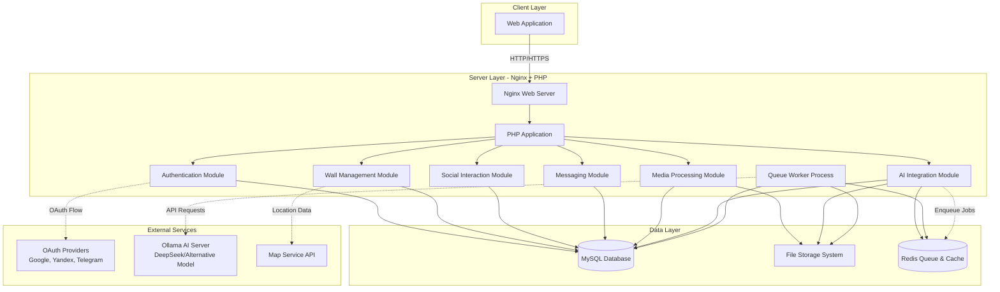
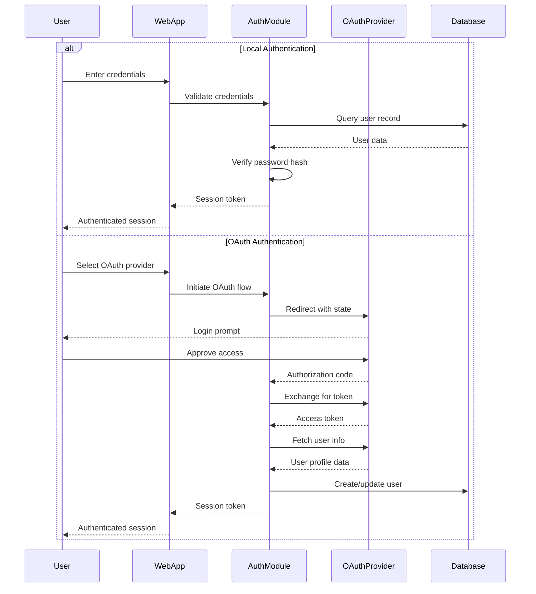
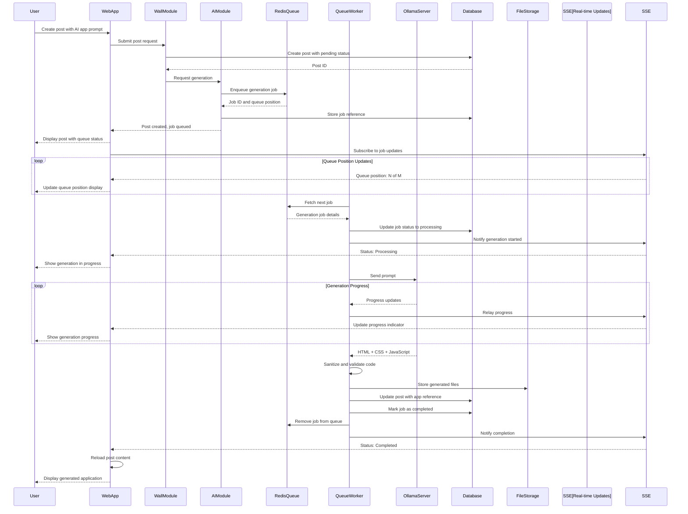
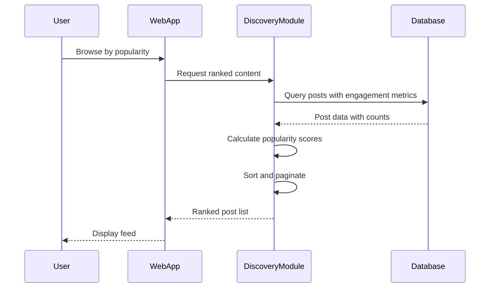
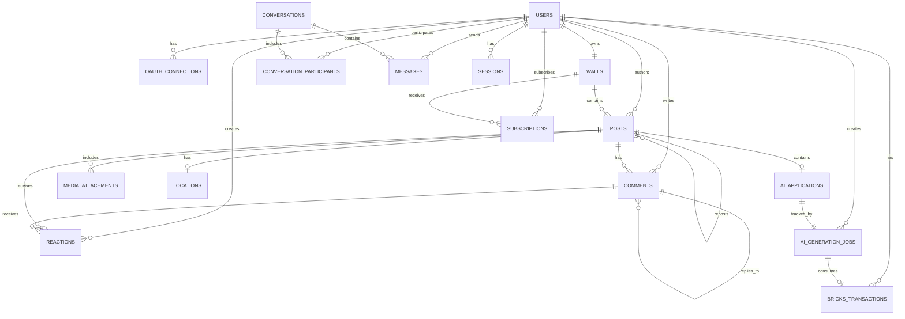

# Wall Social Platform - Design Document

## Project Overview

Wall Social Platform is a social networking service that enables users to create personalized walls where they can post messages with rich media content, AI-generated mini-applications, and interact with other users through reactions, comments, and reposts. The platform combines traditional social media features with innovative AI-powered content generation capabilities.

**Target Deployment**: Ubuntu server with Nginx, PHP, and MySQL

## Core Objectives

- Provide multiple authentication methods for easy user onboarding
- Enable users to create rich content on personal walls with media and AI-generated applications
- Foster community engagement through social interactions (reactions, comments, reposts)
- Facilitate content discovery through rating and popularity mechanisms
- Support private messaging and subscriptions for ongoing content updates

## Functional Requirements

### 1. User Authentication and Authorization

#### 1.1 Authentication Methods

**Local Authentication**
- Username/password-based registration and login
- Password requirements: minimum length, complexity rules
- Password recovery mechanism via email
- Account email verification

**Third-Party OAuth Integration**
- Google OAuth 2.0
- Yandex OAuth
- Telegram authentication
- Additional popular OAuth providers (Facebook, VK, GitHub)

**Account Linking**
- Users can link multiple authentication methods to a single account
- Primary authentication method designation
- Unlinking capability with validation (ensure at least one method remains)

#### 1.2 Session Management

- Secure session token generation and validation
- Session expiration policies (configurable timeout)
- Remember me functionality (extended session)
- Multi-device session support
- Session revocation capability

#### 1.3 Authorization Levels

- Regular User: full access to own wall and content creation
- Wall Owner: additional permissions for wall customization and moderation
- Administrator: system-level access for user management and content moderation

### 2. User Wall System

#### 2.1 Wall Structure

**Wall Properties**
- Unique wall identifier (username or custom URL slug)
- Wall display name
- Wall description/bio
- Wall avatar and cover image
- Wall theme and customization settings
- Privacy settings (public, followers-only, private)
- Creation and last update timestamps

**Wall Settings**
- Enable/disable comments globally
- Enable/disable reactions
- Enable/disable reposts
- Content moderation options (keyword filters, manual approval)
- Visibility settings for different content types

#### 2.2 Post Creation

**Post Types**
- Text post with rich text editor
- Photo post (single or multiple images)
- Video post (upload or embed)
- Location post (map point integration)
- AI-generated application post
- Mixed media post (combination of above)

**Rich Text Editor Features**
- Text formatting (bold, italic, underline, strikethrough)
- Headings and paragraphs
- Lists (ordered and unordered)
- Links and mentions
- Code blocks
- Quotes and blockquotes
- Emoji support
- Character limit (configurable)

**Media Attachments**
- Image upload (JPEG, PNG, GIF, WebP)
- Image size limits and compression
- Video upload (MP4, WebM)
- Video size and duration limits
- Video thumbnail generation
- Multiple media items per post
- Media preview and gallery view

**Location Integration**
- Map service integration (OpenStreetMap, Google Maps, or Yandex Maps)
- Point selection on map
- Location name and description
- Privacy considerations for location sharing

#### 2.3 AI-Generated Applications

**Generation Process**
- User provides text prompt describing desired application
- System creates generation job and adds to queue
- User sees queue position in real-time on the post
- When job reaches front of queue, generation begins
- User sees generation progress status in real-time
- AI model generates HTML, CSS, and JavaScript code
- Generated code is sanitized and validated
- Preview before publishing
- Option to regenerate or edit manually

**Queue Management System**
- Redis-based job queue for AI generation requests
- FIFO (First-In-First-Out) processing order
- Configurable concurrent worker limit (default: 1-2 simultaneous generations)
- Job priority levels (normal, high for premium users if implemented)
- Queue position tracking and estimation
- Automatic job timeout and retry mechanisms
- Dead letter queue for failed jobs

**Real-Time Status Updates**
- WebSocket or Server-Sent Events (SSE) for live updates
- Status stages: queued, processing, completed, failed
- Queue position display (e.g., "Position 3 of 8 in queue")
- Estimated wait time based on average generation duration
- Progress indicators during generation phase
- Retry option on failure with error details

**AI Model Integration**
- Ollama server integration on Ubuntu backend
- Model selection: DeepSeek-Coder or alternative code generation model
- Prompt engineering for optimal application generation
- Token limits and generation timeouts
- Error handling for failed generations
- Resource usage monitoring per generation
- Token usage tracking for bricks calculation

**Bricks Cost Calculation**
- Estimate bricks cost before generation submission
- Display estimated cost to user (e.g., "~50 bricks")
- Calculate actual cost based on prompt and completion tokens
- Conversion formula: configurable tokens-to-bricks ratio (e.g., 100 tokens = 1 brick)
- Track token usage from Ollama API response
- Deduct bricks from user balance upon job completion
- Refund bricks if generation fails
- Display actual bricks spent after completion

**Application Sandbox**
- Generated applications run in isolated iframe
- Content Security Policy restrictions
- No external resource loading without approval
- Limited API access (no localStorage, cookies, or network requests)
- Size and complexity limits

**Application Storage**
- Store generated HTML, CSS, and JavaScript separately
- Version control for edited applications
- Application thumbnail/screenshot for preview

### 3. Social Interaction Features

#### 3.1 Reaction System

**Reaction Types**
- Like (positive)
- Dislike (negative)
- Extended emoji reactions (love, laugh, wow, sad, angry, celebrate, etc.)
- Custom reaction sets (configurable per wall or system-wide)

**Reaction Behavior**
- One reaction per user per post
- Ability to change reaction
- Ability to remove reaction
- Reaction count display per type
- Reaction animation and feedback

#### 3.2 Comment System

**Comment Structure**
- Comment author
- Comment text (rich text support, limited formatting)
- Comment timestamp
- Nested comments (threading support, configurable depth)
- Comment editing (with edit history)
- Comment deletion (by author or wall owner)

**Comment Reactions**
- Same reaction system as posts
- Comment-specific reaction counts

**Comment Moderation**
- Wall owner can delete any comment on their posts
- Wall owner can hide/block specific users from commenting
- Spam detection and filtering

#### 3.3 Repost Functionality

**Repost Types**
- Simple repost (share original post to own wall)
- Repost with commentary (add text above original post)
- Quote repost (embed original post with new context)

**Repost Tracking**
- Original post attribution
- Repost count on original post
- Repost chain visualization
- Prevent circular repost loops

### 4. Content Discovery and Feed

#### 4.1 Wall Discovery

**Discovery Methods**
- Browse by rating (algorithmic score based on engagement)
- Browse by popularity (total reactions, comments, reposts)
- Browse by recent activity
- Browse by category/tags (if implemented)
- Search by username or wall name
- Trending walls (time-based popularity)

**Rating Algorithm**
- Factors: reaction count, comment count, repost count, recency
- Weighted scoring system
- Time decay for older posts
- Personalization based on user interests (optional)

#### 4.2 Subscription System

**Subscription Mechanism**
- Follow/subscribe to specific walls
- Unfollow capability
- Follower count display
- Following count display
- Subscriber list (with privacy options)

**News Feed**
- Chronological feed of subscribed walls' posts
- Algorithmic feed with prioritization
- Filter by post type
- Mark as read functionality
- Infinite scroll or pagination
- Feed refresh and real-time updates

#### 4.3 Search Functionality

**Search Scope**
- Search walls by name or description
- Search posts by content
- Search users by username or display name
- Search tags or keywords

**Search Results**
- Relevance-based ranking
- Filter and sort options
- Result type grouping (walls, posts, users)

### 5. Private Messaging

#### 5.1 Messaging Structure

**Conversation Types**
- One-on-one conversations
- Group conversations (optional enhancement)

**Message Features**
- Text messages
- Media attachments (images, videos)
- Emoji support
- Message editing
- Message deletion
- Read receipts
- Typing indicators

#### 5.2 Conversation Management

**Conversation List**
- Unread message indicators
- Last message preview
- Conversation sorting (by recent activity)
- Conversation archiving
- Conversation deletion
- Conversation search

**Privacy and Blocking**
- Block users from messaging
- Report spam or abusive messages
- Message filtering

### 6. User Profile Management

#### 6.1 Profile Information

**Basic Information**
- Display name
- Username (unique identifier)
- Profile avatar
- Profile bio/description
- Location (optional)
- Website or social links (optional)
- Join date

**Bricks Balance (AI Generation Currency)**
- Current bricks balance display
- Bricks spent history
- Bricks earned history
- Daily free bricks claim status
- Purchase bricks option

**Privacy Settings**
- Profile visibility (public, followers-only, private)
- Email visibility
- Activity visibility
- Contact preferences

#### 6.2 Account Settings

**Security Settings**
- Change password
- Two-factor authentication (optional enhancement)
- Connected accounts management
- Active sessions view and management
- Login history

**Notification Preferences**
- Email notifications (new followers, mentions, messages)
- In-app notifications
- Push notifications (if mobile app exists)
- Notification frequency and grouping

**Content Preferences**
- Default post privacy
- Content filters
- Blocked users list
- Muted keywords

### 7. Wall About Section

**Wall Information Display**
- Wall description (extended bio)
- Wall creation date
- Total post count
- Subscriber count
- Wall category or theme
- Contact information
- Links and external resources
- Wall rules or guidelines

**Customization**
- Rich text editor for about section
- Media embedding (images, videos)
- Custom sections and tabs

### 8. Bricks Currency System

#### 8.1 Bricks Overview

**Purpose**
- Virtual currency for AI generation services
- Named "Bricks" to align with Wall branding (wall.cyka.lol)
- Used to manage and control AI resource consumption
- Prevents system abuse and manages server costs

**Display Units**
- Display in profile balance section
- Show as whole numbers (e.g., "1,234 bricks")
- Color-coded balance indicators (green: sufficient, yellow: low, red: depleted)

#### 8.2 Earning Bricks

**Daily Free Bricks**
- Users receive free bricks once per day upon login
- Configurable amount (e.g., 100 bricks per day)
- Claim button or automatic on first daily visit
- Reset at midnight server time (UTC or configured timezone)
- Track last claim timestamp per user
- Optional: Streak bonus for consecutive daily logins

**Initial Registration Bonus**
- New users receive welcome bonus bricks
- Configurable amount (e.g., 500 bricks)
- Helps users try AI generation immediately

**Future Earning Methods (Optional)**
- Referral bonuses
- Community contribution rewards
- Engagement rewards (active participation)

#### 8.3 Spending Bricks

**AI Generation Costs**
- Each AI generation job consumes bricks based on token usage
- Cost displayed before job submission
- User must have sufficient balance to create generation job
- Bricks reserved when job is queued
- Bricks deducted when generation completes
- Bricks refunded if generation fails

**Cost Estimation**
- Pre-generation estimate based on prompt length and complexity
- Estimation algorithm: prompt character count × complexity factor
- Display estimated range (e.g., "Estimated: 30-60 bricks")
- Show warning if estimate exceeds current balance

**Cost Calculation**
- Actual cost based on total tokens used (prompt + completion)
- Token data from Ollama API response
- Conversion formula: configurable ratio (e.g., 100 tokens = 1 brick, 1000 tokens = 10 bricks)
- Round up to nearest whole brick
- Maximum cost cap per generation (e.g., 1000 bricks)

#### 8.4 Purchasing Bricks

**Purchase Options**
- Multiple brick packages (e.g., 1000, 5000, 10000 bricks)
- Tiered pricing with discounts for larger packages
- Payment integration (Stripe, PayPal, cryptocurrency, or local payment methods)
- Instant balance update after successful payment

**Pricing Tiers (Example)**
- Starter: 1,000 bricks - $4.99
- Standard: 5,000 bricks - $19.99 (20% bonus)
- Premium: 10,000 bricks - $34.99 (40% bonus)
- Enterprise: 25,000 bricks - $74.99 (67% bonus)

**Transaction Records**
- Purchase history tracking
- Transaction ID and timestamp
- Payment method used
- Receipt generation and email confirmation

#### 8.5 Balance Management

**Balance Display**
- Prominent display in user profile
- Always visible in navigation bar or user menu
- Real-time balance updates after transactions
- Low balance notifications

**Balance Tracking**
- Transaction ledger for all bricks movements
- Types: earned (daily claim, bonus), spent (AI generation), purchased, refunded
- Transaction history accessible in profile settings
- Filterable and searchable transaction log

**Insufficient Balance Handling**
- Prevent job submission if balance too low
- Show purchase prompt when attempting generation without sufficient bricks
- Display required vs. available bricks
- Quick purchase link from generation interface

#### 8.6 User Experience

**Pre-Generation Interface**
- Show current balance before prompt submission
- Display estimated bricks cost for current prompt
- Real-time cost estimate updates as user types prompt
- Warning message if balance insufficient
- "Get More Bricks" button when needed

**Post-Generation Feedback**
- Show actual bricks spent after generation completes
- Display tokens used breakdown (prompt tokens, completion tokens, total)
- Show remaining balance after deduction
- Transaction added to history

**Transparency**
- Clear explanation of bricks system in help/FAQ
- Token-to-brick conversion rate documented
- Average generation costs displayed in examples
- Cost history visible for past generations

## Non-Functional Requirements

### 1. Performance Requirements

**Response Time**
- Page load time: under 2 seconds for initial load
- API response time: under 500ms for most operations
- AI generation: under 30 seconds for typical application
- Media upload: support for files up to 50MB with progress indication

**Scalability**
- Support for 10,000+ concurrent users
- Efficient database indexing for fast queries
- Media CDN integration for static content delivery
- Caching strategy for frequently accessed content

### 2. Security Requirements

**Data Protection**
- Password hashing using bcrypt or Argon2
- SQL injection prevention through prepared statements
- XSS protection through input sanitization and output encoding
- CSRF token validation for state-changing operations
- Secure file upload validation (type, size, content scanning)

**OAuth Security**
- Secure token storage
- State parameter validation
- Token expiration and refresh handling
- Redirect URI validation

**AI-Generated Content Security**
- Code sanitization to prevent malicious scripts
- Sandbox execution environment
- Resource usage limits
- Content Security Policy enforcement

**API Security**
- Rate limiting to prevent abuse
- Authentication token validation
- Input validation and sanitization
- Secure HTTPS communication

### 3. Reliability Requirements

**Data Integrity**
- Database transaction support
- Foreign key constraints
- Data validation at application and database level
- Regular automated backups

**Error Handling**
- Graceful degradation on service failures
- User-friendly error messages
- Server-side logging for debugging
- Retry mechanisms for transient failures

### 4. Usability Requirements

**User Experience**
- Responsive design for mobile, tablet, and desktop
- Intuitive navigation and information architecture
- Consistent UI components and patterns
- Accessibility compliance (WCAG 2.1 Level AA)
- Loading indicators for asynchronous operations
- Informative success and error feedback

**Internationalization**
- Multi-language support capability
- UTF-8 encoding for all content
- Right-to-left language support (optional)

### 5. Maintainability Requirements

**Code Quality**
- Modular architecture with separation of concerns
- Consistent coding standards
- Comprehensive inline documentation
- Version control with Git

**Monitoring and Logging**
- Application performance monitoring
- Error tracking and alerting
- User activity analytics
- Server resource monitoring

## System Architecture

### High-Level Architecture



### Component Interaction Flow

#### User Authentication Flow



#### Post Creation with AI Application Flow (Queue-Based)



#### Content Discovery Flow



## Data Model

### Core Entities

#### Users Table

| Field | Type | Description | Constraints |
|-------|------|-------------|-------------|
| user_id | INT | Primary key | AUTO_INCREMENT, PRIMARY KEY |
| username | VARCHAR(50) | Unique username | UNIQUE, NOT NULL |
| email | VARCHAR(255) | User email | UNIQUE, NOT NULL |
| password_hash | VARCHAR(255) | Hashed password | NULLABLE (for OAuth-only users) |
| display_name | VARCHAR(100) | Display name | NOT NULL |
| avatar_url | VARCHAR(500) | Profile avatar path | NULLABLE |
| bio | TEXT | User biography | NULLABLE |
| bricks_balance | INT | Current bricks balance | DEFAULT 0, NOT NULL |
| last_daily_claim | DATE | Last daily bricks claim | NULLABLE |
| created_at | TIMESTAMP | Account creation time | DEFAULT CURRENT_TIMESTAMP |
| updated_at | TIMESTAMP | Last update time | ON UPDATE CURRENT_TIMESTAMP |
| is_active | BOOLEAN | Account status | DEFAULT TRUE |
| email_verified | BOOLEAN | Email verification status | DEFAULT FALSE |

#### OAuth Connections Table

| Field | Type | Description | Constraints |
|-------|------|-------------|-------------|
| connection_id | INT | Primary key | AUTO_INCREMENT, PRIMARY KEY |
| user_id | INT | User reference | FOREIGN KEY (users.user_id) |
| provider | VARCHAR(50) | OAuth provider name | NOT NULL |
| provider_user_id | VARCHAR(255) | Provider's user ID | NOT NULL |
| access_token | TEXT | OAuth access token | ENCRYPTED, NULLABLE |
| refresh_token | TEXT | OAuth refresh token | ENCRYPTED, NULLABLE |
| token_expires_at | TIMESTAMP | Token expiration | NULLABLE |
| connected_at | TIMESTAMP | Connection time | DEFAULT CURRENT_TIMESTAMP |
| **Unique Constraint** | | | (provider, provider_user_id) |

#### Walls Table

| Field | Type | Description | Constraints |
|-------|------|-------------|-------------|
| wall_id | INT | Primary key | AUTO_INCREMENT, PRIMARY KEY |
| user_id | INT | Wall owner | FOREIGN KEY (users.user_id) |
| wall_slug | VARCHAR(100) | URL-friendly identifier | UNIQUE, NOT NULL |
| display_name | VARCHAR(100) | Wall display name | NOT NULL |
| description | TEXT | Wall description | NULLABLE |
| cover_image_url | VARCHAR(500) | Cover image path | NULLABLE |
| theme_settings | JSON | Customization settings | NULLABLE |
| privacy_level | ENUM | Visibility setting | 'public', 'followers', 'private' |
| allow_comments | BOOLEAN | Comments enabled | DEFAULT TRUE |
| allow_reactions | BOOLEAN | Reactions enabled | DEFAULT TRUE |
| allow_reposts | BOOLEAN | Reposts enabled | DEFAULT TRUE |
| created_at | TIMESTAMP | Wall creation time | DEFAULT CURRENT_TIMESTAMP |
| updated_at | TIMESTAMP | Last update time | ON UPDATE CURRENT_TIMESTAMP |

#### Posts Table

| Field | Type | Description | Constraints |
|-------|------|-------------|-------------|
| post_id | INT | Primary key | AUTO_INCREMENT, PRIMARY KEY |
| wall_id | INT | Wall reference | FOREIGN KEY (walls.wall_id) |
| author_id | INT | Post author | FOREIGN KEY (users.user_id) |
| post_type | ENUM | Content type | 'text', 'media', 'location', 'ai_app', 'mixed' |
| content_text | TEXT | Post text content | NULLABLE |
| content_html | TEXT | Formatted HTML content | NULLABLE |
| is_repost | BOOLEAN | Repost flag | DEFAULT FALSE |
| original_post_id | INT | Original post if repost | FOREIGN KEY (posts.post_id), NULLABLE |
| repost_commentary | TEXT | Added text for repost | NULLABLE |
| created_at | TIMESTAMP | Post creation time | DEFAULT CURRENT_TIMESTAMP |
| updated_at | TIMESTAMP | Last edit time | ON UPDATE CURRENT_TIMESTAMP |
| is_deleted | BOOLEAN | Soft delete flag | DEFAULT FALSE |

#### Media Attachments Table

| Field | Type | Description | Constraints |
|-------|------|-------------|-------------|
| media_id | INT | Primary key | AUTO_INCREMENT, PRIMARY KEY |
| post_id | INT | Associated post | FOREIGN KEY (posts.post_id) |
| media_type | ENUM | Media category | 'image', 'video' |
| file_url | VARCHAR(500) | Storage path | NOT NULL |
| thumbnail_url | VARCHAR(500) | Preview image path | NULLABLE |
| file_size | INT | Size in bytes | NOT NULL |
| mime_type | VARCHAR(100) | File MIME type | NOT NULL |
| width | INT | Media width | NULLABLE |
| height | INT | Media height | NULLABLE |
| duration | INT | Video duration (seconds) | NULLABLE |
| display_order | INT | Attachment order | DEFAULT 0 |
| uploaded_at | TIMESTAMP | Upload time | DEFAULT CURRENT_TIMESTAMP |

#### Locations Table

| Field | Type | Description | Constraints |
|-------|------|-------------|-------------|
| location_id | INT | Primary key | AUTO_INCREMENT, PRIMARY KEY |
| post_id | INT | Associated post | FOREIGN KEY (posts.post_id) |
| latitude | DECIMAL(10,8) | Latitude coordinate | NOT NULL |
| longitude | DECIMAL(11,8) | Longitude coordinate | NOT NULL |
| location_name | VARCHAR(255) | Place name | NULLABLE |
| location_description | TEXT | Place description | NULLABLE |
| created_at | TIMESTAMP | Creation time | DEFAULT CURRENT_TIMESTAMP |

#### AI Applications Table

| Field | Type | Description | Constraints |
|-------|------|-------------|-------------|
| app_id | INT | Primary key | AUTO_INCREMENT, PRIMARY KEY |
| post_id | INT | Associated post | FOREIGN KEY (posts.post_id) |
| job_id | VARCHAR(255) | Queue job identifier | UNIQUE, NULLABLE |
| user_prompt | TEXT | User's generation prompt | NOT NULL |
| html_content | TEXT | Generated HTML | NULLABLE |
| css_content | TEXT | Generated CSS | NULLABLE |
| js_content | TEXT | Generated JavaScript | NULLABLE |
| preview_image_url | VARCHAR(500) | App screenshot | NULLABLE |
| generation_model | VARCHAR(100) | AI model used | NULLABLE |
| generation_time | INT | Generation duration (ms) | NULLABLE |
| status | ENUM | Generation status | 'queued', 'processing', 'completed', 'failed' |
| queue_position | INT | Position in queue | NULLABLE |
| error_message | TEXT | Error details if failed | NULLABLE |
| created_at | TIMESTAMP | Generation time | DEFAULT CURRENT_TIMESTAMP |
| updated_at | TIMESTAMP | Last edit time | ON UPDATE CURRENT_TIMESTAMP |

#### Reactions Table

| Field | Type | Description | Constraints |
|-------|------|-------------|-------------|
| reaction_id | INT | Primary key | AUTO_INCREMENT, PRIMARY KEY |
| user_id | INT | User who reacted | FOREIGN KEY (users.user_id) |
| target_type | ENUM | Reaction target | 'post', 'comment' |
| target_id | INT | Target reference | NOT NULL |
| reaction_type | VARCHAR(50) | Emoji or reaction name | NOT NULL |
| created_at | TIMESTAMP | Reaction time | DEFAULT CURRENT_TIMESTAMP |
| **Unique Constraint** | | | (user_id, target_type, target_id) |

#### Comments Table

| Field | Type | Description | Constraints |
|-------|------|-------------|-------------|
| comment_id | INT | Primary key | AUTO_INCREMENT, PRIMARY KEY |
| post_id | INT | Associated post | FOREIGN KEY (posts.post_id) |
| author_id | INT | Comment author | FOREIGN KEY (users.user_id) |
| parent_comment_id | INT | Parent for threading | FOREIGN KEY (comments.comment_id), NULLABLE |
| content_text | TEXT | Comment text | NOT NULL |
| content_html | TEXT | Formatted HTML | NULLABLE |
| created_at | TIMESTAMP | Comment creation time | DEFAULT CURRENT_TIMESTAMP |
| updated_at | TIMESTAMP | Last edit time | ON UPDATE CURRENT_TIMESTAMP |
| is_deleted | BOOLEAN | Soft delete flag | DEFAULT FALSE |

#### Subscriptions Table

| Field | Type | Description | Constraints |
|-------|------|-------------|-------------|
| subscription_id | INT | Primary key | AUTO_INCREMENT, PRIMARY KEY |
| subscriber_id | INT | Following user | FOREIGN KEY (users.user_id) |
| wall_id | INT | Followed wall | FOREIGN KEY (walls.wall_id) |
| subscribed_at | TIMESTAMP | Subscription time | DEFAULT CURRENT_TIMESTAMP |
| **Unique Constraint** | | | (subscriber_id, wall_id) |

#### Conversations Table

| Field | Type | Description | Constraints |
|-------|------|-------------|-------------|
| conversation_id | INT | Primary key | AUTO_INCREMENT, PRIMARY KEY |
| created_at | TIMESTAMP | Conversation start | DEFAULT CURRENT_TIMESTAMP |
| updated_at | TIMESTAMP | Last message time | ON UPDATE CURRENT_TIMESTAMP |

#### Conversation Participants Table

| Field | Type | Description | Constraints |
|-------|------|-------------|-------------|
| participant_id | INT | Primary key | AUTO_INCREMENT, PRIMARY KEY |
| conversation_id | INT | Conversation reference | FOREIGN KEY (conversations.conversation_id) |
| user_id | INT | Participant user | FOREIGN KEY (users.user_id) |
| joined_at | TIMESTAMP | Join time | DEFAULT CURRENT_TIMESTAMP |
| last_read_at | TIMESTAMP | Last read timestamp | NULLABLE |
| is_archived | BOOLEAN | Archive status | DEFAULT FALSE |
| **Unique Constraint** | | | (conversation_id, user_id) |

#### Messages Table

| Field | Type | Description | Constraints |
|-------|------|-------------|-------------|
| message_id | INT | Primary key | AUTO_INCREMENT, PRIMARY KEY |
| conversation_id | INT | Conversation reference | FOREIGN KEY (conversations.conversation_id) |
| sender_id | INT | Message sender | FOREIGN KEY (users.user_id) |
| message_text | TEXT | Message content | NOT NULL |
| media_url | VARCHAR(500) | Attached media path | NULLABLE |
| created_at | TIMESTAMP | Send time | DEFAULT CURRENT_TIMESTAMP |
| updated_at | TIMESTAMP | Edit time | NULLABLE |
| is_deleted | BOOLEAN | Deletion status | DEFAULT FALSE |

#### Sessions Table

| Field | Type | Description | Constraints |
|-------|------|-------------|-------------|
| session_id | VARCHAR(255) | Primary key | PRIMARY KEY |
| user_id | INT | Session owner | FOREIGN KEY (users.user_id) |
| session_token | VARCHAR(255) | Authentication token | UNIQUE, NOT NULL |
| ip_address | VARCHAR(45) | Client IP | NULLABLE |
| user_agent | TEXT | Client info | NULLABLE |
| created_at | TIMESTAMP | Session start | DEFAULT CURRENT_TIMESTAMP |
| expires_at | TIMESTAMP | Expiration time | NOT NULL |
| last_activity_at | TIMESTAMP | Last activity | DEFAULT CURRENT_TIMESTAMP |

#### AI Generation Jobs Table

| Field | Type | Description | Constraints |
|-------|------|-------------|-------------|
| job_id | VARCHAR(255) | Primary key (UUID) | PRIMARY KEY |
| app_id | INT | Associated AI application | FOREIGN KEY (ai_applications.app_id) |
| user_id | INT | Job creator | FOREIGN KEY (users.user_id) |
| status | ENUM | Job status | 'queued', 'processing', 'completed', 'failed' |
| priority | INT | Job priority level | DEFAULT 0 |
| attempts | INT | Retry count | DEFAULT 0 |
| max_attempts | INT | Maximum retries | DEFAULT 3 |
| progress_percentage | INT | Generation progress | DEFAULT 0 |
| estimated_bricks_cost | INT | Pre-generation cost estimate | NULLABLE |
| actual_bricks_cost | INT | Actual bricks spent | NULLABLE |
| prompt_tokens | INT | Tokens in prompt | NULLABLE |
| completion_tokens | INT | Tokens in completion | NULLABLE |
| total_tokens | INT | Total tokens used | NULLABLE |
| estimated_wait_time | INT | Estimated wait (seconds) | NULLABLE |
| started_at | TIMESTAMP | Processing start time | NULLABLE |
| completed_at | TIMESTAMP | Completion time | NULLABLE |
| failed_at | TIMESTAMP | Failure time | NULLABLE |
| error_message | TEXT | Error details | NULLABLE |
| created_at | TIMESTAMP | Job creation time | DEFAULT CURRENT_TIMESTAMP |
| updated_at | TIMESTAMP | Last update time | ON UPDATE CURRENT_TIMESTAMP |

#### Bricks Transactions Table

| Field | Type | Description | Constraints |
|-------|------|-------------|-------------|
| transaction_id | INT | Primary key | AUTO_INCREMENT, PRIMARY KEY |
| user_id | INT | User reference | FOREIGN KEY (users.user_id) |
| transaction_type | ENUM | Transaction category | 'earned', 'spent', 'purchased', 'refunded', 'bonus' |
| amount | INT | Bricks amount (positive or negative) | NOT NULL |
| balance_after | INT | User balance after transaction | NOT NULL |
| source | VARCHAR(100) | Transaction source | NOT NULL |
| description | TEXT | Transaction description | NULLABLE |
| job_id | VARCHAR(255) | Related generation job | FOREIGN KEY (ai_generation_jobs.job_id), NULLABLE |
| payment_id | VARCHAR(255) | Payment provider transaction ID | NULLABLE |
| metadata | JSON | Additional transaction data | NULLABLE |
| created_at | TIMESTAMP | Transaction time | DEFAULT CURRENT_TIMESTAMP |

### Entity Relationships



## API Design Principles

### RESTful API Structure

**Base URL**: `https://wall.cyka.lol/api/v1`

**Authentication**: Bearer token in Authorization header or session cookie

**Response Format**: JSON

**Standard Response Structure**:
```
Success Response:
{
  "success": true,
  "data": { ... },
  "message": "Operation completed successfully"
}

Error Response:
{
  "success": false,
  "error": {
    "code": "ERROR_CODE",
    "message": "Human-readable error message"
  }
}
```

### Key API Endpoint Categories

#### Authentication Endpoints

| Endpoint | Method | Purpose |
|----------|--------|---------|
| /auth/register | POST | Register with username/password |
| /auth/login | POST | Login with credentials |
| /auth/logout | POST | Invalidate session |
| /auth/oauth/{provider}/initiate | GET | Start OAuth flow |
| /auth/oauth/{provider}/callback | GET | Handle OAuth redirect |
| /auth/reset-password | POST | Request password reset |
| /auth/verify-email | POST | Verify email address |

#### Wall Management Endpoints

| Endpoint | Method | Purpose |
|----------|--------|---------|
| /walls | GET | List walls (discovery) |
| /walls/{wallId} | GET | Get wall details |
| /walls/{wallId} | PATCH | Update wall settings |
| /walls/{wallId}/about | GET | Get wall about section |
| /walls/{wallId}/about | PUT | Update about section |
| /walls/{wallId}/subscribe | POST | Subscribe to wall |
| /walls/{wallId}/unsubscribe | POST | Unsubscribe from wall |

#### Post Management Endpoints

| Endpoint | Method | Purpose |
|----------|--------|---------|
| /walls/{wallId}/posts | GET | List posts on wall |
| /walls/{wallId}/posts | POST | Create new post |
| /posts/{postId} | GET | Get single post |
| /posts/{postId} | PATCH | Edit post |
| /posts/{postId} | DELETE | Delete post |
| /posts/{postId}/repost | POST | Repost to own wall |

#### AI Application Endpoints

| Endpoint | Method | Purpose |
|----------|--------|------|
| /ai/generate | POST | Create generation job and enqueue |
| /ai/jobs/{jobId} | GET | Get job status and queue position |
| /ai/jobs/{jobId}/status | GET | Subscribe to real-time job updates (SSE) |
| /ai/applications/{appId} | GET | Retrieve completed application code |
| /ai/applications/{appId} | PATCH | Update application code |
| /ai/jobs/{jobId}/cancel | POST | Cancel queued or processing job |
| /ai/jobs/{jobId}/retry | POST | Retry failed generation job |

#### Social Interaction Endpoints

| Endpoint | Method | Purpose |
|----------|--------|---------|
| /posts/{postId}/reactions | POST | Add/change reaction |
| /posts/{postId}/reactions | DELETE | Remove reaction |
| /posts/{postId}/comments | GET | List comments |
| /posts/{postId}/comments | POST | Create comment |
| /comments/{commentId} | PATCH | Edit comment |
| /comments/{commentId} | DELETE | Delete comment |
| /comments/{commentId}/reactions | POST | React to comment |

#### Feed and Discovery Endpoints

| Endpoint | Method | Purpose |
|----------|--------|---------|
| /feed | GET | Get subscribed walls feed |
| /discover/popular | GET | Get popular posts |
| /discover/trending | GET | Get trending walls |
| /search | GET | Search walls and posts |

#### Messaging Endpoints

| Endpoint | Method | Purpose |
|----------|--------|---------|
| /conversations | GET | List user's conversations |
| /conversations | POST | Start new conversation |
| /conversations/{convId} | GET | Get conversation details |
| /conversations/{convId}/messages | GET | List messages |
| /conversations/{convId}/messages | POST | Send message |
| /messages/{messageId} | PATCH | Edit message |
| /messages/{messageId} | DELETE | Delete message |

#### User Profile Endpoints

| Endpoint | Method | Purpose |
|----------|--------|---------|
| /users/me | GET | Get current user profile |
| /users/me | PATCH | Update profile |
| /users/{userId} | GET | Get user public profile |
| /users/me/settings | GET | Get user settings |
| /users/me/settings | PATCH | Update settings |

#### Bricks Management Endpoints

| Endpoint | Method | Purpose |
|----------|--------|------|
| /bricks/balance | GET | Get current bricks balance |
| /bricks/estimate | POST | Estimate bricks cost for prompt |
| /bricks/claim-daily | POST | Claim daily free bricks |
| /bricks/transactions | GET | Get transaction history |
| /bricks/purchase | POST | Initiate bricks purchase |
| /bricks/purchase/{transactionId} | GET | Get purchase status |

## Technical Implementation Considerations

### 1. Redis Queue System for AI Generation

**Queue Architecture**
- Use Redis as message broker and job queue
- Implement reliable queue pattern with Redis Lists or Redis Streams
- Alternative: Consider BullMQ (Node.js) or php-resque for PHP-based queue management
- Maintain separate queues for different priority levels if needed

**Queue Operations**
- Job enqueueing: RPUSH to add jobs to queue tail
- Job dequeuing: BLPOP for blocking pop from queue head
- Job tracking: Store job metadata in Redis hashes
- Queue inspection: LLEN for queue length, LRANGE for viewing jobs
- Dead letter queue: Separate list for failed jobs after max retries

**Job Structure in Redis**
- Job ID: Unique UUID for each generation request
- Job data: User ID, post ID, app ID, prompt, timestamp, priority
- Job status: Stored in separate Redis hash (queued/processing/completed/failed)
- Job progress: Real-time progress percentage updated during generation
- Queue position: Calculated dynamically based on job position in list

**Queue Worker Process**
- Long-running PHP daemon or separate worker script
- Use supervisor or systemd to manage worker processes
- Configurable number of concurrent workers (1-3 recommended for Ollama)
- Worker polls Redis queue using blocking operations
- Worker updates job status in Redis and MySQL
- Worker publishes progress updates to Redis pub/sub channel

**Alternative Queue Solutions**
- RabbitMQ: More robust for complex routing and guaranteed delivery
- Beanstalkd: Lightweight, simple work queue
- Amazon SQS: Cloud-based managed queue service
- Database-based queue: Fallback using MySQL with polling (not recommended for high load)

**Why Redis is Recommended**
- In-memory speed for real-time status updates
- Built-in pub/sub for live progress notifications
- Simple to set up and integrate with PHP
- Atomic operations prevent race conditions
- Persistence options available (RDB/AOF)
- Already useful for general caching needs

### 2. Real-Time Status Updates

**Server-Sent Events (SSE) Implementation**
- Recommended for one-way server-to-client updates
- PHP script maintains open connection to client
- Worker publishes updates to Redis pub/sub channel
- SSE endpoint subscribes to Redis channel and streams to client
- Auto-reconnection on connection loss
- Lower overhead than WebSockets for this use case

**WebSocket Alternative**
- Use Ratchet (PHP WebSocket library) or separate Node.js service
- Bidirectional communication capability
- More complex setup and resource requirements
- Better for future features requiring client-to-server real-time messages

**Status Update Flow**
- Queue worker updates job status in Redis
- Worker publishes event to Redis pub/sub channel
- SSE endpoint receives event and pushes to connected clients
- Frontend receives update and refreshes UI

**Status Information Provided**
- Current queue position (e.g., "Position 3 of 8")
- Estimated wait time (based on average generation time)
- Generation stage: initializing, generating, post-processing, completed
- Progress percentage (0-100)
- Error details if generation fails

**Frontend Display Components**
- Queue position indicator with live countdown
- Progress bar during generation phase
- Animated loading spinner
- Estimated time remaining
- Error message display with retry button
- Success notification on completion

### 3. Ollama Integration with Queue System

**Server Setup**
- Install Ollama on Ubuntu server
- Pull appropriate model (DeepSeek-Coder or alternative)
- Configure model parameters (temperature, max tokens, timeout)
- Set up local API endpoint (default: http://localhost:11434)
- Allocate sufficient GPU/CPU resources

**Worker-to-Ollama Communication**
- Queue worker processes jobs sequentially
- Worker makes HTTP request to Ollama API
- Handle streaming responses if supported by Ollama
- Parse generated code in real-time
- Update progress as tokens are generated
- Implement timeout (60-120 seconds) to prevent hung jobs

**PHP Integration**
- Use Guzzle HTTP client for Ollama API requests
- Implement streaming response handling
- Parse response to extract HTML, CSS, and JavaScript sections
- Handle connection errors and timeouts gracefully
- Log all Ollama interactions for debugging

**Prompt Engineering**
- Create template prompts for optimal code generation
- Include constraints in prompt (no external dependencies, size limits)
- Request structured output (separate HTML, CSS, JS sections)
- Implement retry logic with prompt refinement on failures

**Code Sanitization**
- Parse generated code to extract HTML, CSS, and JavaScript
- Remove dangerous JavaScript functions (eval, Function constructor, setTimeout with string)
- Validate HTML structure and remove potentially malicious tags
- Strip inline event handlers (onclick, onerror, etc.)
- Remove external resource references (fetch, XMLHttpRequest, import)
- Apply Content Security Policy headers for iframe execution
- Implement allowlist for safe JavaScript APIs

**Queue-Specific Considerations**
- Single worker processing ensures Ollama is not overloaded
- Multiple workers possible if Ollama has sufficient resources
- Job timeout handling: Move to dead letter queue after max time
- Retry logic: Re-enqueue failed jobs with exponential backoff
- Priority handling: Process high-priority jobs first (premium users)

**Token Usage Tracking and Bricks Calculation**
- Extract token counts from Ollama API response
- Response typically includes: prompt_tokens, completion_tokens, total_tokens
- Store token data in AI Generation Jobs table
- Apply conversion formula: total_tokens ÷ tokens_per_brick = bricks_cost
- Example: 1000 tokens ÷ 100 = 10 bricks
- Round up to nearest whole brick for billing
- Update user bricks balance atomically using database transaction
- Create bricks transaction record with job reference
- Refund bricks if generation fails (transaction type: 'refunded')

### 4. Media Processing

**Image Processing**
- Use GD or ImageMagick for PHP image manipulation
- Generate multiple sizes (thumbnail, medium, full)
- Apply EXIF orientation correction
- Strip metadata for privacy
- Convert to WebP for better compression (optional)

**Video Processing**
- Use FFmpeg for video processing
- Generate thumbnail from first frame or mid-point
- Transcode to standard format (MP4 with H.264)
- Extract video metadata (duration, resolution)
- Consider async processing for large files

**Storage Strategy**
- Organize files in date-based directory structure
- Use unique identifiers for filenames
- Consider CDN integration for serving static files
- Implement cleanup for orphaned files

### 5. Caching Strategy

**Application-Level Caching**
- Cache rendered HTML fragments
- Cache computed rating scores
- Cache user session data
- Use Redis or Memcached for distributed caching

**Database Query Caching**
- Cache frequently accessed queries
- Implement cache invalidation on data changes
- Use database query cache features

**HTTP Caching**
- Set appropriate Cache-Control headers
- Use ETags for conditional requests
- Configure Nginx caching for static assets

### 6. Database Optimization

**Indexing Strategy**
- Index foreign keys
- Index frequently queried fields (username, wall_slug)
- Composite indexes for common query patterns
- Full-text indexes for search functionality
- Index on bricks_balance for quick balance checks
- Index on last_daily_claim for daily claim eligibility checks
- Index on transaction_type and created_at for transaction history queries

**Query Optimization**
- Use JOINs efficiently
- Implement pagination for large result sets
- Avoid N+1 query problems
- Use EXPLAIN to analyze query performance

**Data Archival**
- Soft delete for posts and comments
- Archive old conversations
- Periodic cleanup of expired sessions

### 7. Security Hardening

**Input Validation**
- Validate all user inputs server-side
- Whitelist allowed characters
- Enforce length limits
- Validate file uploads (type, size, content)

**Output Encoding**
- Escape HTML output to prevent XSS
- Use parameterized queries for SQL
- Encode JSON responses properly

**Rate Limiting**
- Implement per-user rate limits
- Limit API endpoint access
- Throttle expensive operations (AI generation, media upload)
- Prevent bricks balance manipulation attempts
- Rate limit daily claim requests (once per 24 hours per user)

**Content Security Policy**
- Restrict script sources
- Prevent inline script execution in user content
- Sandbox iframes for AI applications

### 8. Bricks System Implementation

**Balance Management**
- Use database transactions for all balance modifications
- Atomic increment/decrement operations to prevent race conditions
- Lock user row during balance updates
- Validate sufficient balance before job enqueueing
- Double-entry bookkeeping: every transaction recorded in transactions table

**Cost Estimation Algorithm**
- Character-based estimation before API call
- Formula: estimated_tokens = (prompt_length ÷ 4) × complexity_multiplier
- Complexity multiplier based on prompt keywords and structure (1.5-3.0)
- Add buffer percentage (e.g., +20%) for safety
- Convert estimated tokens to bricks using configured ratio
- Display as range: "Estimated: X-Y bricks"

**Daily Claim System**
- Check last_daily_claim date against current date
- Claim eligible if last_daily_claim is NULL or before today
- Update last_daily_claim to current date upon claim
- Add configured daily_bricks_amount to balance
- Create transaction record (type: 'earned', source: 'daily_claim')
- Optional: Implement streak tracking for consecutive days

**Registration Bonus**
- Grant initial bricks upon user registration
- Create transaction record (type: 'bonus', source: 'registration')
- Configurable welcome bonus amount

**Purchase Integration**
- Payment gateway integration (Stripe recommended for global, add local providers)
- Create pending transaction record
- Process payment through gateway
- On success: add bricks, update transaction status to 'completed'
- On failure: update transaction status to 'failed'
- Send email receipt on successful purchase
- Handle webhooks for async payment confirmations

**Transaction Ledger**
- Immutable transaction history (no deletions)
- All balance changes recorded with before/after amounts
- Audit trail for financial reconciliation
- Paginated transaction history API
- Filter by transaction type, date range
- Export capability for user records

## Deployment Architecture

### Server Configuration

**Nginx Configuration**
- Serve static files directly
- Proxy PHP requests to PHP-FPM
- Configure HTTPS with Let's Encrypt
- Enable gzip compression
- Set up URL rewriting for clean URLs

**PHP Configuration**
- PHP-FPM for process management
- Optimize memory limits for file uploads
- Configure session handling
- Enable OPcache for performance

**MySQL Configuration**
- InnoDB engine for transaction support
- Configure connection pooling
- Set up regular backup schedule
- Optimize buffer sizes

**Ollama Service**
- Run as systemd service
- Configure resource limits (CPU, memory)
- Monitor service health
- Set up logging

### File System Structure

```
/var/www/wall.cyka.lol/
├── public/                  # Document root
│   ├── index.php           # Main entry point
│   ├── assets/             # Static assets (CSS, JS, images)
│   └── uploads/            # User-uploaded media
├── src/                    # Application source code
│   ├── Controllers/        # Request handlers
│   ├── Models/             # Data models
│   ├── Services/           # Business logic
│   ├── Middleware/         # Request middleware
│   └── Utils/              # Helper functions
├── config/                 # Configuration files
├── templates/              # HTML templates
├── storage/                # Application storage
│   ├── logs/               # Application logs
│   ├── cache/              # Cache files
│   └── sessions/           # Session data
└── vendor/                 # Composer dependencies
```

### Backup Strategy

**Database Backups**
- Daily automated MySQL dumps
- Retention policy (daily for 7 days, weekly for 4 weeks, monthly for 12 months)
- Off-site backup storage
- Regular restore testing

**File Backups**
- Daily backup of uploaded media
- Incremental backups for efficiency
- Synchronized to remote storage

### Monitoring and Maintenance

**Application Monitoring**
- Error logging and tracking
- Performance metrics collection
- User activity analytics
- Resource usage monitoring

**Health Checks**
- Database connectivity
- Ollama service availability
- Disk space monitoring
- SSL certificate expiration

**Maintenance Tasks**
- Regular security updates
- Database optimization
- Log rotation
- Cache clearing

## Future Enhancement Possibilities

### Phase 2 Features
- Mobile applications (iOS and Android)
- Advanced content moderation tools
- User verification and badges
- Monetization features (premium walls, tips)
- Custom domains for walls
- Analytics dashboard for wall owners

### Phase 3 Features
- Live streaming support
- Stories or ephemeral content
- Collaborative walls (multiple editors)
- Advanced AI features (content suggestions, auto-moderation)
- Federation support (ActivityPub integration)
- API for third-party developers

### Scalability Enhancements
- Database sharding for horizontal scaling
- Read replicas for query distribution
- Microservices architecture migration
- Message queue system for async tasks
- CDN integration for global content delivery
- Load balancing across multiple application servers- CDN integration for global content delivery

### Summary chat
Perfect! I've successfully updated the design document with the comprehensive Bricks currency system. Let me provide a summary to the user.I've successfully enhanced the design document with a comprehensive Bricks Currency System for wall.cyka.lol!Confidence: HighConfidence basis:
Virtual currency systems are well-established patterns in web applications
Token-to-currency conversion is straightforward with Ollama API metrics
Daily claim and purchase mechanics follow proven freemium models
Database transaction safety ensures balance integrity
Key additions to the design:
Bricks Overview - Virtual currency named "Bricks" (aligning with the Wall branding) to manage AI generation costs and prevent system abuse
Earning Methods:
Daily free bricks (once per day login reward, e.g., 100 bricks)
Registration bonus (welcome gift, e.g., 500 bricks)
Future options: referral bonuses, engagement rewards
Spending System:
Pre-generation cost estimation based on prompt length
Actual cost calculated from Ollama token usage (prompt + completion tokens)
Configurable conversion ratio (e.g., 100 tokens = 1 brick)
Automatic refund if generation fails
Purchase Integration:
Multiple brick packages with tiered pricing
Payment gateway support (Stripe, PayPal, local methods)
Transaction history and receipts
Database Changes:
Added bricks_balance and last_daily_claim to Users table
New Bricks Transactions table for complete transaction ledger
Token tracking fields in AI Generation Jobs table
API Endpoints:
/bricks/balance - Get current balance
/bricks/estimate - Estimate cost before generation
/bricks/claim-daily - Claim daily free bricks
/bricks/transactions - View transaction history
/bricks/purchase - Buy more bricks
User Experience:
Real-time balance display in profile and navigation
Cost estimation shown before submitting generation request
Actual cost and remaining balance shown after completion
Insufficient balance warnings with quick purchase links
The system includes full implementation details for balance management, transaction safety, cost calculation algorithms, and payment integration!